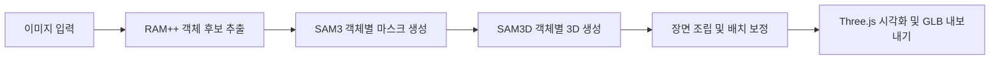
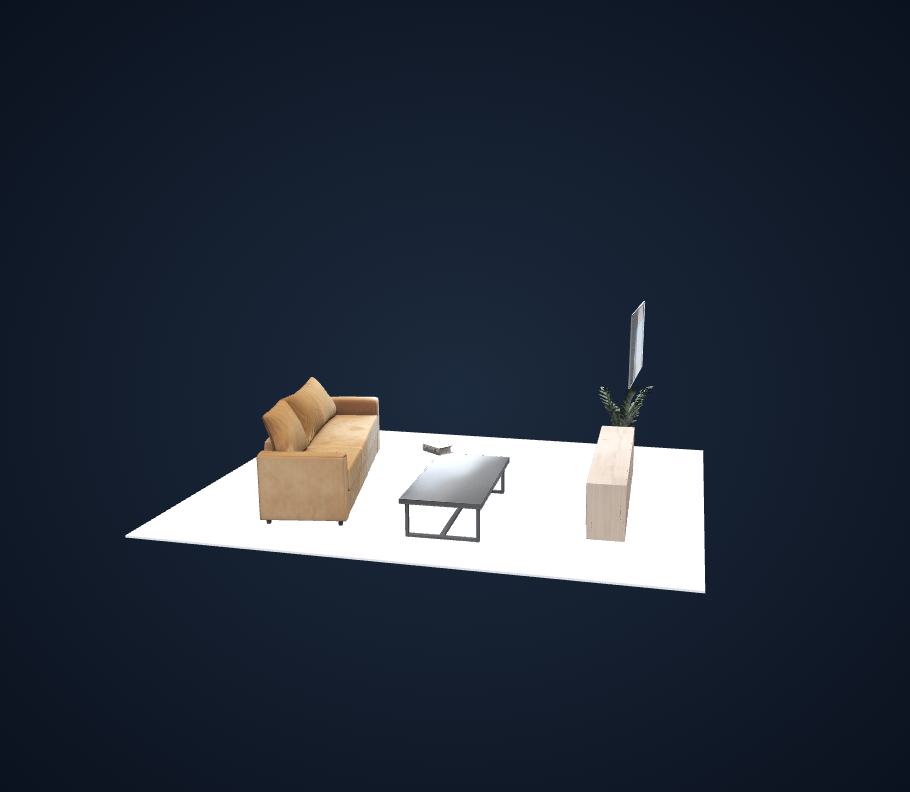

# MapMaker

**단일 이미지에서 객체별 3D 모델을 생성하고 하나의 장면으로 조립하는 프로젝트**

MapMaker는 이미지 한 장을 입력받아 주요 객체를 찾아 분리하고, 각 객체의 3D 형상과 배치를 추정하여 웹에서 확인할 수 있는 3D 장면을 생성합니다. RAM++, SAM3, SAM3D Objects를 하나의 처리 과정으로 연결하며, 생성된 객체는 개별 노드로 유지한 채 GLB 파일로 내보냅니다.

프로젝트의 목표는 **단일 이미지 기반 3D 생성 기술을 실제로 동작하는 시스템으로 구현하는 것**입니다. 기존 모델을 활용한 생성 과정부터 장면 조립·배치 보정, 원격 GPU 실행, 웹 시각화까지 연결한 1차 구현을 정리합니다.

장기적으로는 방과 주변을 포함한 온전한 장면 복원과 편집을 목표로 합니다. 이번 1차 구현은 객체별 3D 생성과 장면 구성까지이며, 주변 공간 전체 복원과 객체 편집 UI는 후속 범위로 남아 있습니다.

모델 연결·좌표 변환·배치 보정·원격 실행의 구체적인 방식은 [상세 구현 문서](docs/IMPLEMENTATION.md)에 정리했습니다.

## 주요 기능

| 기능 | 설명 |
|---|---|
| 이미지 입력 | PNG·JPEG·WebP 업로드, 이미지 방향 및 색상 형식 정규화 |
| 객체 탐색·분리 | RAM++의 객체 후보를 바탕으로 SAM3가 객체별 마스크 생성 |
| 객체별 3D 생성 | SAM3D Objects로 메시와 위치·회전·크기 추정 |
| 장면 조립·보정 | 객체별 노드를 가진 장면 구성, 위쪽 방향 정렬, 지정된 가구의 바닥 접지 및 바닥 생성 |
| 웹 시각화 | 회전·확대·축소·이동, 객체별 표시 전환, 생성 진행 상태 확인 |
| 결과 저장·내보내기 | 전체 장면 GLB 다운로드, 실행 ID 기반 결과 다시 열기, 중간 산출물·로그 보존 |

현재 입력 제한은 **25 MiB / 16 megapixels**, 장면당 분리 대상은 최대 **12개 객체**입니다. 일부 객체 생성에 실패하면 성공한 객체로 장면을 구성하고, 모든 객체가 실패하면 해당 실행을 실패 처리합니다. 객체 표시 전환은 뷰어에만 적용되며, 다운로드에는 바닥을 포함한 전체 장면이 저장됩니다.

## 처리 과정



1. **입력 준비**: 이미지의 EXIF 방향을 반영하고 RGB PNG로 정규화합니다.
2. **객체 후보 추출**: RAM++가 이미지의 태그를 추출합니다. 배경·재질·동작 등 독립 객체로 보기 어려운 태그를 제외하고 후보 이름을 정리합니다.
3. **객체 분리**: 후보 이름을 SAM3의 프롬프트로 사용하여 객체별 영역을 구합니다. 신뢰도·면적·중복 기준으로 마스크를 선택합니다.
4. **3D 생성**: SAM3D Objects에 원본 전체 이미지와 객체별 마스크를 전달하여 각 객체의 메시와 위치·회전·크기를 추정합니다.
5. **장면 구성**: 모델의 좌표계를 GLB에 맞게 변환하여 객체를 조립한 뒤, 방향과 바닥 배치를 보정합니다.
6. **결과 확인**: Three.js 뷰어에서 장면을 탐색하고 GLB를 다운로드합니다. 입력·마스크·객체 모델·메타데이터를 함께 저장하여 결과를 추적할 수 있습니다.

## 직접 구현한 부분

### 기존 모델 연결

RAM++ → SAM3 → SAM3D Objects의 입출력을 연결하고, 이미지 한 장으로 객체 탐색부터 3D 생성까지 진행되는 파이프라인을 구성했습니다. 모델별 Python·PyTorch·CUDA 의존성 차이를 고려해 비전 처리와 3D 생성 환경을 분리하고, 실행 상태와 오류를 하나의 작업 단위로 관리합니다.

각 모델은 객체 인식·분할·3D 추정을 담당하며, 본 프로젝트의 구현 기여는 이 모델들을 연결하고 생성 결과를 사용할 수 있는 시스템으로 구성한 부분에 있습니다.

### 장면 조립·배치 보정

객체의 메시와 추정된 위치·회전·크기를 이용하여 하나의 장면을 구성합니다. 각 객체는 독립 노드로 유지하고, 모델의 좌표계와 GLB 좌표계 사이의 변환을 처리합니다.

현재 보정은 다음 순서로 적용됩니다.

- 전체 객체의 위쪽 축 방향을 평균하여 장면을 월드 +Y 방향으로 정렬하고, 전체 메시의 최저점을 Y=0으로 이동합니다.
- 각 객체의 로컬 +Y 축을 개별적으로 월드 +Y에 정렬합니다.
- 의자·테이블·소파 등 지정된 가구는 메시의 최저점이 Y=0에 닿도록 이동합니다. 그 외 객체는 개별 회전 시 기준점 위치를 유지합니다.
- 최종 객체 범위를 바탕으로 단색 바닥을 추가합니다. 이 바닥은 원본 이미지에서 복원한 실제 바닥 형상이 아닙니다.

원본 객체 메시와 모델이 추정한 pose는 보존하고, 보정 변환을 별도로 기록합니다. 축 정렬과 접지를 위한 기하학적 후처리이며, 물리 시뮬레이션이나 객체 간 충돌 해결은 포함하지 않습니다.

### 원격 GPU 처리

Windows의 로컬 Python 서버가 RunPod Serverless에 생성 작업을 제출하고, S3를 통해 입력과 결과를 주고받습니다. GPU worker가 모델 추론을 수행하며, 로컬 서버는 진행 상태를 조회하고 결과 파일의 해시와 입력 일치 여부를 확인한 뒤 후처리·결과 게시를 마칩니다.

시간 초과·실패·취소 요청과 중복 생성 요청을 처리하고 실행별 로그를 남깁니다. 서버 재시작으로 중단된 원격 작업은 실패 처리 후 취소를 시도하며, 자동 재개는 지원하지 않습니다.

### 웹 뷰어

Three.js 기반으로 이미지 업로드, 생성 상태 표시, 3D 장면 탐색, 객체 표시 전환, GLB 다운로드를 구현했습니다. `/?run=<run_id>` 주소로 저장된 결과를 다시 열 수 있습니다.

## 구현 결과와 검증

아래는 현재 배치 보정을 적용한 거실 장면의 WebGL 렌더링 예시입니다. 가구의 형태와 배치를 확인할 수 있으며, TV·책 등 일부 객체의 부유와 접촉 문제도 남아 있습니다.

| 원본 이미지 | 결과물 |
|:---:|:---:|
|  |  |

저장소에 보존된 검증 기록은 다음과 같습니다. 각 기록은 수행 당시의 구현과 입력을 기준으로 합니다.

| 검증 범위 | 기록된 결과 | 해석 범위 |
|---|---|---|
| 기존 GPU 생성·뷰어 검증 | 당시 29개 입력 중 22개 PASS, 7개는 16MP 입력 제한으로 실패 | 이전 배치 보정 버전의 전체 생성 경로 검증 |
| 현재 배치 보정(v4) 수치 검증 | 저장된 22개 장면·120개 객체의 축 정렬, 가구 46개의 접지 검사 통과 | 기존 추론 결과를 사용한 보정 검증이며 GPU 재추론은 아님 |
| 현재 보정의 화면 비교 | 대표 3개 장면·28개 객체를 재처리하고 전후 6개 뷰어 검사 통과 | 동일 카메라 조건의 비교 및 표시 전환·다운로드 등 동작 확인 |

검증 PASS는 파일·좌표 변환·뷰어 동작이 검사 기준을 충족했다는 의미입니다. 실제 공간과의 복원 정확도나 시각적 완성도를 나타내는 점수는 아닙니다. 원본 이미지와 최종 결과의 웹 뷰어 화면은 [현재 샘플 5개 결과](docs/SAMPLES_BEFORE_AFTER_COMPARISON.md)에서 확인할 수 있습니다.

## 현재 한계

- **형상과 배치의 불확실성**: 한 장의 이미지에서 추정하므로 가려진 부분, 얇은 구조, 작은 소품의 형상이 부정확하거나 객체가 누락될 수 있습니다. 실제 치수나 정확한 상대 배치를 보장하지 않습니다.
- **접촉·충돌 문제**: 로컬 +Y가 실제 위쪽이라는 가정으로 정렬합니다. 가구의 모든 다리가 바닥에 닿거나 소품이 지지 가구에 붙어 있는 상태를 보장하지 않으며, 부유·관통·겹침이 남을 수 있습니다.
- **장면 범위**: 객체 중심의 장면을 생성합니다. 벽·천장을 포함한 공간 전체 복원과 객체 위치·크기를 수정하는 편집 기능은 구현하지 않았습니다.
- **실행 환경**: 실제 생성에는 준비된 GPU 모델 환경이 필요합니다. 초기 모델 로딩과 파일 전송 시간이 있으며, RunPod 사용 시 GPU·스토리지 비용이 발생합니다.

## 기술 구성

| 구분 | 사용 기술 |
|---|---|
| 객체 인식·분할·생성 | RAM++, SAM3, SAM3D Objects, PyTorch |
| 파이프라인·장면 처리 | Python, NumPy, Pillow, trimesh |
| 원격 실행·저장 | RunPod Serverless, S3, Docker |
| 웹 화면 | HTML, CSS, JavaScript, Three.js |
| 검증 | pytest, Playwright, 산출물·좌표 변환 검증 스크립트 |

## 실행 방법

기본 사용 환경은 **Windows 로컬 서버 + RunPod 원격 GPU**입니다. Python 3.11, Node.js, uv와 별도로 배포된 RunPod endpoint 및 S3 접근 설정이 필요합니다. 모델과 인증 정보는 저장소에 포함하지 않습니다.

처음 준비할 때는 저장소 루트에서 실행합니다.

```powershell
uv sync --frozen --extra remote
npm.cmd ci --prefix web --omit=dev
powershell -ExecutionPolicy Bypass -File scripts/configure_runpod_api.ps1
powershell -ExecutionPolicy Bypass -File scripts/configure_runpod_s3.ps1
```

`RUNPOD_ENDPOINT_ID`, `MAPMAKER_S3_BUCKET`, `MAPMAKER_S3_ENDPOINT`, `AWS_DEFAULT_REGION`을 환경 변수 또는 `.runtime/runpod-settings.json`에 설정합니다. 인증 스크립트는 최초 설정용이며, 이미 설정된 환경에서는 아래 명령으로 실행합니다.

```powershell
.venv\Scripts\python.exe -m mapmaker.cli doctor
powershell -ExecutionPolicy Bypass -File scripts/start_scene_web.ps1
```

[로컬 앱](http://127.0.0.1:8082)에서 이미지를 선택하고 **Generate 3D Scene**을 누릅니다. 생성이 끝날 때까지 서버를 유지해야 합니다. `doctor`는 설정·파일 존재 검사이며 실제 원격 인증이나 추론 성공을 확인하는 명령은 아닙니다.

## 저장소와 결과 구성

```text
mapmaker/       Python 서버, 모델 연결, 원격 처리, 장면 조립·보정
web/            Three.js 뷰어와 브라우저 검증
configs/        모델·런타임 설정과 고정 소스 버전
deploy/runpod/  GPU worker Docker 구성
scripts/        실행·배포·검증·재처리 도구
tests/          파이프라인·좌표 변환·원격 처리 회귀 테스트
samples/        입력 예시
docs/           사용법과 검증 보고서
runs/           실행별 산출물 (Git 제외)
```

각 `runs/<run_id>/`에는 정규화한 입력 이미지, 객체 후보, 마스크, 객체별 GLB·pose, 최종 `scene.glb`, 메타데이터, 미리보기와 로그가 저장됩니다. 저장된 결과를 다시 보려면 해당 실행 폴더와 로컬 서버가 필요합니다.
