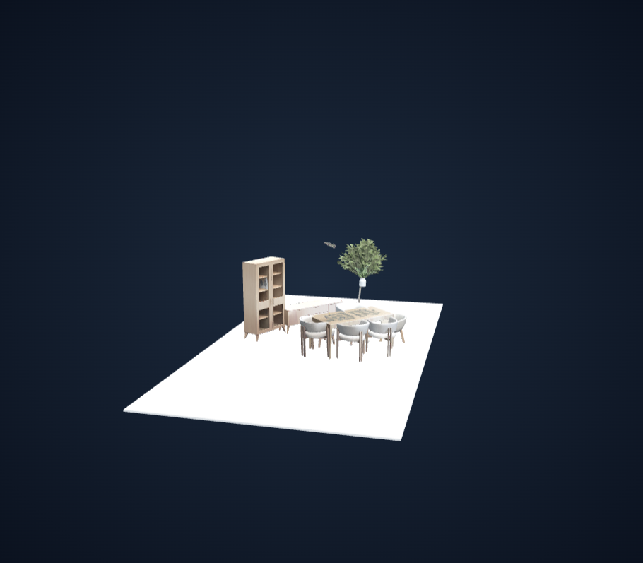
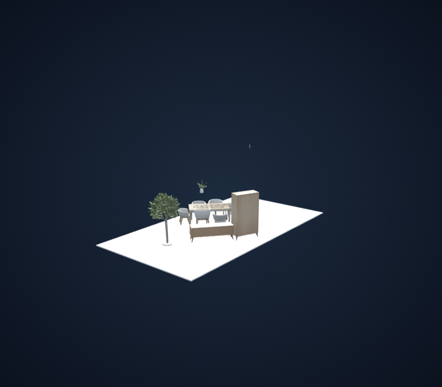
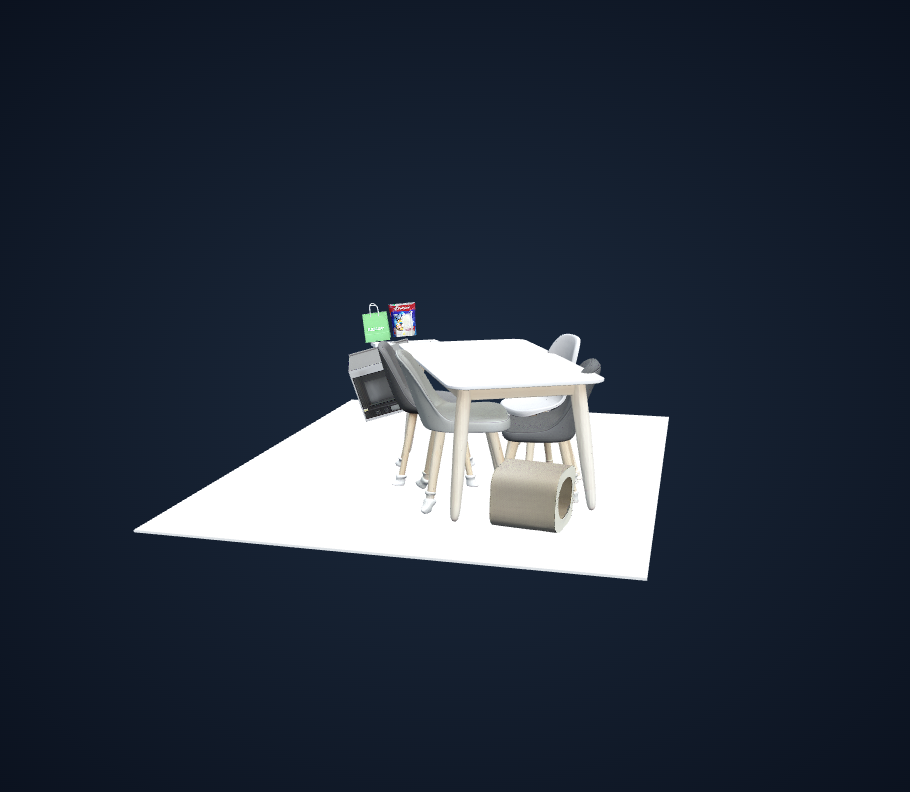
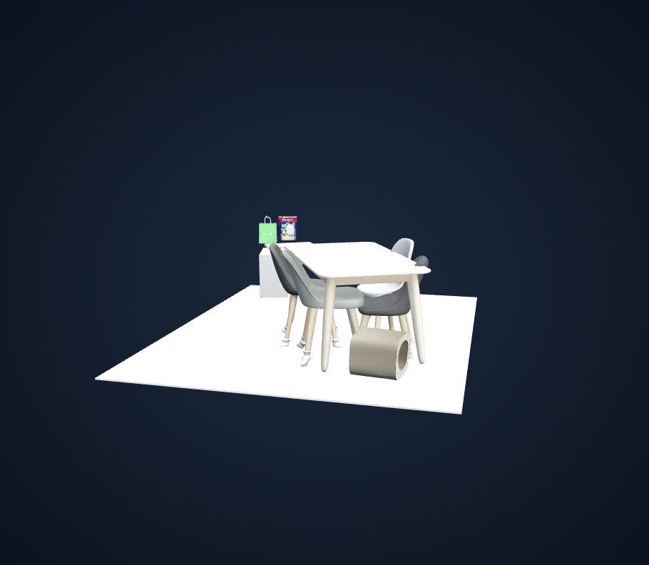
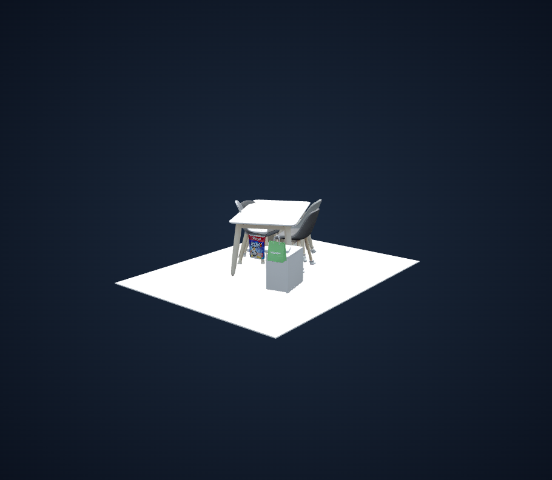
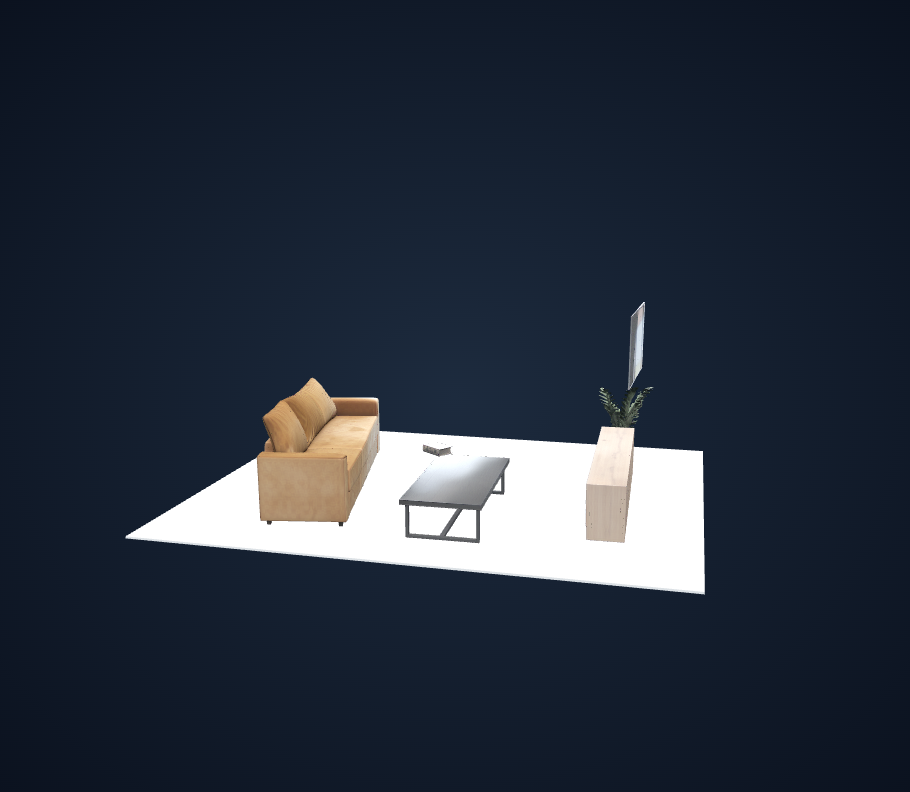
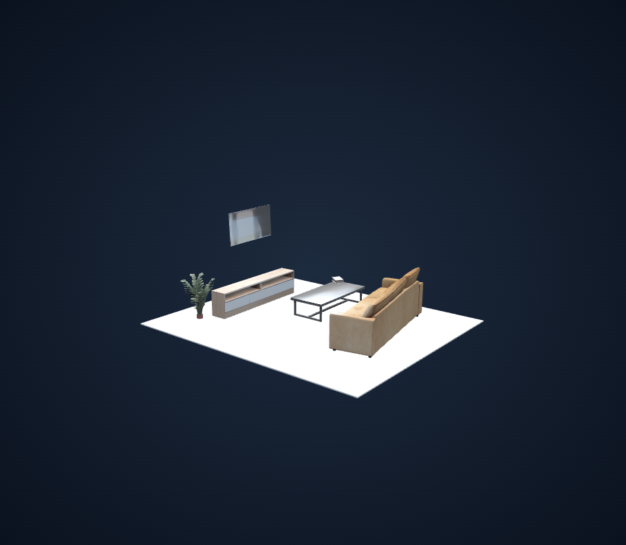

# 전체 객체 Y-up 정렬 비교·검증 보고서 — placement v4

## 요약

- **Before(v3):** 가구만 개별 Y-up 정렬·접지. 비가구는 공통 정렬 결과 유지.
- **After(v4):** 모든 생성 성공 객체에 개별 Y-up 정렬. 바닥으로 이동하는 대상은 기존 가구 목록만 유지.
- 기존 수치 검증: 22개 장면·120개 객체, 가구 46개 접지 및 나머지 74개 원점 XYZ 보존 PASS. 단위/회귀 테스트 57 passed.
- 이번 비교: 대표 3개 장면·28개 객체를 같은 원본 추론 아티팩트에서 새 run으로 재처리. 전후 6개 뷰어 검증 PASS, 2개 구도 × 전후 × 3개 장면 = 비교 이미지 12장.
- GPU 재추론은 하지 않았다. 기존 run과 원본 객체 파일은 변경하지 않았다.

## 비교 조건과 검증 방법

각 쌍은 원본 객체 GLB SHA와 pose가 같은지 확인했다. After는 보정 전 original_matrix와 원본 객체 메시로 조립을 복원한 뒤 현재 production finalize_scene을 적용했다. 이전 보정 결과에 추가로 덮어 회전하지 않았다.

카메라 중심·거리·near/far는 전후 장면 bounds의 합집합으로 계산한다. 같은 viewport(1440×1000), 같은 시점/target/projection으로 캡처하고 실제 카메라 값의 동일성을 검증했다. 카메라 이동 외의 모델 배치 조작은 하지 않았다. 정면/반대편은 캡처용 두 시점의 이름이다.

새 GLB는 artifact validator로 행렬 합성·전체 Y-up·가구 접지·비가구 root XYZ 보존·최종 bounds·floor를 검사했다. 브라우저에서는 원본 객체/노드 수, 실제 WebGL 삼각형, floor, 모든 객체 표시 전환, orbit, GLB 다운로드 해시, runtime/HTTP 오류를 검사했다. 비교 화면 12장은 직접 확인했다.

메시의 로컬 +Y 정렬과 최저점 접촉은 의미적 자세·다리 전체 접촉·충돌 해결을 보장하지 않는다. 비가구는 자기 root 중심 회전만 하므로 부유하거나 바닥을 관통할 수도 있다. 소품 추종은 없다.

## 장면별 비교

### 식탁·책장·식물 장면

- Before: `548e695e69c64739a2fc342bc8fffd68` / After: `921b384520ca42a3bd8c4aa8326a4cef`
- [Before viewer](http://127.0.0.1:8082/?run=548e695e69c64739a2fc342bc8fffd68) · [After viewer](http://127.0.0.1:8082/?run=921b384520ca42a3bd8c4aa8326a4cef)
- 관찰: 가구 9개의 자세와 접지는 그대로다. 큰 식물과 장식의 회전은 작고, 공중의 작은 greenery 조각은 눈에 띄게 회전했다. 조각의 부유·분리 상태는 해결되지 않았다.
- 판단: 비가구의 축 정렬은 확인했으나 전체 장면 품질 개선은 제한적이다.

| 비가구 객체 | Before Y-up 각도 | After Y-up 각도 |
|---|---:|---:|
| `greenery_00` | 3.86° | 0.00° |
| `centerpiece_00` | 2.15° | 0.00° |
| `greenery_01` | 69.78° | 0.00° |

**정면 — 동일 카메라**

| Before: 가구만 정렬 | After: 전체 객체 정렬 |
|---|---|
|  |  |

**반대편 — 동일 카메라**

| Before: 가구만 정렬 | After: 전체 객체 정렬 |
|---|---|
|  |  |

### 식탁·의자·상자형 객체 장면

- Before: `a2a4105556154c45a9283f98b50a0c6b` / After: `2e20f63f57144522af726de15a0cd618`
- [Before viewer](http://127.0.0.1:8082/?run=a2a4105556154c45a9283f98b50a0c6b) · [After viewer](http://127.0.0.1:8082/?run=2e20f63f57144522af726de15a0cd618)
- 관찰: 기울어진 appliance 상자형 객체가 세워져 정면/반대편에서 자세 차이가 뚜렷하다. package와 bag은 소폭 회전했다. 식탁·의자 등 기존 가구 6개의 변환은 유지됐다.
- 판단: 가장 눈에 띄는 변화다. appliance의 약 157.8도 회전은 로컬 +Y 기준이며, 실제 의미적 위쪽이나 다른 물체와의 접촉이 맞는다는 보장은 없다.

| 비가구 객체 | Before Y-up 각도 | After Y-up 각도 |
|---|---:|---:|
| `appliance_00` | 157.77° | 0.00° |
| `kitchen_counter_00` | 3.02° | 0.00° |
| `package_00` | 7.80° | 0.00° |
| `bag_00` | 7.85° | 0.00° |

**정면 — 동일 카메라**

| Before: 가구만 정렬 | After: 전체 객체 정렬 |
|---|---|
|  |  |

**반대편 — 동일 카메라**

| Before: 가구만 정렬 | After: 전체 객체 정렬 |
|---|---|
|  |  |

### 거실 장면

- Before: `5f4a0ad8b71847eb9e457b2a110ea9e6` / After: `216bb631fd1e455691fa79f675e15f2c`
- [Before viewer](http://127.0.0.1:8082/?run=5f4a0ad8b71847eb9e457b2a110ea9e6) · [After viewer](http://127.0.0.1:8082/?run=216bb631fd1e455691fa79f675e15f2c)
- 관찰: 소파·테이블·수납장 3개는 그대로다. TV·식물·책의 변화는 약 1~2도 수준으로 화면에서는 작게 보인다. TV의 부유 및 책과 테이블 사이의 기존 접촉 문제는 남는다.
- 판단: 수치 정렬은 성공했지만 이 장면의 시각적 변화는 작다.

| 비가구 객체 | Before Y-up 각도 | After Y-up 각도 |
|---|---:|---:|
| `television_00` | 2.34° | 0.00° |
| `plant_00` | 1.60° | 0.00° |
| `book_00` | 1.22° | 0.00° |

**정면 — 동일 카메라**

| Before: 가구만 정렬 | After: 전체 객체 정렬 |
|---|---|
|  |  |

**반대편 — 동일 카메라**

| Before: 가구만 정렬 | After: 전체 객체 정렬 |
|---|---|
|  |  |

## 전체 수치 검증 (기존 22개)

대표 3개는 이번에 GLB/preview/브라우저 비교까지 확장했다. 나머지 19개는 메모리상 수치 검사이며 모든 장면의 시각적 품질을 확인했다는 의미는 아니다.

| 원본 run | Y-up 정렬 객체 | 바닥 이동 가구 | 수치 결과 |
|---|---:|---:|---|
| `a738b5f0` | 12 | 9 | PASS |
| `ceb9b530` | 1 | 0 | PASS |
| `f0cd8821` | 5 | 0 | PASS |
| `85a4480d` | 1 | 0 | PASS |
| `ae39389c` | 1 | 0 | PASS |
| `bc18279a` | 6 | 2 | PASS |
| `38b6e971` | 12 | 1 | PASS |
| `c20feb3c` | 9 | 7 | PASS |
| `34534587` | 1 | 0 | PASS |
| `f818c1ee` | 1 | 0 | PASS |
| `dcff34e6` | 8 | 0 | PASS |
| `006bf0d5` | 1 | 0 | PASS |
| `ecbbf289` | 3 | 0 | PASS |
| `e88df977` | 5 | 0 | PASS |
| `2a2d9c3e` | 10 | 6 | PASS |
| `330daeb8` | 1 | 0 | PASS |
| `88e01c90` | 6 | 3 | PASS |
| `8c3edc6d` | 1 | 0 | PASS |
| `827ffb7b` | 1 | 0 | PASS |
| `345b6371` | 12 | 6 | PASS |
| `4e11dbfa` | 12 | 4 | PASS |
| `a69ab48a` | 11 | 8 | PASS |

## 재현과 보존 위치

- 로컬 viewer 링크는 127.0.0.1:8082 서버와 runs 폴더가 필요하며 공개 호스팅 링크가 아니다.
- 신규 run에는 최종 scene.glb, scene_metadata.json, logs/placement.json, logs/artifact_validation.json 및 CPU oblique preview가 있다. WebGL 비교 이미지는 docs/assets/all_object_upright에 보존한다.
- 원본 브라우저 증거: runs/all_object_upright_visual/<source-prefix>/comparison.json. 공통 카메라 값과 실행별 검사 결과가 포함된다.
- CPU 재처리 진단: 로컬 .runtime/replay_upright_visual.py. 동일 카메라 브라우저 검증은 아래 명령으로 재현할 수 있다.

```powershell
$env:PLAYWRIGHT_BROWSERS_PATH = "$PWD/.runtime/browsers"
node web/compare-upright.mjs 548e695e69c64739a2fc342bc8fffd68 921b384520ca42a3bd8c4aa8326a4cef runs/all_object_upright_visual/a738b5f0
node web/compare-upright.mjs a2a4105556154c45a9283f98b50a0c6b 2e20f63f57144522af726de15a0cd618 runs/all_object_upright_visual/2a2d9c3e
node web/compare-upright.mjs 5f4a0ad8b71847eb9e457b2a110ea9e6 216bb631fd1e455691fa79f675e15f2c runs/all_object_upright_visual/88e01c90
```

이번 변경의 범위는 비가구까지 개별 Y-up 회전을 확장한 것이다. 가구 정렬/접지는 이전과 같고, 소품의 지지면 복원이나 물체 관계 보정은 후속 작업으로 남는다.
