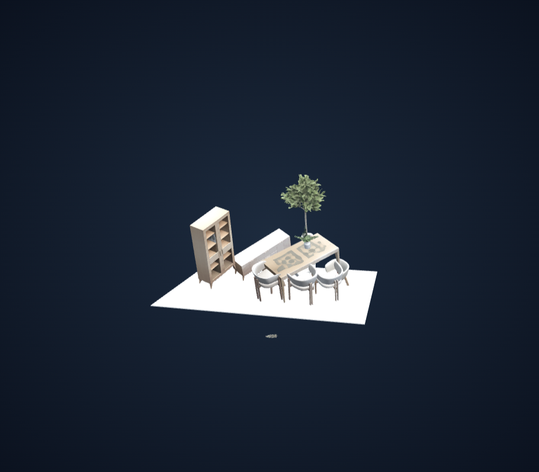
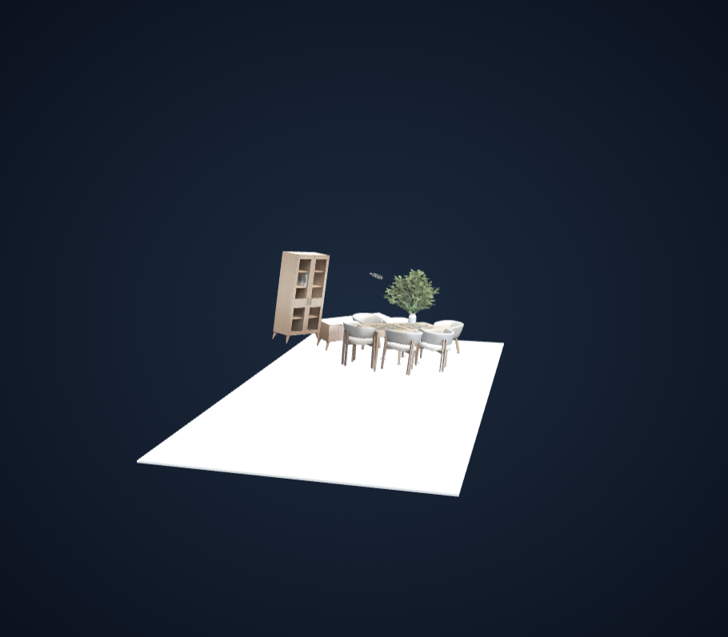
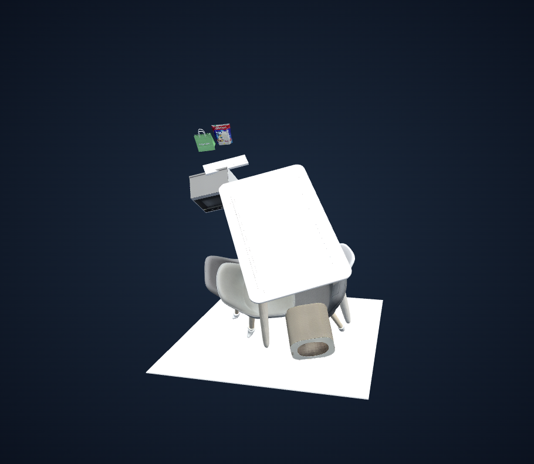
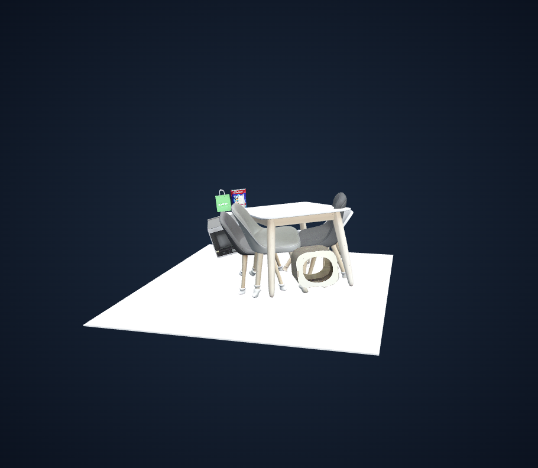
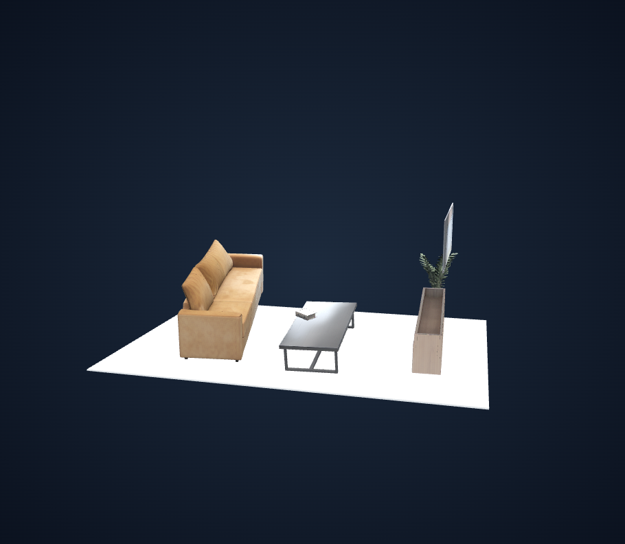
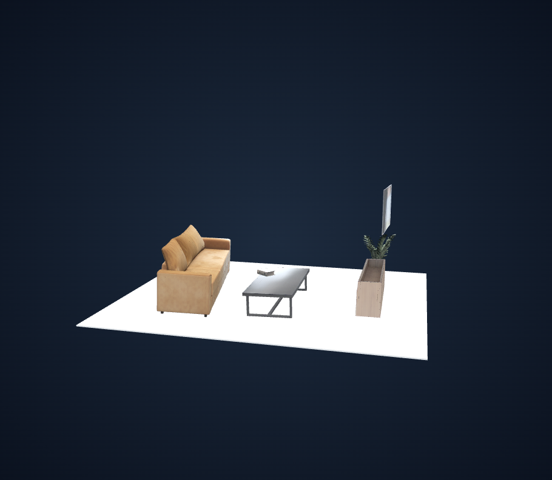

# 전체 좌표계 정렬 검증 — placement v2

## 구현

생성 성공 객체 전부의 로컬 +Y를 조립 행렬로 변환·정규화한 후 동일 가중치로 단순 평균한다. 평균을 월드 +Y로 맞추는 공통 최소 회전과 전체 최저 정점을 Y=0으로 맞추는 공통 이동만 적용한다. 객체별 Y 보정과 소품 추종은 껐다. 바닥 윗면은 Y=0이고 크기는 전체 객체 XZ 범위로 계산한다.

평균 길이 <1e-6이면 실패한다. 정확한 반대 방향은 고정 X축 180도 회전이다. placement v1 결과에 중복 적용하지 않으며 metadata에는 공통 변환과 객체별 원본 행렬/전후 방향을 저장한다.

## 검증 범위

- 단위/회귀 테스트: 51 passed. 공통 변환, 상대 배치, 원본 mesh/pose, 크기 정규화 후 동일 가중치, unknown 포함, 평행/반대 방향, 평균 상쇄 실패, nested geometry/instance, GLB 왕복, 중복 적용 및 v1 거절을 검증했다.
- 저장된 22개 장면/120개 객체 모두 수치 검증 PASS. 새 GPU 추론은 수행하지 않았다.
- 입력은 이전 fresh run의 원본 객체 GLB와 저장된 보정 전 original_matrix로 복원했다. 기존 개별 Y 보정과 기존 바닥을 제거한 원본 조립 좌표에서 검사했다.
- 22개 중 3개는 새 run으로 최종 GLB/metadata/preview를 생성하고 artifact validator 및 실제 WebGL 뷰어 검사를 통과했다. 나머지 19개는 메모리상의 변환 검사이며 새 viewer run은 생성하지 않았다.
- 기존 source scene.glb와 원본 객체 GLB의 해시 보존을 검사했다. 이전 입력 이미지 중 로컬 samples에서 삭제된 2개는 저장 run의 아티팩트로 검증했으며 삭제 상태를 변경하지 않았다.
- 전체 최저 Y의 최대 절댓값: 2.22e-16. 객체 간 상대 행렬의 최대 오차: 1.78e-15.
- 자동 PASS는 방향 정렬·공통 이동·산출물 동작을 뜻한다. 모든 객체가 바닥에 닿거나 실제 물리적 위쪽으로 정렬되었다는 뜻은 아니다.

## 실제 뷰어 비교

왼쪽은 같은 추론 결과에 적용됐던 이전 개별 보정(v1), 오른쪽은 원본 조립 결과에서 시작한 공통 정렬(v2)이다. 각 뷰어의 자동 카메라 fit을 사용하므로 화면 크기/구도는 동일하지 않다. 로컬 서버와 runs 폴더가 필요하며 공개 호스팅 링크는 없다.

### 1. 5MrJb0VLPeu5pWNey2XE3AE5mqAXdSIeMg3rOIJIeWpA4

- 공통 회전: 28.28°. 평균 벡터 길이: 0.9412.
- [이전 viewer](http://127.0.0.1:8082/?run=a738b5f0653a430bbfa9650a6b98316a) · [정렬 후 viewer](http://127.0.0.1:8082/?run=ebed43601aff402b89b1f3f5a23cc038)
- 책장·식탁·의자의 공통 기울기는 줄었다. 작은 분리 조각도 포함한 전체 XZ 범위 때문에 바닥이 넓으며, 일부 가구의 부유는 남는다.

| 이전 개별 보정 | 새 공통 정렬 |
|---|---|
|  |  |

### 2. KakaoTalk_20260829_164738573.jpg

- 공통 회전: 40.60°. 평균 벡터 길이: 0.5864.
- [이전 viewer](http://127.0.0.1:8082/?run=2a2d9c3e0eb64d80862fc6b697217d8a) · [정렬 후 viewer](http://127.0.0.1:8082/?run=680ba8ee5216419d91aaca589a74dda1)
- 기존 큰 공통 기울기는 줄었다. 테이블과 의자의 개별 자세 차이·겹침·부유는 남는다.

| 이전 개별 보정 | 새 공통 정렬 |
|---|---|
|  |  |

### 3. living_room.jpg

- 공통 회전: 7.09°. 평균 벡터 길이: 0.6667.
- [이전 viewer](http://127.0.0.1:8082/?run=88e01c90565644c79b5e31312ebebca7) · [정렬 후 viewer](http://127.0.0.1:8082/?run=cc553b61e3254eeaa598064a4d6989c3)
- 소파와 테이블의 전체 방향이 정렬되었다. TV 등 원래 공중에 있는 객체도 동일한 변환을 받으며 바닥으로 개별 이동하지 않는다.

| 이전 개별 보정 | 새 공통 정렬 |
|---|---|
|  |  |

## 전체 수치 검사

| 원본 run | 객체 수 | 공통 회전(°) | 평균 벡터 길이 | 결과 |
|---|---:|---:|---:|---|
| `a738b5f0` | 12 | 28.28 | 0.9412 | PASS |
| `ceb9b530` | 1 | 46.08 | 1.0000 | PASS |
| `f0cd8821` | 5 | 34.46 | 0.5856 | PASS |
| `85a4480d` | 1 | 9.41 | 1.0000 | PASS |
| `ae39389c` | 1 | 1.24 | 1.0000 | PASS |
| `bc18279a` | 6 | 23.92 | 0.7828 | PASS |
| `38b6e971` | 12 | 30.23 | 0.9961 | PASS |
| `c20feb3c` | 9 | 4.30 | 0.9987 | PASS |
| `34534587` | 1 | 4.43 | 1.0000 | PASS |
| `f818c1ee` | 1 | 1.58 | 1.0000 | PASS |
| `dcff34e6` | 8 | 17.18 | 0.7505 | PASS |
| `006bf0d5` | 1 | 3.02 | 1.0000 | PASS |
| `ecbbf289` | 3 | 51.75 | 0.3122 | PASS |
| `e88df977` | 5 | 13.16 | 0.2005 | PASS |
| `2a2d9c3e` | 10 | 40.60 | 0.5864 | PASS |
| `330daeb8` | 1 | 23.86 | 1.0000 | PASS |
| `88e01c90` | 6 | 7.09 | 0.6667 | PASS |
| `8c3edc6d` | 1 | 6.57 | 1.0000 | PASS |
| `827ffb7b` | 1 | 0.94 | 1.0000 | PASS |
| `345b6371` | 12 | 5.44 | 0.5040 | PASS |
| `4e11dbfa` | 12 | 16.83 | 0.8312 | PASS |
| `a69ab48a` | 11 | 1.87 | 0.9979 | PASS |

## 한계와 실행 근거

평균에는 가구·소품·식물·통합 메시를 모두 포함한다. 원본 로컬 +Y가 실제 위쪽이 아니거나 서로 반대인 객체가 섞이면 평균이 왜곡될 수 있다. 개별 기울기/높이/충돌은 후속 과제다. 기존 Gaussian preview는 공통 정렬을 반영하지 않는다.

수치 검사 원본은 `runs/global_alignment_validation/index.json`, 새 run의 `logs/placement.json`, `logs/artifact_validation.json` 및 각 검증 폴더의 `browser.json`에 있다. CPU 검사 스크립트는 로컬 `.runtime/validate_global_alignment.py`이며 외부 GPU 요청 없이 실행했다. 공개 가능한 수치 요약은 함께 제공하는 JSON에 보존한다.
