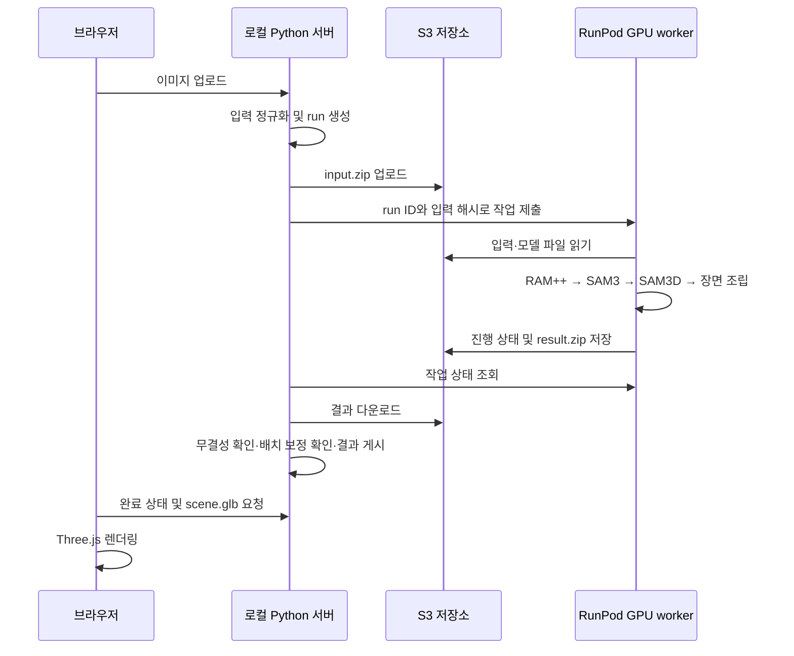

# MapMaker 상세 구현

이 문서는 단일 이미지에서 객체별 3D 장면을 생성하는 현재 구현을 설명한다. 프로젝트 소개와 기본 실행 방법은 [README](../README.md)에서 다룬다.

기준: 2026-09-29, 배치 보정 `placement v4`. 아래 내용은 저장소의 코드와 기존 검증 기록을 기준으로 하며, 모델 자체의 신규 학습이나 새로운 생성 모델 개발을 의미하지 않는다. 직접 구현한 범위는 기존 모델 연결, 장면 조립·배치 보정, 원격 GPU 처리, 웹 뷰어다.

## 1. 시스템 구조



Windows의 기본 backend는 RunPod이고 Linux의 기본값은 local이다. `MAPMAKER_BACKEND`로 선택한다. local 경로는 모델 환경이 준비된 Linux GPU 환경을 전제로 한다. Windows 서버는 요청·전송·후처리를 담당하므로 로컬에 GPU 모델 환경을 구성할 필요가 없다.

현재 worker 코드의 `Pipeline.run()`도 배치 보정을 수행한다. 로컬 수신 경로는 이전 worker의 보정되지 않은 결과도 처리할 수 있도록 동일한 `finalize_scene()`을 호출한다. 같은 보정 버전과 최종 해시이면 재적용하지 않는다. 따라서 후처리가 양쪽에 존재해도 같은 변환을 두 번 누적하는 구조는 아니다.

## 2. 입력과 실행 단위

코드: [scene_pipeline.py](../mapmaker/scene_pipeline.py), [scene_run.py](../mapmaker/scene_run.py), [web.py](../mapmaker/web.py).

`create_run()`은 이미지를 읽고 16MP 제한을 확인한 뒤, EXIF 방향을 반영하여 RGB PNG로 저장한다. HTTP 업로드에는 별도로 25MiB 제한을 적용한다. 원본 파일의 인코딩 대신 정규화한 입력 이미지의 SHA-256을 기록한다.

실행마다 UUID 기반 디렉터리를 생성한다. 원격 실행 ID는 32자리 소문자 16진수이며, 입력·객체·메타데이터·로그를 같은 실행 아래 모은다.

```text
runs/<run_id>/
├── input/source_image.png       정규화한 입력
├── object_candidates.json       태그·후보·제외 사유
├── masks/<object_id>.png        원본 해상도 객체 마스크
├── objects/<object_id>.glb      원본 객체 메시
├── objects/<object_id>.pose.json 모델 추정 위치·회전·크기
├── scene.glb                    보정·바닥을 포함한 최종 장면
├── scene_metadata.json          객체 목록·변환·시간·오류
├── status.json                  현재 실행 상태
├── previews/                    마스크 및 장면 미리보기
└── logs/                        단계별 실행·검증 기록
```

JSON은 임시 파일에 쓴 뒤 교체한다. 브라우저가 저장 도중의 불완전한 JSON을 읽는 상황을 줄이기 위한 처리다. 상태 변경은 `status.json`과 누적 `logs/run.log`에 함께 남긴다.

## 3. 기존 모델을 연결하는 방식

### 3.1 RAM++: 객체 후보 이름 추출

코드: [scene_vision.py](../mapmaker/scene_vision.py), [object_candidates.py](../mapmaker/object_candidates.py).

RAM++는 이미지에서 태그를 추출한다. 이 단계에서는 객체 개수나 정확한 마스크를 정하지 않는다. 태그를 SAM3에 전달할 후보 이름으로 변환한다.

| 처리 | 현재 코드의 설정 |
|---|---|
| 모델 입력 | `ram_plus`, `swin_l`, 입력 크기 384 |
| 태그 임계값 | 모델의 클래스별 임계값에 0.75를 곱함 |
| 추가 관찰 영역 | 원본 긴 변이 768px를 넘으면 가로·세로 각각 60% 크기의 겹치는 crop 5개 추가 |
| 이름 정리 | 소문자·공백 정리, `sofa → couch`, `cocktail table → coffee table` 등의 alias 적용 |
| 후보 제외 | 배경·색상·재질·동작·일부 작은 부속품 등의 공통 제외 목록 적용 |
| 후보 우선순위 | 여러 관찰 영역에서 반복된 이름을 우선하고 최대 40개 선택 |

Crop은 RAM++의 태그 추출에만 사용한다. 이후 SAM3와 SAM3D에는 정규화한 원본 전체 이미지가 전달된다. 후보 필터는 이미지별 수기 목록으로 객체를 추가하지 않으며, 모델이 찾지 못한 이름을 만들어 넣지도 않는다.

### 3.2 SAM3: 후보 이름에서 객체별 마스크로

SAM3에 원본 이미지를 설정하고 후보 이름마다 텍스트 프롬프트를 전달한다. 같은 이름의 객체가 여러 개면 각각 별도의 마스크가 될 수 있다.

| 선택 기준 | 값 |
|---|---:|
| 마스크 신뢰도 | 0.6 이상 |
| 최소 면적 | 전체 이미지의 0.003 이상, 즉 0.3% |
| 중복 제외 | 이미 선택한 마스크와 IoU가 0.8 초과 |
| 포함 영역 제외 | 새 마스크 면적의 90% 초과가 이미 선택한 마스크와 겹침 |
| 최종 개수 | 최대 12개 |

면적이 큰 순서, 신뢰도가 높은 순서로 검사하므로 주요 객체가 먼저 선택된다. 이름과 순번으로 `coffee_table_00` 같은 ID를 만들고, 마스크·경계 상자·면적·신뢰도·해시를 기록한다. 탈락한 후보의 이유도 로그에 남긴다.

이 기준은 현재 구현의 선택 규칙이다. 다른 값과 비교해 최적임을 입증한 하이퍼파라미터 탐색 결과는 아니다. 작은 소품이나 서로 겹치는 객체가 제외될 수 있다.

### 3.3 SAM3D Objects: 마스크별 메시와 pose 생성

코드: [scene_reconstruct.py](../mapmaker/scene_reconstruct.py).

공식 notebook의 `Inference`를 `compile=False`로 초기화하고, 객체마다 `MODEL(image, mask, seed=42)`를 실행한다. 반환된 GLB와 `rotation`, `translation`, `scale`을 각각 저장한다. 이 단계에서 객체 메시의 원점이나 크기를 임의로 다시 정규화하지 않는다.

SAM3D 프로세스는 상주하며 초기화한 모델을 다음 작업에서도 재사용한다. 비전 단계는 별도 프로세스에서 실행한다. 반복 호출 비용을 줄일 수 있지만 GPU worker가 새로 시작되면 모델 준비 비용이 다시 발생한다.

현재 SAM3D 내부에는 DINOv2와 MoGe 계열 보조 모델도 필요하다. 이는 초기 파이프라인에서 직접 깊이를 추정하고 배치하던 독립 MoGe 단계와 구분한다. 초기 경로를 제거했다는 이유로 현재 모델 환경의 MoGe·DINOv2 의존성까지 제거할 수는 없다.

객체 하나가 실패하면 해당 객체에 오류를 남기고 다음 객체를 처리한다. 하나 이상 성공하면 성공 객체로 조립을 계속하며, 전부 실패하면 전체 작업을 실패 처리한다. 마스크 수, 성공 객체 수, 최종 장면의 객체 수를 구분해야 하는 이유다.

## 4. 장면 조립과 좌표계

코드: [scene_assembly.py](../mapmaker/scene_assembly.py).

### 4.1 GLB 축 변환과 모델 pose 연결

SAM3D의 native pose와 내보낸 GLB의 정점 좌표는 같은 표현이 아니다. 모델의 메시 내보내기 과정에 축 회전이 있으므로, 내보낸 정점에 native pose를 그대로 적용하면 공식 장면과 다른 위치가 될 수 있다.

현재 조립 행렬은 공식 `compose_transform()` 결과와 내보내기 축 변환을 연결한다.

```text
E = [[1, 0,  0],
     [0, 0, -1],
     [0, 1,  0]]

M_i = official_pose_row.T @ E4
```

`E4`는 E를 4×4 동차 행렬로 확장한 것이다. 최종 `M_i`는 열벡터 기준이며, 객체 내부의 child transform도 유지한다. 행렬의 전치와 축 변환은 같은 3D 관계를 GLB 표현으로 옮기는 과정이다.

### 4.2 독립 객체 노드와 검증

```text
Scene
├── object_00                 객체별 변환
│   └── object_00__0          메시와 내부 변환
├── object_01
│   ├── object_01__0
│   └── object_01__1
└── background_floor          후처리에서 추가하는 바닥
```

조립 과정에서 표본 정점을 공식 `SceneVisualizer.object_pointcloud()` 결과와 비교하고, 최대 좌표 오차가 `1e-5`를 넘으면 실패한다. 저장한 GLB를 다시 읽어 객체 노드와 변환 행렬도 확인한다.

이 검사는 **공식 pose를 올바르게 옮겼는가**를 확인한다. 모델이 추정한 pose 자체가 현실과 일치하는지, 물체가 실제 바닥에 닿는지를 입증하는 검사는 아니다. 그 차이 때문에 별도의 배치 보정이 필요했다.

## 5. 현재 배치 보정: placement v4

코드: [scene_placement.py](../mapmaker/scene_placement.py).

### 5.1 전체 장면의 공통 방향 정렬

객체 i의 조립 행렬을 `M_i`, 객체 내부 정점에 필요한 변환을 모두 적용한 월드 정점을 `p`라고 하면 공통 보정은 다음과 같다.

```text
u_i = normalize(M_i의 두 번째 열의 XYZ 성분)
m = mean(u_1, ..., u_n)
R = normalize(m)을 월드 +Y로 맞추는 최소 회전
h = min(모든 객체 정점에 R을 적용한 뒤의 Y)
G = translation(0, -h, 0) @ rotation(R)
M_global_i = G @ M_i
```

각 방향을 먼저 정규화하므로 객체 크기에 의한 가중치를 주지 않는다. 생성에 성공한 모든 객체를 동일 가중치로 포함하며, 가구만 선택하거나 이상치를 제거하지 않는다. 평균 길이가 `1e-6` 미만이면 정렬 방향을 임의로 고르지 않고 실패 처리한다. 정확히 반대 방향이면 고정 X축 180도 회전을 사용한다.

같은 G를 모든 객체에 적용하는 이 단계에서는 객체 사이의 상대 변환이 보존된다. 다만 최저 정점 하나를 Y=0에 맞추는 것이므로 나머지 가구까지 모두 접지되지는 않는다.

### 5.2 객체별 직립과 지정 가구의 접지

공통 정렬 후 모든 객체의 로컬 +Y를 월드 +Y로 맞춘다. 회전 중심은 메시의 바운딩 박스 중심이 아니라 **객체 root의 월드 위치**다.

```text
c_i = 공통 정렬 후 객체 root 위치
Q_i = 해당 객체의 로컬 +Y를 월드 +Y로 맞추는 최소 회전
D_i = translation(c_i) @ rotation(Q_i) @ translation(-c_i)

지정 가구인 경우:
    d_i = -min(D_i로 회전한 실제 메시 정점의 Y)
    D_i = translation(0, d_i, 0) @ D_i

M_final_i = D_i @ G @ M_i
```

`FLOOR_CATEGORIES`의 정확한 이름 목록에 해당하는 객체만 접지한다. 예로 chair, table, couch, bed, cabinet, bookcase 등이 있다. 원본 이미지에서 지지 관계를 새로 판별하는 모델은 아니다.

가구의 root XZ와 크기는 보존하지만 Y 위치는 바뀐다. 비가구는 root XYZ를 보존하고 회전만 한다. **원점이 움직이지 않아도 메시의 최저점은 회전으로 달라질 수 있다.** 비가구가 바닥을 관통하거나 소품이 가구와 떨어지는 현상은 이 단계에서 해결하지 않는다. 객체별 변환이 달라지므로 공통 정렬 단계와 달리 전체 객체 간 상대 배치는 보존되지 않는다.

월드 bounds는 descendant node 및 공유 geometry instance의 변환을 반영한 실제 정점으로 구한다. 원점 높이나 로컬 bbox만으로 접지 높이를 판단하지 않는다.

### 5.3 바닥과 보정 기록

최종 객체의 XZ 범위에 각 방향 15% 여백을 두고 얇은 단색 slab를 만든다. 두께는 XZ 범위의 최대 길이를 기준으로 0.5%이며, 퇴화한 범위에는 최소 크기를 적용한다. 윗면은 Y=0이다. 바닥은 별도 노드이고 정렬 방향 계산에는 포함하지 않는다.

메타데이터에는 보정 전 행렬, 공통 정렬 행렬, 개별 회전 중심·변환·접지 이동량, 전후 bounds, 원본·최종 GLB 해시, 보정 버전을 남긴다. `individual.applied`는 개별 회전 적용, `individual.grounded`는 가구 접지를 구분한다.

동일 v4 결과는 해시를 확인한 뒤 재사용한다. 다른 보정 버전이 이미 있으면 직접 덮어 적용하지 않는다. [reprocess_scene.py](../scripts/reprocess_scene.py)는 완료된 **보정 전 원본 run**에서 새 run을 만드는 도구이며, v1~v3 결과를 자동 변환하는 범용 migration 도구는 아니다.

## 6. 원격 GPU 실행과 결과 수신

코드: [scene_remote.py](../mapmaker/scene_remote.py), [serverless_worker.py](../mapmaker/serverless_worker.py), [scene_transfer.py](../mapmaker/scene_transfer.py), [model_cache.py](../mapmaker/model_cache.py).

### 6.1 전송과 모델 준비

입력 이미지와 메타데이터를 `input.zip`으로 묶어 S3에 저장한다. RunPod 요청에는 대형 바이너리 대신 protocol·run ID·입력 ZIP 해시를 전달한다. worker는 ZIP과 정규화 이미지 해시를 확인한 뒤 실행한다.

모델 파일은 manifest의 경로·크기·SHA-256을 기준으로 준비한다. 이미 일치하는 파일은 재사용하고, 다운로드는 `.part` 파일에 받은 뒤 검증하여 교체한다. Python 환경은 orchestration, vision, SAM3D로 분리한다.

### 6.2 결과가 준비된 뒤에만 완료 게시

1. 결과 ZIP의 SHA-256을 검사한다.
2. 임시 staging 디렉터리에 압축을 푼다. 경로 이탈·심볼릭 링크·중복 파일을 거부하고 압축 해제 크기를 제한한다.
3. run ID, 원래 입력 이미지, 원격 상태, 원격 GLB 해시를 확인한다.
4. 성공 결과에 `finalize_scene()`을 호출해 보정·미리보기를 완료하거나 기존 v4 결과를 확인한다.
5. 결과 파일을 실행 디렉터리에 옮기고 `status.json`을 마지막으로 게시한다.

브라우저가 `done`을 보았는데 GLB가 아직 없거나 보정이 끝나지 않은 상황을 막기 위한 순서다. ZIP의 해시는 worker 결과의 무결성을, 최종 GLB 해시는 로컬 보정 결과를 나타내므로 둘을 구분해서 보존한다.

### 6.3 실패·중단 처리

| 상황 | 처리 |
|---|---|
| 생성 중 추가 웹 요청 | 프로세스 내 lock으로 HTTP 409 반환 |
| 상태 조회의 일시 오류 | 제한적으로 재시도, 연속 5회 실패하면 종료 |
| 제출 결과가 불명확함 | GPU 작업이 중복될 수 있어 제출을 자동 재시도하지 않음 |
| 원격 제한 시간 초과·중단 | 취소를 시도하고 실패 상태 기록 |
| 로컬 서버 재시작 | 미완료 원격 작업을 실패 처리하고 저장된 job ID로 취소 시도 |
| 객체 일부 생성 실패 | 성공 객체로 계속하고 오류 기록 |
| worker pipeline 실패 | 가능한 경우 실패 로그를 결과 ZIP으로 회수 |

RunPod 상태와 S3 진행 상태를 함께 사용한다. 진행 정보 전송 실패 자체로 실행 중인 GPU 작업을 중단하지 않는다. 반대로 결과 업로드가 실패하면 추론이 성공했더라도 로컬에서 완료 결과를 받지 못할 수 있다. 자동 작업 재개, 여러 서버 프로세스 사이의 전역 lock, S3 결과 자동 정리는 구현되어 있지 않다.

## 7. 웹 뷰어

코드: [web.py](../mapmaker/web.py), [app.js](../web/app.js).

| 요청 | 역할 |
|---|---|
| `POST /api/runs` | 이미지 바이트 제출, 성공 시 HTTP 202와 run ID 반환 |
| `GET /api/runs/<id>` | 상태·메타데이터 조회 |
| `GET /runs/<id>/scene.glb` | 최종 GLB 로드 |
| `GET /runs/<id>/scene.glb?download` | 전체 장면 다운로드 |

브라우저는 약 1.5초 간격으로 상태를 조회한다. 진행 막대는 처리 단계에 대응하며 전체 실행 시간의 정확한 완료율은 아니다. 완료 후 `GLTFLoader`로 GLB를 읽고, 장면 bounds를 기준으로 카메라와 `OrbitControls` 중심을 설정한다.

메타데이터의 객체 ID로 GLB 노드를 찾아 `visible`을 변경하므로 객체 내부의 여러 메시를 함께 표시하거나 숨길 수 있다. 다운로드는 서버의 GLB 원본 파일을 반환하므로 표시 전환은 저장 결과에 반영되지 않는다. 뷰어는 금속성·거칠기 값을 조절해 표시하므로 외부 뷰어와 외관이 완전히 같지는 않을 수 있다.

URL에 run ID를 저장하여 새로고침 시 입력·상태·결과를 다시 연다. 이는 파일로 남아 있는 실행을 복원하는 기능이며 중단된 GPU 작업을 재개하는 기능은 아니다. 모델을 교체할 때 geometry·material·texture의 GPU 자원도 해제한다.

## 8. 검증과 해석

| 검증 층 | 확인하는 것 | 확인하지 못하는 것 |
|---|---|---|
| CPU 단위·회귀 테스트 | 입력 정규화, 좌표·bounds, 보정, 전송 오류와 게시 순서 | 실제 GPU 모델 품질 및 원격 서비스 가용성 |
| 산출물 검사 | 객체 노드, 메시·pose·마스크, 행렬·해시·바닥 | 실제 공간의 정답 형상과 일치하는지 |
| 브라우저 검사 | 실제 WebGL 렌더링, 표시 전환, 시점 이동, 다운로드 | 모든 시점에서의 자연스러움과 의미상 정확성 |
| 화면 검토 | 기울기·부유·형상 깨짐·소품 분리의 관찰 | 넓은 입력 분포에 대한 정량적 일반화 성능 |

현재 검증 도구와 테스트는 [tests](../tests), [validate_scene_run.py](../scripts/validate_scene_run.py), [브라우저 E2E](../web/e2e.mjs)에 있다. 이 문서를 작성하면서 GPU 추론이나 브라우저 검증을 새로 수행한 것은 아니며, 결과 수치는 연결된 기존 보고서의 기록이다.

최종 장면의 외관은 `scene.glb`를 불러온 WebGL을 기준으로 확인한다. Gaussian 미리보기는 원래 SAM3D pose를 보존하여 보정과 바닥이 없으며, CPU 메시 미리보기는 정밀한 픽셀별 깊이 렌더러가 아니다. 서로 다른 종류의 미리보기를 같은 조건의 개선 전후 이미지로 비교하면 안 된다.
