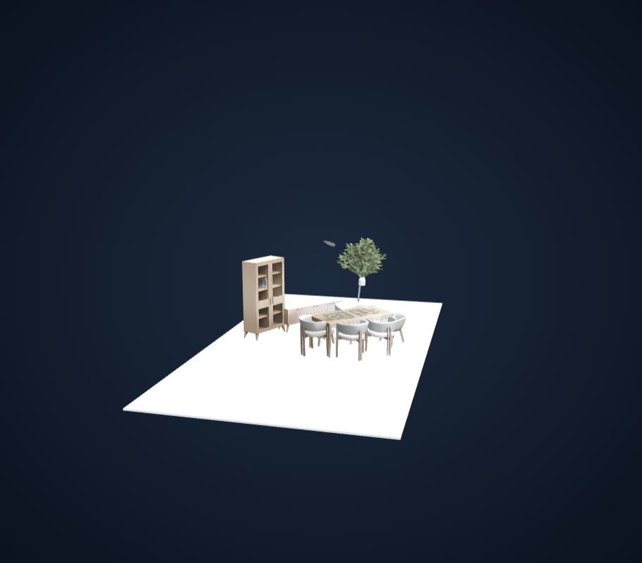
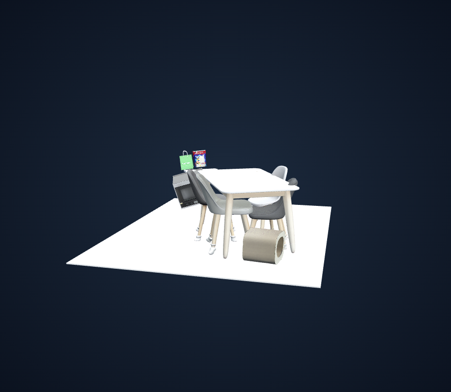
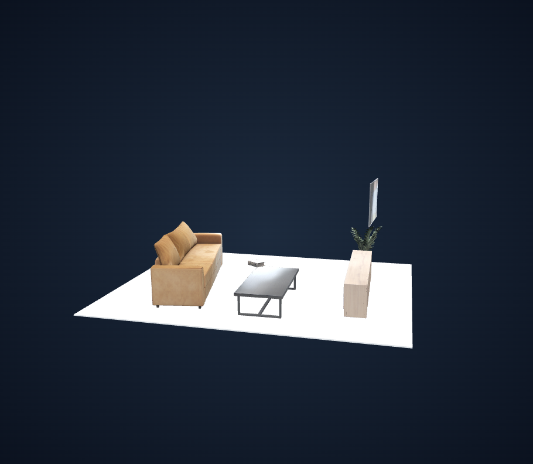

# 개별 객체 Y-up 정렬·접지 검증 — placement v3

## 구현

기존 공통 정렬 후 FLOOR_CATEGORIES에 해당하는 가구에만 개별 정렬을 적용한다. 자기 root 원점을 중심으로 현재 로컬 +Y를 월드 +Y에 맞추는 최소 회전을 구하고, 회전된 실제 메시의 최저 Y가 0이 되도록 Y 이동한다. root XZ와 크기 및 원본 mesh/pose는 보존한다. 전체 객체의 상대 배치는 개별 보정 단계에서 달라진다.

소품·식물·벽걸이·unknown·통합 장면은 공통 정렬 결과 그대로다. 가구 위 소품의 추종이나 지지 관계 추론, 밑면 접촉 면적 최대화, 충돌 해결은 이번 범위에 없다. 최종 bounds로 바닥 크기를 다시 계산한다.

## 검증

- 테스트 56 passed. 기존 공통 정렬 회귀와 개별 pivot/XZ/scale/원본 mesh/pose 보존, 반대 방향, heading 유지, 비대상 불변, nested/off-center geometry, 이전 버전 중복 적용 거절을 포함한다.
- 저장 장면 22개 / 객체 120개 중 지정된 가구 46개를 개별 보정했다. 22개 모두 수치 검사 PASS.
- 대상 가구의 부유: 39 → 0. 공통 정렬 직후와 개별 보정 직후를 비교한 값이다. 허용오차는 기존 contact_tolerance를 사용한다.
- 대상 가구 최저점의 최대 절댓값: 1.39e-17 scene units. 비대상은 공통 정렬 결과와 같은 행렬임을 검사했다.
- 3개 대표 장면은 새 GLB/metadata/preview 및 WebGL 바닥·표시 전환·orbit·zoom·pan·다운로드 해시 검사까지 수행했다. 나머지 19개는 메모리에서 수치 검사했다.
- GPU 재추론 없이 원본 객체 GLB 및 저장된 보정 전 original_matrix로 조립을 복원했다. 기존 run/원본 파일은 보존했다.

## 비교 화면

왼쪽은 공통 정렬만 적용한 v2, 오른쪽은 같은 추론 아티팩트에 개별 정렬을 추가한 v3이다. 각 장면의 자동 fit 카메라를 사용하므로 크기/구도가 완전히 같지는 않다. viewer는 로컬 서버와 runs 폴더가 필요하다.

### a738b5f0

- [공통 정렬](http://127.0.0.1:8082/?run=ebed43601aff402b89b1f3f5a23cc038) · [개별 정렬](http://127.0.0.1:8082/?run=548e695e69c64739a2fc342bc8fffd68)
- 책장·식탁·의자의 직립/접지는 개선됐다. 비대상 식물과 소품은 공통 정렬 위치에 남아 상대적으로 더 떠 보인다.

| 공통 정렬 v2 | 개별 정렬 v3 |
|---|---|
|  |  |

### 2a2d9c3e

- [공통 정렬](http://127.0.0.1:8082/?run=680ba8ee5216419d91aaca589a74dda1) · [개별 정렬](http://127.0.0.1:8082/?run=a2a4105556154c45a9283f98b50a0c6b)
- 식탁·의자들이 더 똑바로 서고 접지했다. hassock으로 분류된 객체는 약 173.5도 회전하여 자세가 크게 달라졌다. 카테고리와 로컬 +Y를 신뢰하는 방식의 한계이며, 올바른 의미적 자세나 충돌 해소를 보장하지 않는다. 비대상 물체의 부유/겹침은 남는다.

| 공통 정렬 v2 | 개별 정렬 v3 |
|---|---|
|  |  |

### 88e01c90

- [공통 정렬](http://127.0.0.1:8082/?run=cc553b61e3254eeaa598064a4d6989c3) · [개별 정렬](http://127.0.0.1:8082/?run=5f4a0ad8b71847eb9e457b2a110ea9e6)
- 소파·테이블·수납장의 Y-up과 접지가 맞춰졌다. TV·식물·책은 이동하지 않아 테이블 위 책 등 소품과 가구의 접촉 관계는 맞지 않을 수 있다.

| 공통 정렬 v2 | 개별 정렬 v3 |
|---|---|
|  |  |

## 전체 수치 검사

| Source | 전체 객체 | 대상 가구 | 부유 전→후 | 결과 |
|---|---:|---:|---:|---|
| `a738b5f0` | 12 | 9 | 9 → 0 | PASS |
| `ceb9b530` | 1 | 0 | 0 → 0 | PASS |
| `f0cd8821` | 5 | 0 | 0 → 0 | PASS |
| `85a4480d` | 1 | 0 | 0 → 0 | PASS |
| `ae39389c` | 1 | 0 | 0 → 0 | PASS |
| `bc18279a` | 6 | 2 | 1 → 0 | PASS |
| `38b6e971` | 12 | 1 | 0 → 0 | PASS |
| `c20feb3c` | 9 | 7 | 6 → 0 | PASS |
| `34534587` | 1 | 0 | 0 → 0 | PASS |
| `f818c1ee` | 1 | 0 | 0 → 0 | PASS |
| `dcff34e6` | 8 | 0 | 0 → 0 | PASS |
| `006bf0d5` | 1 | 0 | 0 → 0 | PASS |
| `ecbbf289` | 3 | 0 | 0 → 0 | PASS |
| `e88df977` | 5 | 0 | 0 → 0 | PASS |
| `2a2d9c3e` | 10 | 6 | 5 → 0 | PASS |
| `330daeb8` | 1 | 0 | 0 → 0 | PASS |
| `88e01c90` | 6 | 3 | 2 → 0 | PASS |
| `8c3edc6d` | 1 | 0 | 0 → 0 | PASS |
| `827ffb7b` | 1 | 0 | 0 → 0 | PASS |
| `345b6371` | 12 | 6 | 5 → 0 | PASS |
| `4e11dbfa` | 12 | 4 | 3 → 0 | PASS |
| `a69ab48a` | 11 | 8 | 8 → 0 | PASS |

## 남는 한계

최저점 접촉과 로컬 Y-up 일치를 보장하는 방식이다. 다리 전체 접촉, 메시 자체의 실제 직립, 물체 간 충돌은 보장하지 않는다. 원본 +Y가 틀린 객체나 오분류 객체도 지정된 이름이면 회전한다. 소품은 따라 움직이지 않으므로 가구와의 기존 접촉이 깨질 수 있다. 개별 정렬 후 모든 객체의 평균 Y-up은 다시 +Y와 달라질 수 있으며, 글로벌 단계 평균과 최종 평균을 메타데이터에 따로 기록한다.

원본 수치/브라우저 근거는 `runs/individual_alignment_validation/`, 새 run의 `logs/placement.json`과 `logs/artifact_validation.json`에 있다. 재처리 진단 스크립트는 로컬 `.runtime/validate_individual_alignment.py`다. v1/v2 결과에 v3를 바로 덮어 적용하지 않고 보정 전 조립 결과에서 새로 시작한다.
