# Sample Before / After Comparison

## 1. 개요

전체 29개 입력: PASS **22**, PARTIAL **0**, FAIL **7**. 새 GLB 22개, 새 floor 22개, After viewer 검증 통과 22개.

Before는 저장된 기존 원본 결과이고, After는 사용자 승인 후 현재 production 경로로 새로 수행한 RAM++ → SAM3 → SAM3D → 배치 보정 → 바닥 생성 → GLB/preview 결과다. 이전 CPU 재처리 결과를 새 추론으로 사용하지 않았다.

기존 run은 EXIF 정규화 RGB 픽셀 SHA가 정확히 일치하는 원본 완료 결과 중 가장 최근 것으로 매칭했다. Before 22개가 매칭됐고 7개는 누락이다. 원본 입력과 기존 GLB/preview를 보존했다.

**해석 주의:** 새 GPU 추론이므로 객체 추출·형상 자체도 기존 run과 달라질 수 있다. 아래 화면 차이를 배치 보정만의 효과로 단정하지 않는다. 접촉 통계의 전/후는 각 새 run 내부의 보정 전/후이며, 과거 Before run과의 통계 비교가 아니다.

## 2. 실행 환경

- Branch: `main`; 실행 HEAD: `4c15f6e55632acde37b077351fb5ccdde2c0ea85`.
- 해당 HEAD 위의 기존 미커밋 placement/floor 구현을 사용했다. 정확한 소스 SHA-256은 함께 제공하는 JSON에 기록했다. 기존 사용자 구현 변경은 이번 문서 commit에 포함하지 않는다.
- Windows / Python 3.11.9 / 기존 `.venv`, RunPod endpoint `8dzbkfrxys43hb`, 기존 S3 전송 설정.
- GPU 추론은 기존 배포 worker image tag `8a0bcaa35`를 사용했다. worker를 새 HEAD로 재배포하지 않았다. worker의 파일별 실제 SHA는 각 행의 `worker_implementation`, 현재 로컬 후처리 코드는 최상위 `implementation_sha256`에 별도로 기록한다. 따라서 로컬 HEAD 전체가 GPU에서 실행됐다는 의미는 아니다.
- 이전 자동 승인 심사 차단 후 사용자가 22개 이미지 외부 전송 및 GPU 비용을 명시 승인하여 실행했다. 7개는 16MP 입력 제한으로 실제 로컬 HTTP 400이 발생했으며 임의 축소하지 않았다.

- 첫 2개는 production HTTP 서버로 제출했다. 이후 검증 실행기는 같은 `create_run` / `configured_pipeline().run` production 함수를 호출하고 최대 3개 run의 전송·다운로드·렌더링을 겹쳤다. 기존 endpoint의 GPU 동시 실행 한도 1개는 변경하지 않았다. 객체 생성·배치·바닥 알고리즘은 동일하다.

```powershell
.venv\Scripts\python.exe scripts/compare_all_samples.py --manifest runs/all_samples_comparison/20260929/index.json
# 기존 start_scene_web.ps1과 같은 RunPod 환경을 사용한 나머지 batch
.venv\Scripts\python.exe scripts/run_sample_batch.py --manifest runs/all_samples_comparison/20260929/index.json
.venv\Scripts\python.exe scripts/report_sample_comparison.py --manifest runs/all_samples_comparison/20260929/index.json
.venv\Scripts\python.exe -m pytest -q -p no:cacheprovider
node --check web/compare-sample.mjs
```

### Viewer와 산출물 보존

실제 URL 형식은 `/?run=<run-id>`다. 고정 공개 host는 설정되어 있지 않다. 아래 로컬 Viewer 링크는 **D:\MapMaker의 runs를 보유한 컴퓨터에서 서버가 실행 중일 때만** 유효하다. 다른 환경은 `{MAPMAKER_BASE_URL}/?run=<run-id>`와 해당 run 디렉터리 복원이 필요하다. 공개 URL을 임의 생성하지 않았다.

`runs/`는 기존 정책대로 Git에서 제외하며 input/masks/objects/scene.glb/metadata/previews/logs를 로컬에 보존한다. GitHub에서 바로 볼 수 있는 입력 축소본과 Before/After preview만 `docs/assets/sample_comparison/`에 commit한다. Preview는 같은 oblique 방향을 사용하나 scene bounds에 따라 화면 배율이 달라진다.

비교 표의 CPU preview는 바닥을 먼저 그리는 방식이므로 바닥 아래 형상이 위에 보일 수 있다. 정확한 가림은 별도 After WebGL 화면과 Viewer에서 확인한다. WebGL 캡처는 viewer 기본 카메라이며 비교 표의 oblique 카메라와는 다르다.

## 3. 전체 결과 요약

PASS는 산출물·floor·placement·viewer 검사와 객체 생성이 모두 성공했다는 뜻이다. 시각적 품질이 완벽하다는 뜻은 아니다. PARTIAL은 생성 결과는 있으나 일부 검사 또는 객체 생성 실패가 있다.

| Sample | Before | After | Viewer | Result |
|---|---|---|---|---|
| [5MrJb0VLPeu5pWNey2XE3AE5mqAXdSIe….jpg](#sample-01) | 09c38164 | a738b5f0 | [Before](http://127.0.0.1:8082/?run=09c38164b7784d95a2d8856875c497fd) / [After](http://127.0.0.1:8082/?run=a738b5f0653a430bbfa9650a6b98316a) | PASS |
| [8xa39rx4u5sqcekrqskwxmnafwyz.png](#sample-02) | 665e1cdb | ceb9b530 | [Before](http://127.0.0.1:8082/?run=665e1cdbc01c454e81daa296ca3def4c) / [After](http://127.0.0.1:8082/?run=ceb9b530a33847998e287357e0aadc86) | PASS |
| [a13d86d90a88538ce3427fe524a79857cbd9b0ae.png](#sample-03) | 21674af9 | f0cd8821 | [Before](http://127.0.0.1:8082/?run=21674af9d4fe41d48d57b0697b55c696) / [After](http://127.0.0.1:8082/?run=f0cd8821cd764c54b6c83bc32e000503) | PASS |
| [alexandra-gorn-JIUjvqe2ZHg-unsplash.jpg](#sample-04) | MISSING | — | 없음 | FAIL |
| [B0yMng87-QPZy6YxEl1ssQEFb_12gluF….jpg](#sample-05) | 13904c85 | 85a4480d | [Before](http://127.0.0.1:8082/?run=13904c85687049dfb0a592cfadf75ccf) / [After](http://127.0.0.1:8082/?run=85a4480ddfdc4e7fad506194143fc175) | PASS |
| [b56sFfaPgkefPFYeBio8ADIH5j84GCng….jpg](#sample-06) | 199672db | ae39389c | [Before](http://127.0.0.1:8082/?run=199672dbca6e4d2da59822262fae88a1) / [After](http://127.0.0.1:8082/?run=ae39389c95a24234b919073ba1fc9057) | PASS |
| [ca4f0d0e-b693-4985-9abf-23a69a8b37a1.jpg](#sample-07) | 7dc137b8 | bc18279a | [Before](http://127.0.0.1:8082/?run=7dc137b805ce41f985ba9b37587b6670) / [After](http://127.0.0.1:8082/?run=bc18279a89b344edaeeeb0329fdd4d06) | PASS |
| [CbJCJsFdnzIdxwKJWBi44TSwXU7QZShG….jpg](#sample-08) | 076a099b | 38b6e971 | [Before](http://127.0.0.1:8082/?run=076a099b71814786acd3979a31b57124) / [After](http://127.0.0.1:8082/?run=38b6e971702f4a549ef13e0833d5589b) | PASS |
| [dan-begel-YE7nAeaWS4w-unsplash.jpg](#sample-09) | MISSING | — | 없음 | FAIL |
| [fp_eRye2yOmskbXBBLbNnJqI7wZNaZNf….jpg](#sample-10) | 0831486b | c20feb3c | [Before](http://127.0.0.1:8082/?run=0831486bdcf741e18fca7953be03090f) / [After](http://127.0.0.1:8082/?run=c20feb3c7ba14e11a394ff3dd3d5b558) | PASS |
| [frank-huang-8E_RqlT7RUs-unsplash.jpg](#sample-11) | MISSING | — | 없음 | FAIL |
| [g31sErZDtH2kz-tEqjrjWker3lTDkJs7….jpg](#sample-12) | 38abfa64 | 34534587 | [Before](http://127.0.0.1:8082/?run=38abfa6472324289a0983cb386764aef) / [After](http://127.0.0.1:8082/?run=34534587988241088830cdb0a296cbbb) | PASS |
| [hichem-meghachou-7I-Rj_E9ihI-unsplash.jpg](#sample-13) | 2b056880 | f818c1ee | [Before](http://127.0.0.1:8082/?run=2b0568809830463899c2705b4321fb8c) / [After](http://127.0.0.1:8082/?run=f818c1ee82294857a1146591d6e29b9c) | PASS |
| [HJBLjCUWEAAMNIM.jpg](#sample-14) | 7f61267d | dcff34e6 | [Before](http://127.0.0.1:8082/?run=7f61267de9764daabb786f0a3fc94540) / [After](http://127.0.0.1:8082/?run=dcff34e672034156b9a72d453a5fdbe0) | PASS |
| [image_0001.jpg](#sample-15) | 574cb4de | 006bf0d5 | [Before](http://127.0.0.1:8082/?run=574cb4de90e34bb684518fd4a459164a) / [After](http://127.0.0.1:8082/?run=006bf0d5a4d3428ab1b8eb9e1d0061f5) | PASS |
| [images.jpg](#sample-16) | ac50e437 | ecbbf289 | [Before](http://127.0.0.1:8082/?run=ac50e4379b3a4a278f470514e44d0516) / [After](http://127.0.0.1:8082/?run=ecbbf289880e45a5b8c1e8726944b982) | PASS |
| [input.jpg](#sample-17) | 85f58142 | e88df977 | [Before](http://127.0.0.1:8082/?run=85f5814232a74b77ab05e21e252027ae) / [After](http://127.0.0.1:8082/?run=e88df9777116431e9d6ce93b0adf8186) | PASS |
| [julia-aX1TTOuq83M-unsplash.jpg](#sample-18) | MISSING | — | 없음 | FAIL |
| [KakaoTalk_20260829_164738573.jpg](#sample-19) | d57fea29 | 2a2d9c3e | [Before](http://127.0.0.1:8082/?run=d57fea2928e6401683c9499f3f4a4a4f) / [After](http://127.0.0.1:8082/?run=2a2d9c3e0eb64d80862fc6b697217d8a) | PASS |
| [l4Oe0Mu-LKBiOcEUE3ShgfPgdMIGE0ho….jpg](#sample-20) | f26922c3 | 330daeb8 | [Before](http://127.0.0.1:8082/?run=f26922c3015947b0b14ae08dac796932) / [After](http://127.0.0.1:8082/?run=330daeb866454b17a0a95f62a58706c0) | PASS |
| [living_room.jpg](#sample-21) | 7bcd1654 | 88e01c90 | [Before](http://127.0.0.1:8082/?run=7bcd165489c84f6e9436e983f474c017) / [After](http://127.0.0.1:8082/?run=88e01c90565644c79b5e31312ebebca7) | PASS |
| [p4oC_SMMAWoxQP0Xb92NkrPRCk-o_WPN….jpg](#sample-22) | d66a457c | 8c3edc6d | [Before](http://127.0.0.1:8082/?run=d66a457c4e6a4aba8d619d646a50fc68) / [After](http://127.0.0.1:8082/?run=8c3edc6d589d4b988ba21938a36e52d4) | PASS |
| [pexels-baran-kilic-640071598-18151871.jpg](#sample-23) | MISSING | — | 없음 | FAIL |
| [pexels-padrechaks-20422959.jpg](#sample-24) | MISSING | — | 없음 | FAIL |
| [PGnAvG-MUEDZ146fq1MHxdqV-UyNuwFL….jpg](#sample-25) | b3d59395 | 827ffb7b | [Before](http://127.0.0.1:8082/?run=b3d5939515de4d5ba97e4777c195c634) / [After](http://127.0.0.1:8082/?run=827ffb7b8d474c84aa972e5032233a8f) | PASS |
| [qLNgF9x-U_xG3reZP3Px6-uHxTOgcdVj….jpg](#sample-26) | 67281f01 | 345b6371 | [Before](http://127.0.0.1:8082/?run=67281f01271b4c86975c9cdbd5767ff8) / [After](http://127.0.0.1:8082/?run=345b637123704f62984036f96631fe47) | PASS |
| [slR2ZfS3jpf_xRfH8yirgKg2ZFNhT9KP….jpg](#sample-27) | 8c4ac2b9 | 4e11dbfa | [Before](http://127.0.0.1:8082/?run=8c4ac2b9b70d4ca7a0336ff065db5176) / [After](http://127.0.0.1:8082/?run=4e11dbfa61c549dcb96216005d8fea87) | PASS |
| [spacejoy-9M66C_w_ToM-unsplash.jpg](#sample-28) | MISSING | — | 없음 | FAIL |
| [vKDU8NwlREulF-1NM8tvH43Bmkrpfmuo….jpg](#sample-29) | 9d0fe038 | a69ab48a | [Before](http://127.0.0.1:8082/?run=9d0fe038d6c34b5cb9d5e61af49fc035) / [After](http://127.0.0.1:8082/?run=a69ab48af7454c58a574baed787f4a6e) | PASS |

<a id="sample-01"></a>
## 01. 5MrJb0VLPeu5pWNey2XE3AE5mqAXdSIeMg3rOIJIeWpA4TcxyLh5AK3y9gCTXQWQ-2yh5n4XCU6M5aV6gCdLq_Co1O9RGajYjnlSbrrM9lcI409QFCL7dP_5HYuWz04mSDhrlM9zGxCaNrGI4-m7cUKm4ol253hpD9BQ79lcHzgFbr1qnzmPoiVsWJj3JAoo.jpg


- 입력: `samples/5MrJb0VLPeu5pWNey2XE3AE5mqAXdSIeMg3rOIJIeWpA4TcxyLh5AK3y9gCTXQWQ-2yh5n4XCU6M5aV6gCdLq_Co1O9RGajYjnlSbrrM9lcI409QFCL7dP_5HYuWz04mSDhrlM9zGxCaNrGI4-m7cUKm4ol253hpD9BQ79lcHzgFbr1qnzmPoiVsWJj3JAoo.jpg` (1024 × 604)

| Before | After |
|---|---|
|  | 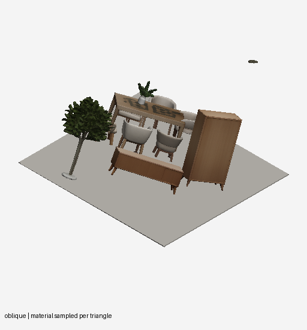 |

<details>
<summary>After WebGL 실제 화면 — 기본 카메라</summary>


</details>

- [Before Viewer — 로컬 전용](http://127.0.0.1:8082/?run=09c38164b7784d95a2d8856875c497fd)
- Before run: `runs/09c38164b7784d95a2d8856875c497fd/`; GLB: `runs/09c38164b7784d95a2d8856875c497fd/scene.glb`; preview: `runs/09c38164b7784d95a2d8856875c497fd/previews/meshes/oblique.png`.
- [After Viewer — 로컬 전용](http://127.0.0.1:8082/?run=a738b5f0653a430bbfa9650a6b98316a)
- After run: `runs/a738b5f0653a430bbfa9650a6b98316a/`; GLB: `runs/a738b5f0653a430bbfa9650a6b98316a/scene.glb`; preview: `runs/a738b5f0653a430bbfa9650a6b98316a/previews/meshes/oblique.png`.
- Before 생성 시각: `2026-09-28T10:45:35.084029+00:00`; 생성 객체 12개; 기존 별도 background floor 없음.

### 비교와 검증

- Before 관찰: 식탁·의자·수납장·식물이 기울어진 구도로 분리되어 있고 공통 바닥은 없다. 우측 상단에 작은 분리 조각도 보인다.
- After에는 회색 바닥 면이 생겨 식탁·의자·수납장의 지지 기준이 보인다. 새 run의 지지 객체 9개는 접촉 보정 후 같은 바닥 높이에 맞춰졌다. 두 화면 모두 큰 수납장과 식탁/의자가 밀집하고, 위쪽의 작은 분리 조각과 기울어진 식물은 남아 있다. 바닥 추가로 화면 자동 배율이 작아져 객체 크기 자체를 직접 비교할 수는 없다.
- 상태: **PASS**.
- 실행 복구 기록: Fresh GPU result was completed by the existing server without local floor finalization. After replacing the local server with current source, the same fresh result was finalized via production finalize_scene; no repeated GPU inference. Audit console UTF-8 and server busy waiting were corrected.
- 새 객체 12개; 생성 실패 0개; floor True; 위치 이동 9개.
- 새 run 내부 접촉 통계: 부유 4 → 0, 관통 4 → 0 (floor-supported 객체만).
- floor X/Z 크기: `[1.8481715433760815, 1.5851466001001104]` (모델 좌표 단위; 실측 m 아님).
- 산출물 검사: True; After viewer 검사: True; Before viewer 검사: True.
- RunPod job: `ff9e0956-c6fe-4d99-a60d-dd1678dc033c-e2`; 실행 시각: `2026-09-29T05:38:56.066057+00:00`.

<a id="sample-02"></a>
## 02. 8xa39rx4u5sqcekrqskwxmnafwyz.png


- 입력: `samples/8xa39rx4u5sqcekrqskwxmnafwyz.png` (2320 × 1080)

| Before | After |
|---|---|
|  | 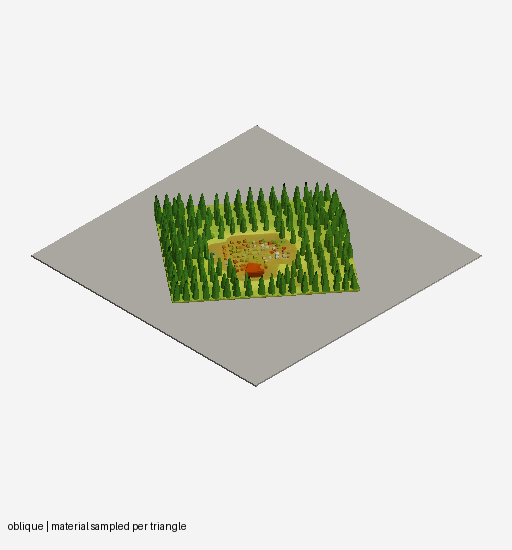 |

<details>
<summary>After WebGL 실제 화면 — 기본 카메라</summary>

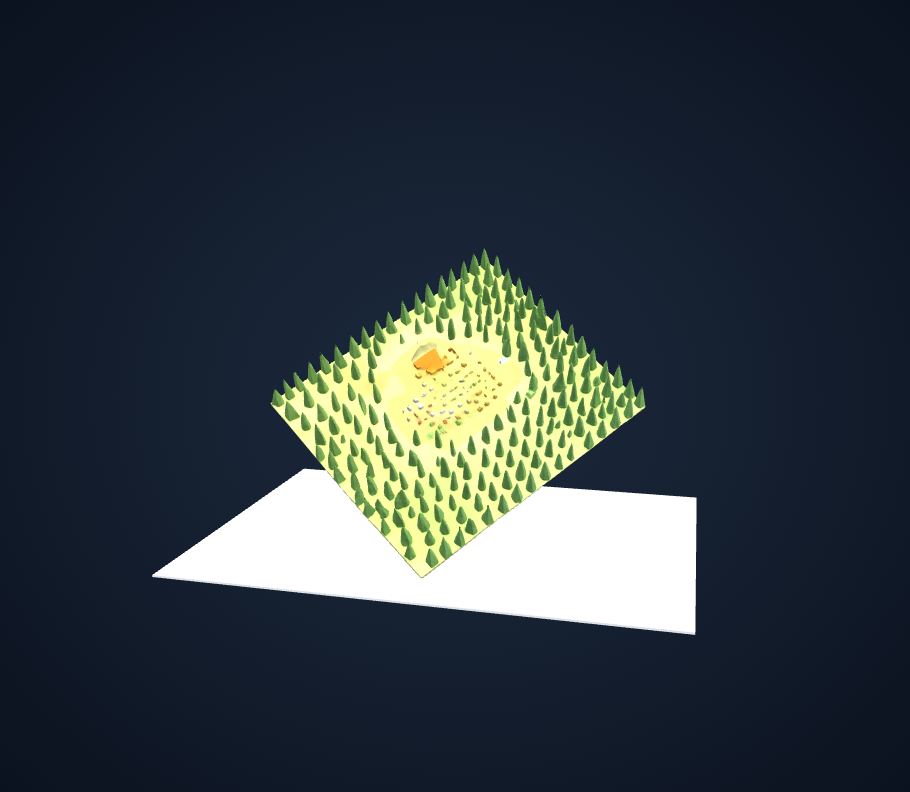

</details>

- [Before Viewer — 로컬 전용](http://127.0.0.1:8082/?run=665e1cdbc01c454e81daa296ca3def4c)
- Before run: `runs/665e1cdbc01c454e81daa296ca3def4c/`; GLB: `runs/665e1cdbc01c454e81daa296ca3def4c/scene.glb`; preview: `runs/665e1cdbc01c454e81daa296ca3def4c/previews/meshes/oblique.png`.
- [After Viewer — 로컬 전용](http://127.0.0.1:8082/?run=ceb9b530a33847998e287357e0aadc86)
- After run: `runs/ceb9b530a33847998e287357e0aadc86/`; GLB: `runs/ceb9b530a33847998e287357e0aadc86/scene.glb`; preview: `runs/ceb9b530a33847998e287357e0aadc86/previews/meshes/oblique.png`.
- Before 생성 시각: `2026-09-28T10:55:21.919217+00:00`; 생성 객체 1개; 기존 별도 background floor 없음.

### 비교와 검증

- Before 관찰: 풀이 붙은 긴 띠 모양의 mesh 하나가 보인다. 객체별 실내 배치 비교에 적합한 결과가 아니다.
- Before와 After 모두 숲/지형이 하나의 길고 기울어진 띠 형태로 복원됐다. After에 넓은 회색 바닥만 추가됐고, 기울어진 지형의 대부분이 그 위에 떠 보이는 형태는 남아 있다. floor-supported 객체가 0개라 접촉 보정은 적용되지 않았다. 원본의 물·텐트·작물 등을 개별 객체로 복원하는 문제도 해결되지 않았다.
- 상태: **PASS**.
- 새 객체 1개; 생성 실패 0개; floor True; 위치 이동 0개.
- 새 run 내부 접촉 통계: 부유 0 → 0, 관통 0 → 0 (floor-supported 객체만).
- floor X/Z 크기: `[4.40502341173099, 3.2339325301397412]` (모델 좌표 단위; 실측 m 아님).
- 산출물 검사: True; After viewer 검사: True; Before viewer 검사: True.
- RunPod job: `1a633563-c426-4d98-a5aa-cfd1d85dc39f-e2`; 실행 시각: `2026-09-29T05:55:57.580211+00:00`.

<a id="sample-03"></a>
## 03. a13d86d90a88538ce3427fe524a79857cbd9b0ae.png


- 입력: `samples/a13d86d90a88538ce3427fe524a79857cbd9b0ae.png` (586 × 396)

| Before | After |
|---|---|
|  | 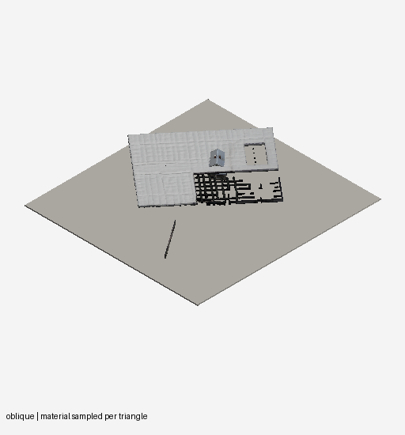 |

<details>
<summary>After WebGL 실제 화면 — 기본 카메라</summary>

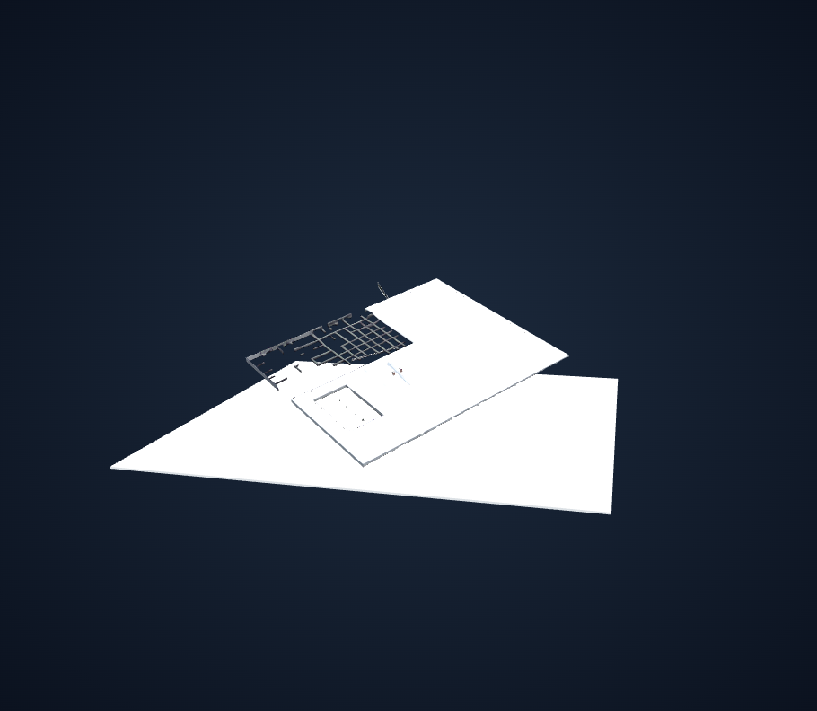

</details>

- [Before Viewer — 로컬 전용](http://127.0.0.1:8082/?run=21674af9d4fe41d48d57b0697b55c696)
- Before run: `runs/21674af9d4fe41d48d57b0697b55c696/`; GLB: `runs/21674af9d4fe41d48d57b0697b55c696/scene.glb`; preview: `runs/21674af9d4fe41d48d57b0697b55c696/previews/meshes/oblique.png`.
- [After Viewer — 로컬 전용](http://127.0.0.1:8082/?run=f0cd8821cd764c54b6c83bc32e000503)
- After run: `runs/f0cd8821cd764c54b6c83bc32e000503/`; GLB: `runs/f0cd8821cd764c54b6c83bc32e000503/scene.glb`; preview: `runs/f0cd8821cd764c54b6c83bc32e000503/previews/meshes/oblique.png`.
- Before 생성 시각: `2026-09-28T11:05:41.106891+00:00`; 생성 객체 5개; 기존 별도 background floor 없음.

### 비교와 검증

- Before 관찰: 넓은 회색 평판과 검은 파편이 보이며 집·울타리의 입체 배치를 명확히 읽기 어렵다.
- After에는 회색 지지면이 추가됐지만 집은 여전히 얇은 회색 평판과 검은 골격/파편처럼 보인다. 떨어진 가느다란 조각과 평판의 기울기는 유지된다. 지지 대상으로 분류된 객체가 0개여서 위치 보정 효과는 없고, 원본 주택의 입체 형상 복원 실패가 주된 한계다.
- 상태: **PASS**.
- 새 객체 5개; 생성 실패 0개; floor True; 위치 이동 0개.
- 새 run 내부 접촉 통계: 부유 0 → 0, 관통 0 → 0 (floor-supported 객체만).
- floor X/Z 크기: `[4.847543388461405, 5.037587671966717]` (모델 좌표 단위; 실측 m 아님).
- 산출물 검사: True; After viewer 검사: True; Before viewer 검사: True.
- RunPod job: `6af2a97f-af55-42cb-9779-ada78a91f5a8-e1`; 실행 시각: `2026-09-29T06:05:23.423493+00:00`.

<a id="sample-04"></a>
## 04. alexandra-gorn-JIUjvqe2ZHg-unsplash.jpg


- 입력: `samples/alexandra-gorn-JIUjvqe2ZHg-unsplash.jpg` (5141 × 3432)

| Before | After |
|---|---|
| BEFORE MISSING | After preview 없음 |

- Before Viewer 없음: 정확히 매칭되는 기존 완료 run 없음.
- After Viewer 없음: 로컬 입력 제한으로 새 run이 생성되지 않음.

### 비교와 검증

- Before 관찰: 매칭되는 기존 완료 run/preview가 없어 Before를 평가할 수 없다.
- 새 결과 없음; 시각적 개선/회귀를 판정할 수 없다.
- 상태: **FAIL**.
- 실패 원인: {"error": "Please use an image with at most 16 megapixels"}

<a id="sample-05"></a>
## 05. B0yMng87-QPZy6YxEl1ssQEFb_12gluF-a3W_mDjVJXYAfZjJCTiz31ryltReAixhwtGZ3W2z-juGvI49scRNCrGm1OwbMpics6giwZNXhOeKeLiSxJStFGoy7_6ONvkieN2ukysror9ZTsCPxU5RdSBku9fHHRqEGuvK9SgR3Y9vZ8vI1-30bmfKLHI1-XC.jpg


- 입력: `samples/B0yMng87-QPZy6YxEl1ssQEFb_12gluF-a3W_mDjVJXYAfZjJCTiz31ryltReAixhwtGZ3W2z-juGvI49scRNCrGm1OwbMpics6giwZNXhOeKeLiSxJStFGoy7_6ONvkieN2ukysror9ZTsCPxU5RdSBku9fHHRqEGuvK9SgR3Y9vZ8vI1-30bmfKLHI1-XC.jpg` (1213 × 832)

| Before | After |
|---|---|
|  | 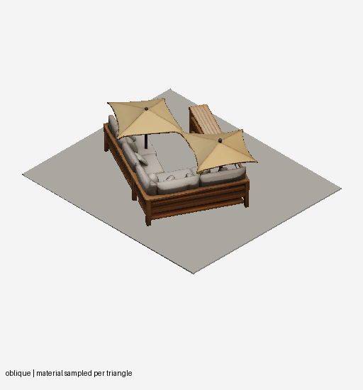 |

<details>
<summary>After WebGL 실제 화면 — 기본 카메라</summary>

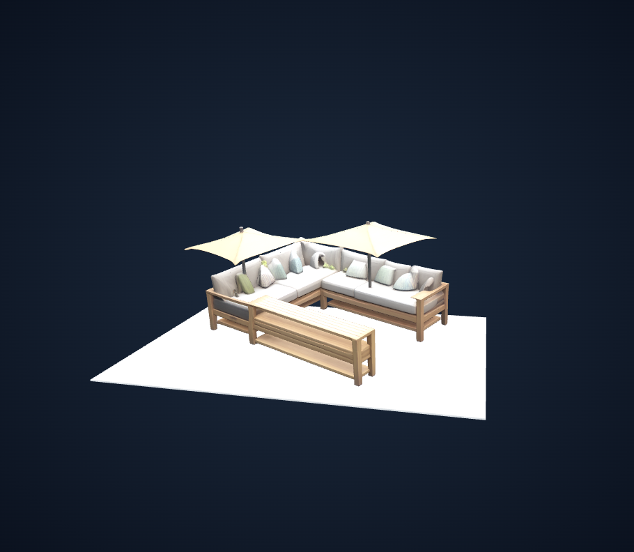

</details>

- [Before Viewer — 로컬 전용](http://127.0.0.1:8082/?run=13904c85687049dfb0a592cfadf75ccf)
- Before run: `runs/13904c85687049dfb0a592cfadf75ccf/`; GLB: `runs/13904c85687049dfb0a592cfadf75ccf/scene.glb`; preview: `runs/13904c85687049dfb0a592cfadf75ccf/previews/meshes/oblique.png`.
- [After Viewer — 로컬 전용](http://127.0.0.1:8082/?run=85a4480ddfdc4e7fad506194143fc175)
- After run: `runs/85a4480ddfdc4e7fad506194143fc175/`; GLB: `runs/85a4480ddfdc4e7fad506194143fc175/scene.glb`; preview: `runs/85a4480ddfdc4e7fad506194143fc175/previews/meshes/oblique.png`.
- Before 생성 시각: `2026-09-28T11:07:28.306334+00:00`; 생성 객체 1개; 기존 별도 background floor 없음.

### 비교와 검증

- Before 관찰: 파라솔과 야외 좌석이 하나의 큰 구조로 묶여 보인다. 별도 생성 background floor는 없다.
- After에서 야외 가구 아래 회색 바닥이 생겼다. Before와 마찬가지로 소파와 파라솔이 하나의 통합 객체로 묶여 있고, 원본의 중앙 테이블과 개별 가구 구성이 명확히 분리되지 않는다. 지지 대상으로 분류된 객체가 0개여서 바닥 추가 외의 접촉 보정은 없으며 통합 형상과 기울기는 그대로다.
- 상태: **PASS**.
- 새 객체 1개; 생성 실패 0개; floor True; 위치 이동 0개.
- 새 run 내부 접촉 통계: 부유 0 → 0, 관통 0 → 0 (floor-supported 객체만).
- floor X/Z 크기: `[3.982070515535297, 3.4658910681246664]` (모델 좌표 단위; 실측 m 아님).
- 산출물 검사: True; After viewer 검사: True; Before viewer 검사: True.
- RunPod job: `f6adf33f-1c7b-499f-af9c-6e97f8310dff-e2`; 실행 시각: `2026-09-29T06:05:23.495771+00:00`.

<a id="sample-06"></a>
## 06. b56sFfaPgkefPFYeBio8ADIH5j84GCngk7CWJnJ3RzaYXvvDZ7NODDOhzCsj1XdHE4CJMqEm6yuVIDXQ52oH8UcRik85dvvqqg32XO_sDJs0zi9uSCUhmWR88pALGx8Vh3ZyLgJ_6_wL_NevQv--kwsN-sdr38bODDTADOoOg52lgTQgsTtfuyPvaMB26kx-.jpg


- 입력: `samples/b56sFfaPgkefPFYeBio8ADIH5j84GCngk7CWJnJ3RzaYXvvDZ7NODDOhzCsj1XdHE4CJMqEm6yuVIDXQ52oH8UcRik85dvvqqg32XO_sDJs0zi9uSCUhmWR88pALGx8Vh3ZyLgJ_6_wL_NevQv--kwsN-sdr38bODDTADOoOg52lgTQgsTtfuyPvaMB26kx-.jpg` (800 × 448)

| Before | After |
|---|---|
|  | 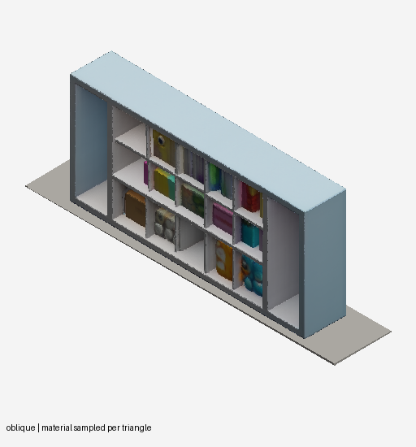 |

<details>
<summary>After WebGL 실제 화면 — 기본 카메라</summary>

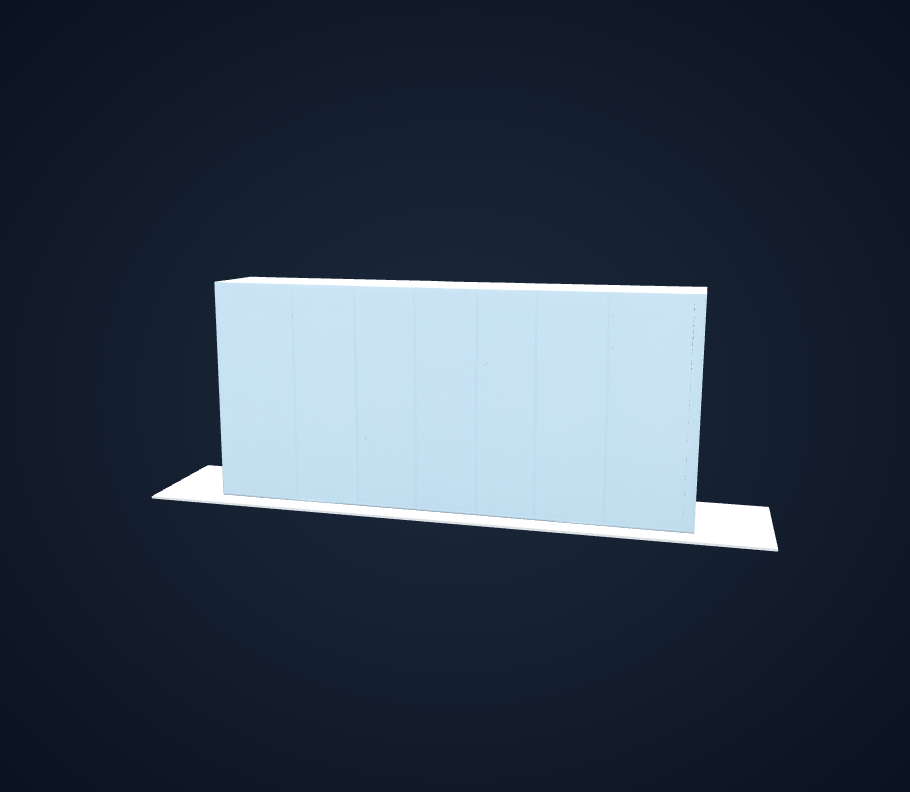

</details>

- [Before Viewer — 로컬 전용](http://127.0.0.1:8082/?run=199672dbca6e4d2da59822262fae88a1)
- Before run: `runs/199672dbca6e4d2da59822262fae88a1/`; GLB: `runs/199672dbca6e4d2da59822262fae88a1/scene.glb`; preview: `runs/199672dbca6e4d2da59822262fae88a1/previews/meshes/oblique.png`.
- [After Viewer — 로컬 전용](http://127.0.0.1:8082/?run=ae39389c95a24234b919073ba1fc9057)
- After run: `runs/ae39389c95a24234b919073ba1fc9057/`; GLB: `runs/ae39389c95a24234b919073ba1fc9057/scene.glb`; preview: `runs/ae39389c95a24234b919073ba1fc9057/previews/meshes/oblique.png`.
- Before 생성 시각: `2026-09-28T11:08:30.723485+00:00`; 생성 객체 1개; 기존 별도 background floor 없음.

### 비교와 검증

- Before 관찰: 다색 칸이 있는 수납장 모양 구조 하나가 보인다. 원본 전체 공간의 객체별 복원 여부는 제한적이다.
- 책장 아래에 얇은 회색 바닥이 추가되어 바닥 기준이 생겼다. 책장과 책들은 Before와 유사한 하나의 긴 선반 형상이며, 원본의 바닥에 앉은 큰 인형들은 별도 객체로 복원되지 않았다. 지지 객체 분류가 0개이므로 위치 이동 효과는 없고, 이번 차이는 바닥 추가다.
- 상태: **PASS**.
- 새 객체 1개; 생성 실패 0개; floor True; 위치 이동 0개.
- 새 run 내부 접촉 통계: 부유 0 → 0, 관통 0 → 0 (floor-supported 객체만).
- floor X/Z 크기: `[3.5246350093650882, 0.67889301829279]` (모델 좌표 단위; 실측 m 아님).
- 산출물 검사: True; After viewer 검사: True; Before viewer 검사: True.
- RunPod job: `4802d177-1ce6-497a-b358-e3c487bb6838-e2`; 실행 시각: `2026-09-29T06:13:38.557521+00:00`.

<a id="sample-07"></a>
## 07. ca4f0d0e-b693-4985-9abf-23a69a8b37a1.jpg


- 입력: `samples/ca4f0d0e-b693-4985-9abf-23a69a8b37a1.jpg` (1950 × 1300)

| Before | After |
|---|---|
|  | 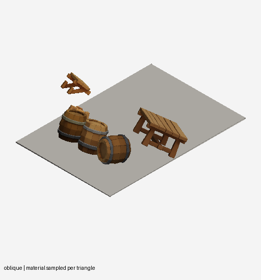 |

<details>
<summary>After WebGL 실제 화면 — 기본 카메라</summary>

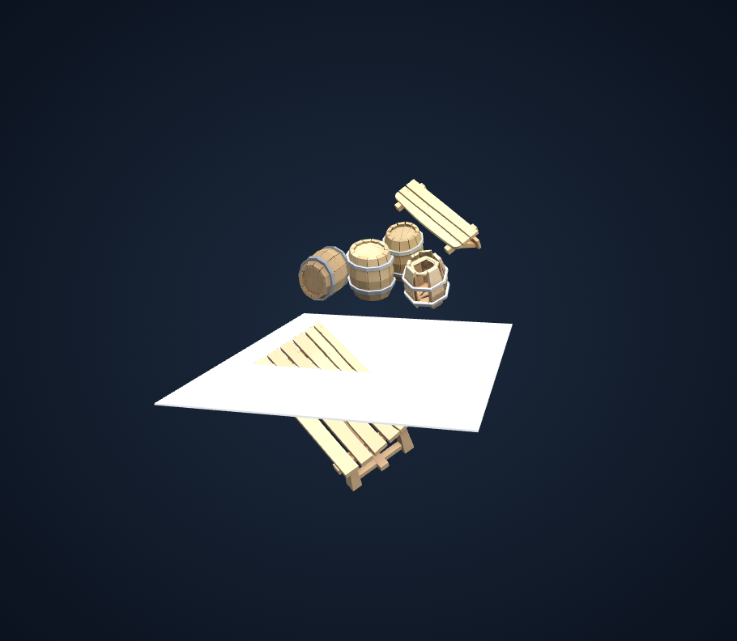

</details>

- [Before Viewer — 로컬 전용](http://127.0.0.1:8082/?run=7dc137b805ce41f985ba9b37587b6670)
- Before run: `runs/7dc137b805ce41f985ba9b37587b6670/`; GLB: `runs/7dc137b805ce41f985ba9b37587b6670/scene.glb`; preview: `runs/7dc137b805ce41f985ba9b37587b6670/previews/meshes/oblique.png`.
- [After Viewer — 로컬 전용](http://127.0.0.1:8082/?run=bc18279a89b344edaeeeb0329fdd4d06)
- After run: `runs/bc18279a89b344edaeeeb0329fdd4d06/`; GLB: `runs/bc18279a89b344edaeeeb0329fdd4d06/scene.glb`; preview: `runs/bc18279a89b344edaeeeb0329fdd4d06/previews/meshes/oblique.png`.
- Before 생성 시각: `2026-09-28T11:09:20.797977+00:00`; 생성 객체 6개; 기존 별도 background floor 없음.

### 비교와 검증

- Before 관찰: 통과 벤치들이 서로 떨어져 있으며 일부 벤치는 다른 높이에 보인다. 공통 지지 바닥은 없다.
- 회색 바닥은 추가됐지만, 위쪽의 분리된 나무 조각과 기울어진 탁자·통 배치는 Before와 유사하게 남아 있다. 두 table 객체는 필요한 이동량이 안전 한도를 넘어 excessive_shift_skipped로 기록되어 위치가 바뀌지 않았다. 지지 객체의 부유 1개·관통 1개가 보정 후에도 그대로이며, 원본 방의 벽과 작은 소품도 복원되지 않았다. 실제 WebGL 화면에서는 바닥이 탁자 중앙을 가로지르며 일부를 가리고, 통 그룹이 바닥 위로 떠 보인다. 바닥 추가로 미해결 관통에 의한 가림이 생긴 표시상 문제다.
- 상태: **PASS**.
- 새 객체 6개; 생성 실패 0개; floor True; 위치 이동 0개.
- 새 run 내부 접촉 통계: 부유 1 → 1, 관통 1 → 1 (floor-supported 객체만).
- floor X/Z 크기: `[0.5188595364316179, 0.748472798748761]` (모델 좌표 단위; 실측 m 아님).
- 산출물 검사: True; After viewer 검사: True; Before viewer 검사: True.
- RunPod job: `0189861f-f564-47f7-b284-7c4d33231683-e1`; 실행 시각: `2026-09-29T06:15:27.458965+00:00`.

<a id="sample-08"></a>
## 08. CbJCJsFdnzIdxwKJWBi44TSwXU7QZShGXq-wRSfSgF9XUi6g8AntJxejO0qTgSGHyy7XB1lQAhH7j_3jLb7X53yta1NPxNOc83NLO1W77OaD_NnosUASbc467Qch7tnVSw1w6BqynijZW9N3RS7VkA1mln-b5GbPwMhlqVjyMR3AqxqX7Bcpt17_me7qJdvs.jpg


- 입력: `samples/CbJCJsFdnzIdxwKJWBi44TSwXU7QZShGXq-wRSfSgF9XUi6g8AntJxejO0qTgSGHyy7XB1lQAhH7j_3jLb7X53yta1NPxNOc83NLO1W77OaD_NnosUASbc467Qch7tnVSw1w6BqynijZW9N3RS7VkA1mln-b5GbPwMhlqVjyMR3AqxqX7Bcpt17_me7qJdvs.jpg` (2560 × 1707)

| Before | After |
|---|---|
|  | 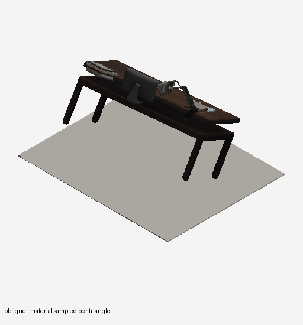 |

<details>
<summary>After WebGL 실제 화면 — 기본 카메라</summary>

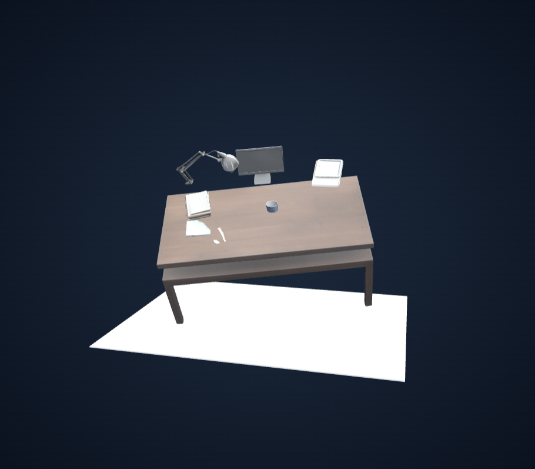

</details>

- [Before Viewer — 로컬 전용](http://127.0.0.1:8082/?run=076a099b71814786acd3979a31b57124)
- Before run: `runs/076a099b71814786acd3979a31b57124/`; GLB: `runs/076a099b71814786acd3979a31b57124/scene.glb`; preview: `runs/076a099b71814786acd3979a31b57124/previews/meshes/oblique.png`.
- [After Viewer — 로컬 전용](http://127.0.0.1:8082/?run=38b6e971702f4a549ef13e0833d5589b)
- After run: `runs/38b6e971702f4a549ef13e0833d5589b/`; GLB: `runs/38b6e971702f4a549ef13e0833d5589b/scene.glb`; preview: `runs/38b6e971702f4a549ef13e0833d5589b/previews/meshes/oblique.png`.
- Before 생성 시각: `2026-09-28T11:26:16.737971+00:00`; 생성 객체 12개; 기존 별도 background floor 없음.

### 비교와 검증

- Before 관찰: 책상과 위의 물체들이 어둡게 보인다. 책상 다리는 있으나 공통 floor geometry는 없다.
- 책상 아래 회색 바닥이 추가됐지만 책상 전체의 기울기와 어두운 형상은 Before와 유사하다. 지지 객체는 책상 1개이며 최저점이 이미 선택된 바닥 높이에 있어 Y 이동은 없었다. 따라서 한쪽 다리가 더 높아 보이는 orientation 문제와 책상 위 소품의 겹침·누락은 해결되지 않았다.
- 상태: **PASS**.
- 새 객체 12개; 생성 실패 0개; floor True; 위치 이동 0개.
- 새 run 내부 접촉 통계: 부유 0 → 0, 관통 0 → 0 (floor-supported 객체만).
- floor X/Z 크기: `[3.156851525573884, 2.4693294892891604]` (모델 좌표 단위; 실측 m 아님).
- 산출물 검사: True; After viewer 검사: True; Before viewer 검사: True.
- RunPod job: `243d721a-9b56-41de-a2bb-1977b89b59e4-e2`; 실행 시각: `2026-09-29T06:16:16.823593+00:00`.

<a id="sample-09"></a>
## 09. dan-begel-YE7nAeaWS4w-unsplash.jpg


- 입력: `samples/dan-begel-YE7nAeaWS4w-unsplash.jpg` (3937 × 5905)

| Before | After |
|---|---|
| BEFORE MISSING | After preview 없음 |

- Before Viewer 없음: 정확히 매칭되는 기존 완료 run 없음.
- After Viewer 없음: 로컬 입력 제한으로 새 run이 생성되지 않음.

### 비교와 검증

- Before 관찰: 매칭되는 기존 완료 run/preview가 없어 Before를 평가할 수 없다.
- 새 결과 없음; 시각적 개선/회귀를 판정할 수 없다.
- 상태: **FAIL**.
- 실패 원인: {"error": "Please use an image with at most 16 megapixels"}

<a id="sample-10"></a>
## 10. fp_eRye2yOmskbXBBLbNnJqI7wZNaZNfkP80C5SW8R81feBrndm8grXAruMEt7n3jCOPKapBKO1-BYfzQrVI70F2jclyDEQg7j_peFK-voT2rH3UYSjTRlLkxtP9JYKAs1P-fOYkti8gQ727Bqi54A0GyR8gyEqBEisFbncIsm4Qar-gL68R6cW8EqsvsuWI.jpg


- 입력: `samples/fp_eRye2yOmskbXBBLbNnJqI7wZNaZNfkP80C5SW8R81feBrndm8grXAruMEt7n3jCOPKapBKO1-BYfzQrVI70F2jclyDEQg7j_peFK-voT2rH3UYSjTRlLkxtP9JYKAs1P-fOYkti8gQ727Bqi54A0GyR8gyEqBEisFbncIsm4Qar-gL68R6cW8EqsvsuWI.jpg` (1200 × 630)

| Before | After |
|---|---|
|  | 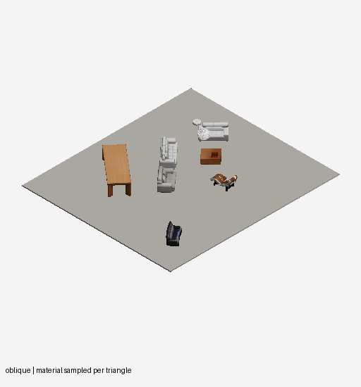 |

<details>
<summary>After WebGL 실제 화면 — 기본 카메라</summary>

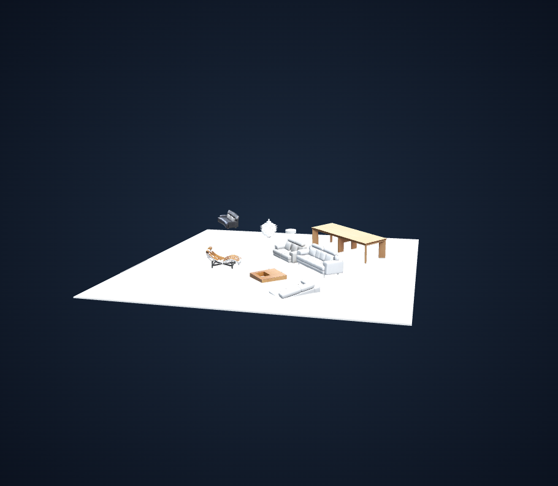

</details>

- [Before Viewer — 로컬 전용](http://127.0.0.1:8082/?run=0831486bdcf741e18fca7953be03090f)
- Before run: `runs/0831486bdcf741e18fca7953be03090f/`; GLB: `runs/0831486bdcf741e18fca7953be03090f/scene.glb`; preview: `runs/0831486bdcf741e18fca7953be03090f/previews/meshes/oblique.png`.
- [After Viewer — 로컬 전용](http://127.0.0.1:8082/?run=c20feb3c7ba14e11a394ff3dd3d5b558)
- After run: `runs/c20feb3c7ba14e11a394ff3dd3d5b558/`; GLB: `runs/c20feb3c7ba14e11a394ff3dd3d5b558/scene.glb`; preview: `runs/c20feb3c7ba14e11a394ff3dd3d5b558/previews/meshes/oblique.png`.
- Before 생성 시각: `2026-09-28T11:46:13.249346+00:00`; 생성 객체 9개; 기존 별도 background floor 없음.

### 비교와 검증

- Before 관찰: 소파·테이블·의자가 넓게 흩어져 있으며 높이와 방향이 제각각인 구도다.
- 넓은 거실의 흩어진 소파·탁자 아래 공통 회색 바닥이 생겼다. 새 run 내부 지지 객체 7개의 부유는 3→1개, 관통은 3→2개로 감소했다. 다만 화면에서 가구의 벌어진 배치와 일부 세워진/기울어진 형상은 남아 있고, 뒤쪽 소파와 앞쪽 의자의 높이 문제도 완전히 해소되지 않았다. 큰 바닥으로 자동 축소되어 세부 확인에는 Viewer 확대가 필요하다. 실제 WebGL에서도 앞쪽의 낮은 소파 일부가 바닥 아래로 가려진다. 새 바닥이 미해결 관통을 가리는 문제를 함께 확인했다.
- 상태: **PASS**.
- 새 객체 9개; 생성 실패 0개; floor True; 위치 이동 3개.
- 새 run 내부 접촉 통계: 부유 3 → 1, 관통 3 → 2 (floor-supported 객체만).
- floor X/Z 크기: `[5.321930420240894, 6.015413393713123]` (모델 좌표 단위; 실측 m 아님).
- 산출물 검사: True; After viewer 검사: True; Before viewer 검사: True.
- RunPod job: `33834932-aff1-4eed-9fd7-7efe0245c905-e1`; 실행 시각: `2026-09-29T06:17:06.451680+00:00`.

<a id="sample-11"></a>
## 11. frank-huang-8E_RqlT7RUs-unsplash.jpg


- 입력: `samples/frank-huang-8E_RqlT7RUs-unsplash.jpg` (3895 × 5843)

| Before | After |
|---|---|
| BEFORE MISSING | After preview 없음 |

- Before Viewer 없음: 정확히 매칭되는 기존 완료 run 없음.
- After Viewer 없음: 로컬 입력 제한으로 새 run이 생성되지 않음.

### 비교와 검증

- Before 관찰: 매칭되는 기존 완료 run/preview가 없어 Before를 평가할 수 없다.
- 새 결과 없음; 시각적 개선/회귀를 판정할 수 없다.
- 상태: **FAIL**.
- 실패 원인: {"error": "Please use an image with at most 16 megapixels"}

<a id="sample-12"></a>
## 12. g31sErZDtH2kz-tEqjrjWker3lTDkJs7oPZFehc61eEp-0DfHYh8wIcTuk6qlwY9pgckesRSSQLokHEF8hWooWk-aHyZJ9D8_FtRwMIPalu4mI938wXfCKYCFLWtn_baGGbPdKoe3d8t0w_IP6EGmrBZ268ZoGGhYXUonftksdBEuBqChMtPUXu_Y9CI0T6R.jpg


- 입력: `samples/g31sErZDtH2kz-tEqjrjWker3lTDkJs7oPZFehc61eEp-0DfHYh8wIcTuk6qlwY9pgckesRSSQLokHEF8hWooWk-aHyZJ9D8_FtRwMIPalu4mI938wXfCKYCFLWtn_baGGbPdKoe3d8t0w_IP6EGmrBZ268ZoGGhYXUonftksdBEuBqChMtPUXu_Y9CI0T6R.jpg` (1920 × 1080)

| Before | After |
|---|---|
|  | 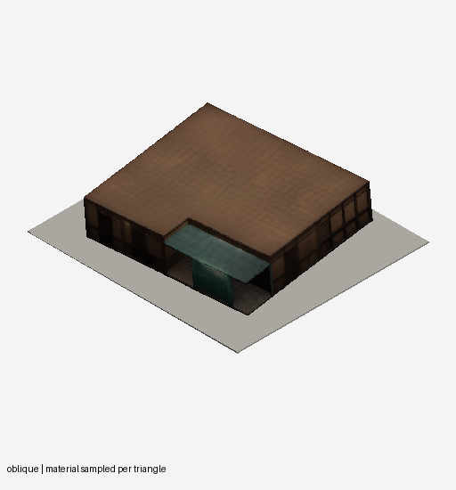 |

<details>
<summary>After WebGL 실제 화면 — 기본 카메라</summary>

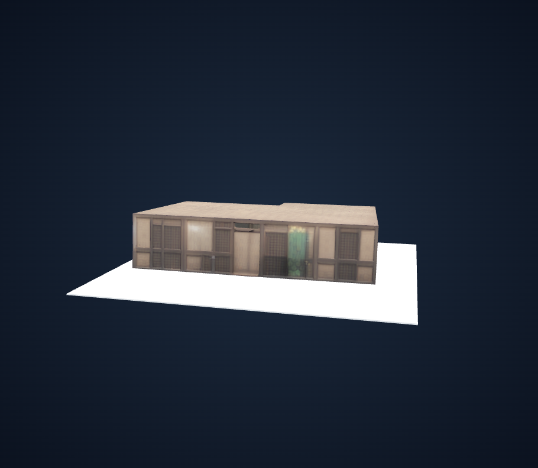

</details>

- [Before Viewer — 로컬 전용](http://127.0.0.1:8082/?run=38abfa6472324289a0983cb386764aef)
- Before run: `runs/38abfa6472324289a0983cb386764aef/`; GLB: `runs/38abfa6472324289a0983cb386764aef/scene.glb`; preview: `runs/38abfa6472324289a0983cb386764aef/previews/meshes/oblique.png`.
- [After Viewer — 로컬 전용](http://127.0.0.1:8082/?run=34534587988241088830cdb0a296cbbb)
- After run: `runs/34534587988241088830cdb0a296cbbb/`; GLB: `runs/34534587988241088830cdb0a296cbbb/scene.glb`; preview: `runs/34534587988241088830cdb0a296cbbb/previews/meshes/oblique.png`.
- Before 생성 시각: `2026-09-28T12:01:20.072643+00:00`; 생성 객체 1개; 기존 별도 background floor 없음.

### 비교와 검증

- Before 관찰: 큰 갈색 지붕/상자 같은 구조만 두드러진다. 원본 야경의 여러 물체를 구분하기 어렵다.
- 야경 골목은 Before와 After 모두 실제 골목 대신 하나의 지붕/상자 같은 통합 형상으로 보인다. After에는 아래 회색 바닥이 추가됐지만 골목 깊이, 벽, 화분 등의 복원 문제는 유지된다. 지지 객체가 0개여서 위치 보정은 적용되지 않았다.
- 상태: **PASS**.
- 새 객체 1개; 생성 실패 0개; floor True; 위치 이동 0개.
- 새 run 내부 접촉 통계: 부유 0 → 0, 관통 0 → 0 (floor-supported 객체만).
- floor X/Z 크기: `[8.101229315119403, 7.347740645424394]` (모델 좌표 단위; 실측 m 아님).
- 산출물 검사: True; After viewer 검사: True; Before viewer 검사: True.
- RunPod job: `3c8960f5-995f-47d2-86de-93614458479e-e1`; 실행 시각: `2026-09-29T06:21:22.511731+00:00`.

<a id="sample-13"></a>
## 13. hichem-meghachou-7I-Rj_E9ihI-unsplash.jpg


- 입력: `samples/hichem-meghachou-7I-Rj_E9ihI-unsplash.jpg` (4979 × 3154)

| Before | After |
|---|---|
|  | 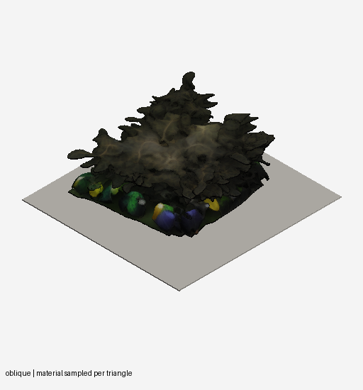 |

<details>
<summary>After WebGL 실제 화면 — 기본 카메라</summary>

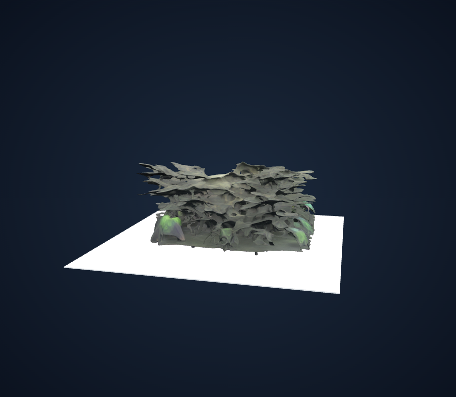

</details>

- [Before Viewer — 로컬 전용](http://127.0.0.1:8082/?run=2b0568809830463899c2705b4321fb8c)
- Before run: `runs/2b0568809830463899c2705b4321fb8c/`; GLB: `runs/2b0568809830463899c2705b4321fb8c/scene.glb`; preview: `runs/2b0568809830463899c2705b4321fb8c/previews/meshes/oblique.png`.
- [After Viewer — 로컬 전용](http://127.0.0.1:8082/?run=f818c1ee82294857a1146591d6e29b9c)
- After run: `runs/f818c1ee82294857a1146591d6e29b9c/`; GLB: `runs/f818c1ee82294857a1146591d6e29b9c/scene.glb`; preview: `runs/f818c1ee82294857a1146591d6e29b9c/previews/meshes/oblique.png`.
- Before 생성 시각: `2026-09-28T12:02:33.698939+00:00`; 생성 객체 1개; 기존 별도 background floor 없음.

### 비교와 검증

- Before 관찰: 검고 뒤엉킨 식생/지형 mesh가 보인다. 개별 물체의 바닥 접촉은 판별하기 어렵다.
- 캠핑장 형상 아래 회색 바닥이 추가됐다. 그러나 Before와 After 모두 텐트·나무가 어두운 덩어리 하나로 합쳐져 있고, 가운데의 큰 불규칙한 나무 형상이 장면을 가린다. 지지 객체가 0개라 배치 이동은 없으며 텐트의 개별 분리와 밝기/형상 문제는 남아 있다.
- 상태: **PASS**.
- 새 객체 1개; 생성 실패 0개; floor True; 위치 이동 0개.
- 새 run 내부 접촉 통계: 부유 0 → 0, 관통 0 → 0 (floor-supported 객체만).
- floor X/Z 크기: `[6.662764809324568, 6.869248521289424]` (모델 좌표 단위; 실측 m 아님).
- 산출물 검사: True; After viewer 검사: True; Before viewer 검사: True.
- RunPod job: `c598da53-aa55-4441-9b64-6c6aed4548fa-e2`; 실행 시각: `2026-09-29T06:29:59.671049+00:00`.

<a id="sample-14"></a>
## 14. HJBLjCUWEAAMNIM.jpg


- 입력: `samples/HJBLjCUWEAAMNIM.jpg` (1199 × 675)

| Before | After |
|---|---|
|  | 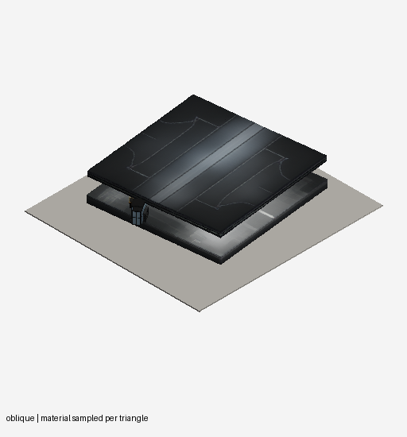 |

<details>
<summary>After WebGL 실제 화면 — 기본 카메라</summary>

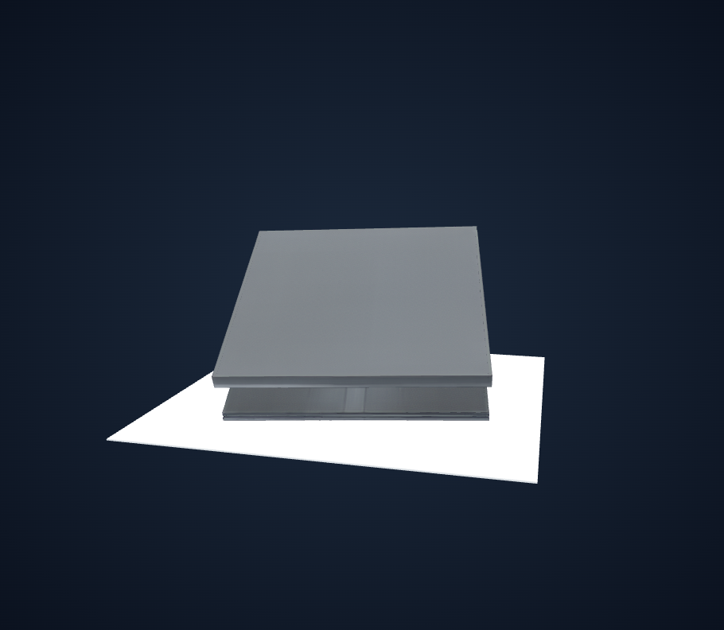

</details>

- [Before Viewer — 로컬 전용](http://127.0.0.1:8082/?run=7f61267de9764daabb786f0a3fc94540)
- Before run: `runs/7f61267de9764daabb786f0a3fc94540/`; GLB: `runs/7f61267de9764daabb786f0a3fc94540/scene.glb`; preview: `runs/7f61267de9764daabb786f0a3fc94540/previews/meshes/oblique.png`.
- [After Viewer — 로컬 전용](http://127.0.0.1:8082/?run=dcff34e672034156b9a72d453a5fdbe0)
- After run: `runs/dcff34e672034156b9a72d453a5fdbe0/`; GLB: `runs/dcff34e672034156b9a72d453a5fdbe0/scene.glb`; preview: `runs/dcff34e672034156b9a72d453a5fdbe0/previews/meshes/oblique.png`.
- Before 생성 시각: `2026-09-28T12:05:29.703490+00:00`; 생성 객체 8개; 기존 별도 background floor 없음.

### 비교와 검증

- Before 관찰: 얇고 넓은 검은 판 위주의 결과로, 측면에 일부 도시 텍스처가 보인다.
- After에는 회색 바닥이 생겼지만 도시 장면은 여전히 큰 검은 평판 두 장이 겹쳐 있고, 건물 조각이 그 사이에 가려진 모습이다. 지지 객체가 0개라 배치 보정은 없었다. 원본의 도로·가로등·개별 건물 구성이 복원되지 않은 문제와 가림은 그대로다.
- 상태: **PASS**.
- 새 객체 8개; 생성 실패 0개; floor True; 위치 이동 0개.
- 새 run 내부 접촉 통계: 부유 0 → 0, 관통 0 → 0 (floor-supported 객체만).
- floor X/Z 크기: `[3.9472355885975747, 3.987137238882131]` (모델 좌표 단위; 실측 m 아님).
- 산출물 검사: True; After viewer 검사: True; Before viewer 검사: True.
- RunPod job: `2d6a219a-cab8-4f76-b097-fa6795cea836-e2`; 실행 시각: `2026-09-29T06:32:55.664731+00:00`.

<a id="sample-15"></a>
## 15. image_0001.jpg


- 입력: `samples/image_0001.jpg` (1216 × 690)

| Before | After |
|---|---|
|  | 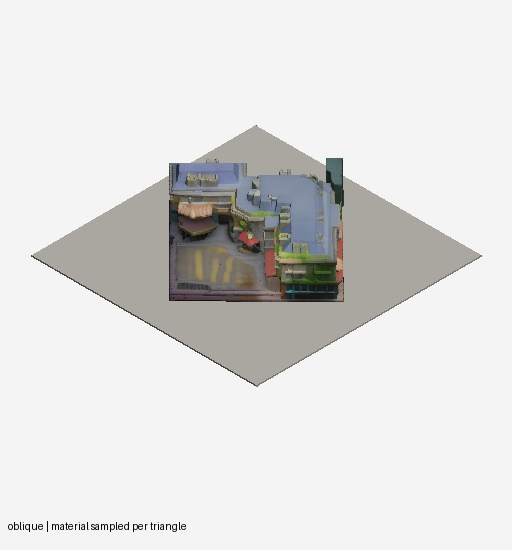 |

<details>
<summary>After WebGL 실제 화면 — 기본 카메라</summary>

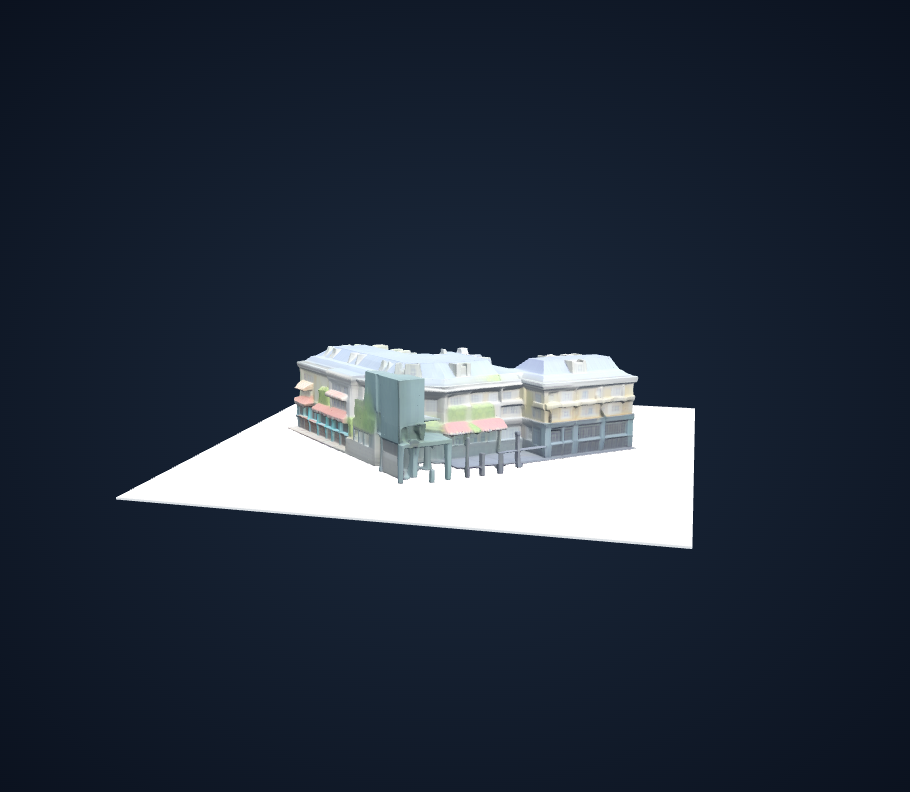

</details>

- [Before Viewer — 로컬 전용](http://127.0.0.1:8082/?run=574cb4de90e34bb684518fd4a459164a)
- Before run: `runs/574cb4de90e34bb684518fd4a459164a/`; GLB: `runs/574cb4de90e34bb684518fd4a459164a/scene.glb`; preview: `runs/574cb4de90e34bb684518fd4a459164a/previews/meshes/oblique.png`.
- [After Viewer — 로컬 전용](http://127.0.0.1:8082/?run=006bf0d5a4d3428ab1b8eb9e1d0061f5)
- After run: `runs/006bf0d5a4d3428ab1b8eb9e1d0061f5/`; GLB: `runs/006bf0d5a4d3428ab1b8eb9e1d0061f5/scene.glb`; preview: `runs/006bf0d5a4d3428ab1b8eb9e1d0061f5/previews/meshes/oblique.png`.
- Before 생성 시각: `2026-09-28T12:10:06.823220+00:00`; 생성 객체 1개; 기존 별도 background floor 없음.

### 비교와 검증

- Before 관찰: 건물 전면과 지면 일부가 사각형 조각으로 묶여 보인다. 별도 배경 바닥은 없다.
- 거리 전체가 하나의 통합 객체이며 After에는 그 아래 큰 회색 바닥이 추가됐다. 건물과 도로의 전체 기울기/방향은 Before와 같고 지지 객체 0개로 위치 이동도 없었다. 바닥 때문에 자동 화면 배율이 더 작아져 거리 세부 형상의 확인은 오히려 어려워졌다. 배경 재구성이나 orientation 개선의 증거는 없다.
- 상태: **PASS**.
- 새 객체 1개; 생성 실패 0개; floor True; 위치 이동 0개.
- 새 run 내부 접촉 통계: 부유 0 → 0, 관통 0 → 0 (floor-supported 객체만).
- floor X/Z 크기: `[11.752112711925468, 11.64871805406547]` (모델 좌표 단위; 실측 m 아님).
- 산출물 검사: True; After viewer 검사: True; Before viewer 검사: True.
- RunPod job: `19de7e21-92bd-4aae-8e4d-de0b2099f359-e1`; 실행 시각: `2026-09-29T06:33:14.497953+00:00`.

<a id="sample-16"></a>
## 16. images.jpg


- 입력: `samples/images.jpg` (275 × 183)

| Before | After |
|---|---|
|  | 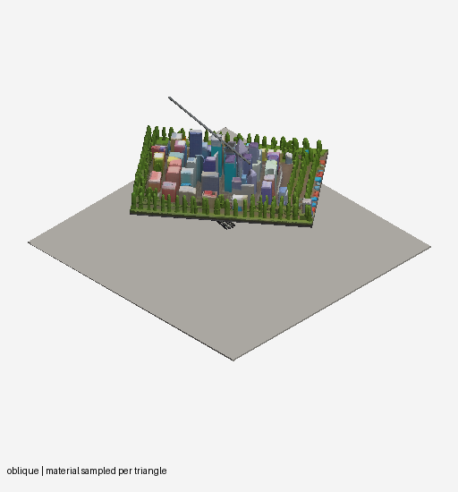 |

<details>
<summary>After WebGL 실제 화면 — 기본 카메라</summary>

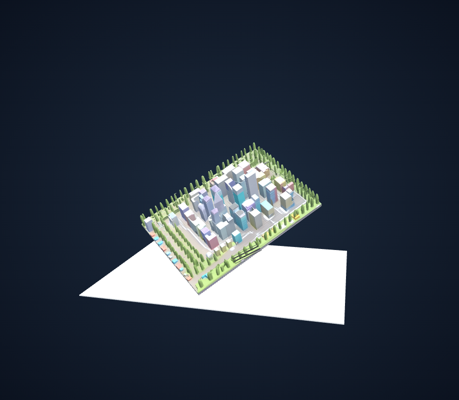

</details>

- [Before Viewer — 로컬 전용](http://127.0.0.1:8082/?run=ac50e4379b3a4a278f470514e44d0516)
- Before run: `runs/ac50e4379b3a4a278f470514e44d0516/`; GLB: `runs/ac50e4379b3a4a278f470514e44d0516/scene.glb`; preview: `runs/ac50e4379b3a4a278f470514e44d0516/previews/meshes/oblique.png`.
- [After Viewer — 로컬 전용](http://127.0.0.1:8082/?run=ecbbf289880e45a5b8c1e8726944b982)
- After run: `runs/ecbbf289880e45a5b8c1e8726944b982/`; GLB: `runs/ecbbf289880e45a5b8c1e8726944b982/scene.glb`; preview: `runs/ecbbf289880e45a5b8c1e8726944b982/previews/meshes/oblique.png`.
- Before 생성 시각: `2026-09-28T12:11:28.420015+00:00`; 생성 객체 3개; 기존 별도 background floor 없음.

### 비교와 검증

- Before 관찰: 도시 skyline과 식생이 긴 띠에 배열되어 있고 아래로 길게 뻗는 가는 조각이 있다.
- 기울어진 도시 띠와 아래로 길게 뻗은 가느다란 파편이 Before/After에 모두 보인다. After에는 넓은 회색 바닥이 생겼지만 도시의 상당 부분은 여전히 위로 떠 보인다. 지지 객체가 0개라 위치 보정은 없고, 긴 파편을 포함한 scene bounds가 바닥과 화면 범위를 크게 만드는 한계가 드러난다.
- 상태: **PASS**.
- 새 객체 3개; 생성 실패 0개; floor True; 위치 이동 0개.
- 새 run 내부 접촉 통계: 부유 0 → 0, 관통 0 → 0 (floor-supported 객체만).
- floor X/Z 크기: `[2.6092645399340353, 2.123213989986392]` (모델 좌표 단위; 실측 m 아님).
- 산출물 검사: True; After viewer 검사: True; Before viewer 검사: True.
- RunPod job: `c158f5dc-a409-4569-b0d0-6d93321fe2d8-e1`; 실행 시각: `2026-09-29T06:34:49.289424+00:00`.

<a id="sample-17"></a>
## 17. input.jpg


- 입력: `samples/input.jpg` (1920 × 1080)

| Before | After |
|---|---|
|  | 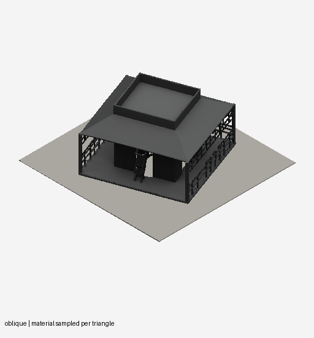 |

<details>
<summary>After WebGL 실제 화면 — 기본 카메라</summary>

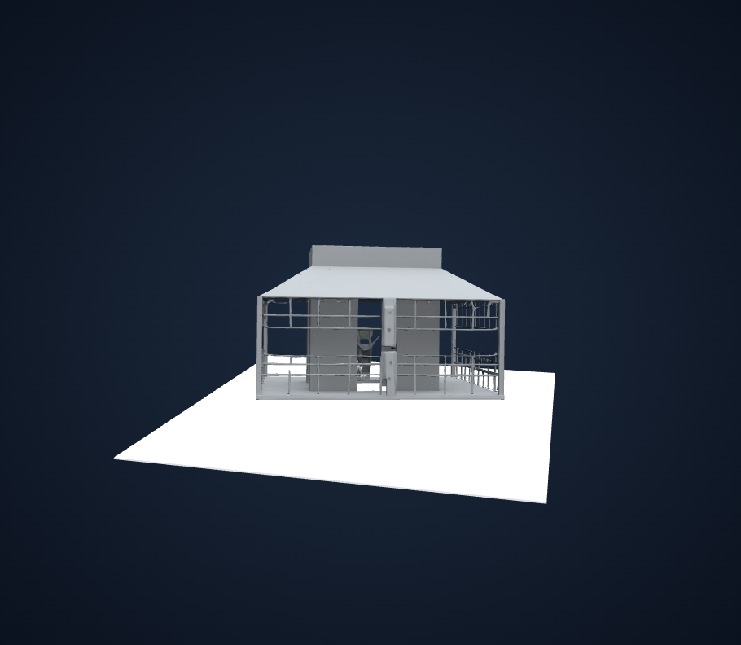

</details>

- [Before Viewer — 로컬 전용](http://127.0.0.1:8082/?run=85f5814232a74b77ab05e21e252027ae)
- Before run: `runs/85f5814232a74b77ab05e21e252027ae/`; GLB: `runs/85f5814232a74b77ab05e21e252027ae/scene.glb`; preview: `runs/85f5814232a74b77ab05e21e252027ae/previews/meshes/oblique.png`.
- [After Viewer — 로컬 전용](http://127.0.0.1:8082/?run=e88df9777116431e9d6ce93b0adf8186)
- After run: `runs/e88df9777116431e9d6ce93b0adf8186/`; GLB: `runs/e88df9777116431e9d6ce93b0adf8186/scene.glb`; preview: `runs/e88df9777116431e9d6ce93b0adf8186/previews/meshes/oblique.png`.
- Before 생성 시각: `2026-09-28T12:12:51.942982+00:00`; 생성 객체 5개; 기존 별도 background floor 없음.

### 비교와 검증

- Before 관찰: 큰 회색 사각 프레임/평판 구조가 보인다. 어두운 원본의 세부 물체 구분은 제한적이다.
- 어두운 게임 장면은 Before/After 모두 큰 지붕과 철골 프레임 같은 구조로 복원됐다. After에는 그 구조 아래 회색 바닥이 추가됐지만 구조물의 크기·기울기와 내부의 가림은 유사하다. 지지 객체 0개로 위치 이동은 없으며 원본 인물과 주변 장치의 재현 문제는 남아 있다.
- 상태: **PASS**.
- 새 객체 5개; 생성 실패 0개; floor True; 위치 이동 0개.
- 새 run 내부 접촉 통계: 부유 0 → 0, 관통 0 → 0 (floor-supported 객체만).
- floor X/Z 크기: `[4.528895150090617, 4.563911573738768]` (모델 좌표 단위; 실측 m 아님).
- 산출물 검사: True; After viewer 검사: True; Before viewer 검사: True.
- RunPod job: `a0660c9d-ea48-44e4-8153-8f8aaeca8681-e1`; 실행 시각: `2026-09-29T06:40:42.324459+00:00`.

<a id="sample-18"></a>
## 18. julia-aX1TTOuq83M-unsplash.jpg


- 입력: `samples/julia-aX1TTOuq83M-unsplash.jpg` (3443 × 5165)

| Before | After |
|---|---|
| BEFORE MISSING | After preview 없음 |

- Before Viewer 없음: 정확히 매칭되는 기존 완료 run 없음.
- After Viewer 없음: 로컬 입력 제한으로 새 run이 생성되지 않음.

### 비교와 검증

- Before 관찰: 매칭되는 기존 완료 run/preview가 없어 Before를 평가할 수 없다.
- 새 결과 없음; 시각적 개선/회귀를 판정할 수 없다.
- 상태: **FAIL**.
- 실패 원인: {"error": "Please use an image with at most 16 megapixels"}

<a id="sample-19"></a>
## 19. KakaoTalk_20260829_164738573.jpg


- 입력: `samples/KakaoTalk_20260829_164738573.jpg` (3024 × 4032)

| Before | After |
|---|---|
|  | 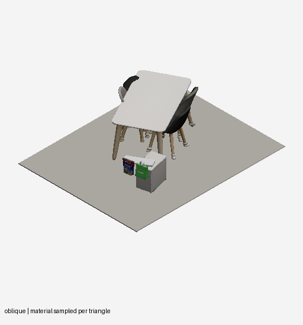 |

<details>
<summary>After WebGL 실제 화면 — 기본 카메라</summary>


</details>

- [Before Viewer — 로컬 전용](http://127.0.0.1:8082/?run=d57fea2928e6401683c9499f3f4a4a4f)
- Before run: `runs/d57fea2928e6401683c9499f3f4a4a4f/`; GLB: `runs/d57fea2928e6401683c9499f3f4a4a4f/scene.glb`; preview: `runs/d57fea2928e6401683c9499f3f4a4a4f/previews/meshes/oblique.png`.
- [After Viewer — 로컬 전용](http://127.0.0.1:8082/?run=2a2d9c3e0eb64d80862fc6b697217d8a)
- After run: `runs/2a2d9c3e0eb64d80862fc6b697217d8a/`; GLB: `runs/2a2d9c3e0eb64d80862fc6b697217d8a/scene.glb`; preview: `runs/2a2d9c3e0eb64d80862fc6b697217d8a/previews/meshes/oblique.png`.
- Before 생성 시각: `2026-09-28T12:15:40.460560+00:00`; 생성 객체 10개; 기존 별도 background floor 없음.

### 비교와 검증

- Before 관찰: 책상·의자와 책상 위 소품들이 기울어져 보인다. 공통 floor 없이 독립 물체들만 보인다.
- After에는 식탁과 의자 아래 바닥이 생기고 각 지지 객체의 최저점이 같은 높이에 맞춰졌다. 새 run 내부 지지 객체 6개의 부유 3→0개, 관통 3→0개로 개선됐다. 다만 식탁과 의자가 크게 기울고 서로 겹치는 형상은 남아 있으며, 한 객체의 모든 다리가 수평으로 놓였다는 뜻은 아니다. 회전·형상 문제는 접촉 이동만으로 해결되지 않았다.
- 상태: **PASS**.
- 새 객체 10개; 생성 실패 0개; floor True; 위치 이동 6개.
- 새 run 내부 접촉 통계: 부유 3 → 0, 관통 3 → 0 (floor-supported 객체만).
- floor X/Z 크기: `[1.7149585161954441, 2.201804780565376]` (모델 좌표 단위; 실측 m 아님).
- 산출물 검사: True; After viewer 검사: True; Before viewer 검사: True.
- RunPod job: `90fbe99f-a270-4e46-aec1-fd75d40c9565-e1`; 실행 시각: `2026-09-29T06:41:01.093405+00:00`.

<a id="sample-20"></a>
## 20. l4Oe0Mu-LKBiOcEUE3ShgfPgdMIGE0hoTei-xgsPPlhAaMJ5HoZ7mOjtNhmYq74wdZcE5bCSkJDzc-pQQmt8qZO_8Ww6-_CO8B6HnEjpfwv6M_cOx_nWKQNsaIAtzAKaYGIwbEoAwRKmXdySd6VZIdHev7ufXxGdI3_vUH0UxPRWF_u3ffY5GhFOfC4ibA6l.jpg


- 입력: `samples/l4Oe0Mu-LKBiOcEUE3ShgfPgdMIGE0hoTei-xgsPPlhAaMJ5HoZ7mOjtNhmYq74wdZcE5bCSkJDzc-pQQmt8qZO_8Ww6-_CO8B6HnEjpfwv6M_cOx_nWKQNsaIAtzAKaYGIwbEoAwRKmXdySd6VZIdHev7ufXxGdI3_vUH0UxPRWF_u3ffY5GhFOfC4ibA6l.jpg` (1920 × 1920)

| Before | After |
|---|---|
|  | 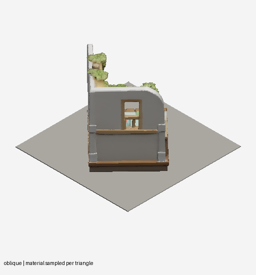 |

<details>
<summary>After WebGL 실제 화면 — 기본 카메라</summary>

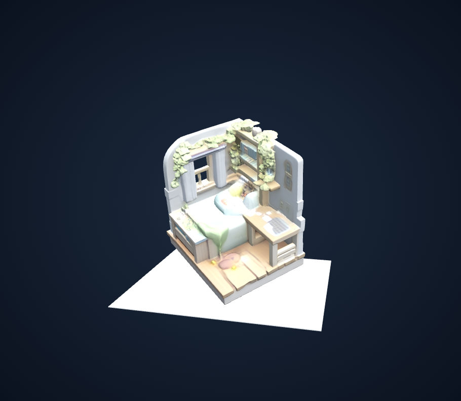

</details>

- [Before Viewer — 로컬 전용](http://127.0.0.1:8082/?run=f26922c3015947b0b14ae08dac796932)
- Before run: `runs/f26922c3015947b0b14ae08dac796932/`; GLB: `runs/f26922c3015947b0b14ae08dac796932/scene.glb`; preview: `runs/f26922c3015947b0b14ae08dac796932/previews/meshes/oblique.png`.
- [After Viewer — 로컬 전용](http://127.0.0.1:8082/?run=330daeb866454b17a0a95f62a58706c0)
- After run: `runs/330daeb866454b17a0a95f62a58706c0/`; GLB: `runs/330daeb866454b17a0a95f62a58706c0/scene.glb`; preview: `runs/330daeb866454b17a0a95f62a58706c0/previews/meshes/oblique.png`.
- Before 생성 시각: `2026-09-28T12:20:39.579286+00:00`; 생성 객체 1개; 기존 별도 background floor 없음.

### 비교와 검증

- Before 관찰: 문과 벽을 포함한 작은 room-shell 같은 mesh 하나가 보인다. 이는 기존 SAM3D 객체이며 새 background floor가 아니다.
- After에는 창문이 있는 벽 조각 아래 회색 바닥이 추가됐다. Before와 동일하게 방 전체가 아니라 벽·창문 중심의 단일 객체로 보이며, 원본의 침대·책상·의자·선반 소품이 대부분 재현되지 않았다. 벽의 기울기는 유지되고 지지 객체 0개로 위치 이동도 없다.
- 상태: **PASS**.
- 새 객체 1개; 생성 실패 0개; floor True; 위치 이동 0개.
- 새 run 내부 접촉 통계: 부유 0 → 0, 관통 0 → 0 (floor-supported 객체만).
- floor X/Z 크기: `[1.6652447913358097, 1.555583360350213]` (모델 좌표 단위; 실측 m 아님).
- 산출물 검사: True; After viewer 검사: True; Before viewer 검사: True.
- RunPod job: `94b36415-dfb8-4b4f-acce-b6e110644a4c-e1`; 실행 시각: `2026-09-29T06:41:31.646855+00:00`.

<a id="sample-21"></a>
## 21. living_room.jpg


- 입력: `samples/living_room.jpg` (1280 × 854)

| Before | After |
|---|---|
|  | 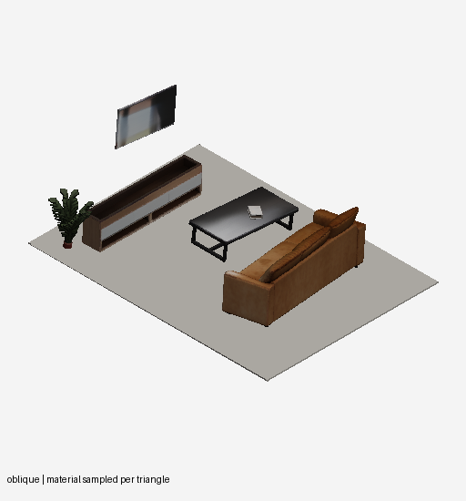 |

<details>
<summary>After WebGL 실제 화면 — 기본 카메라</summary>


</details>

- [Before Viewer — 로컬 전용](http://127.0.0.1:8082/?run=7bcd165489c84f6e9436e983f474c017)
- Before run: `runs/7bcd165489c84f6e9436e983f474c017/`; GLB: `runs/7bcd165489c84f6e9436e983f474c017/scene.glb`; preview: `runs/7bcd165489c84f6e9436e983f474c017/previews/meshes/oblique.png`.
- [After Viewer — 로컬 전용](http://127.0.0.1:8082/?run=88e01c90565644c79b5e31312ebebca7)
- After run: `runs/88e01c90565644c79b5e31312ebebca7/`; GLB: `runs/88e01c90565644c79b5e31312ebebca7/scene.glb`; preview: `runs/88e01c90565644c79b5e31312ebebca7/previews/meshes/oblique.png`.
- Before 생성 시각: `2026-09-28T10:28:31.883397+00:00`; 생성 객체 6개; 기존 별도 background floor 없음.

### 비교와 검증

- Before 관찰: 소파·테이블·수납장·TV·식물이 분리되어 있다. 소파와 수납장의 최저 높이가 다르고 별도 바닥은 없다.
- After에서 소파·커피테이블·긴 수납장 아래 공통 바닥이 생겨 장면의 지지 기준이 명확해졌다. 새 run의 지지 객체 3개에서 부유 1→0개, 관통 1→0개로 개선됐다. TV는 계속 위쪽에 분리되어 있으며 벽은 생성되지 않는다. 소파의 방향과 전체 가구 간격은 Before와 유사하게 남아 있어 바닥 접촉 외의 배치 정합성이 해결됐다고 볼 수 없다.
- 상태: **PASS**.
- 새 객체 6개; 생성 실패 0개; floor True; 위치 이동 2개.
- 새 run 내부 접촉 통계: 부유 1 → 0, 관통 1 → 0 (floor-supported 객체만).
- floor X/Z 크기: `[2.597532656423979, 1.851820647219301]` (모델 좌표 단위; 실측 m 아님).
- 산출물 검사: True; After viewer 검사: True; Before viewer 검사: True.
- RunPod job: `067b2d1d-b8a3-4d3a-a02c-2dc4578ab1a6-e1`; 실행 시각: `2026-09-29T06:44:40.995236+00:00`.

<a id="sample-22"></a>
## 22. p4oC_SMMAWoxQP0Xb92NkrPRCk-o_WPNRIKgnRpyd58T8Xxihjpkh8_TvVFr8XKHqUAkQIeFmq4idGkwmNBPUn-Uy55tm1l30lca6QdZ0x2S1pwVRthYaLVkOG0bGYj3d_GMohI6hlRjn0Ic3INlwTjtuwnisYxzsJoPUeQ2o2X6JCASeT-hL1Jyn4sxoCgP.jpg


- 입력: `samples/p4oC_SMMAWoxQP0Xb92NkrPRCk-o_WPNRIKgnRpyd58T8Xxihjpkh8_TvVFr8XKHqUAkQIeFmq4idGkwmNBPUn-Uy55tm1l30lca6QdZ0x2S1pwVRthYaLVkOG0bGYj3d_GMohI6hlRjn0Ic3INlwTjtuwnisYxzsJoPUeQ2o2X6JCASeT-hL1Jyn4sxoCgP.jpg` (3840 × 2160)

| Before | After |
|---|---|
|  | 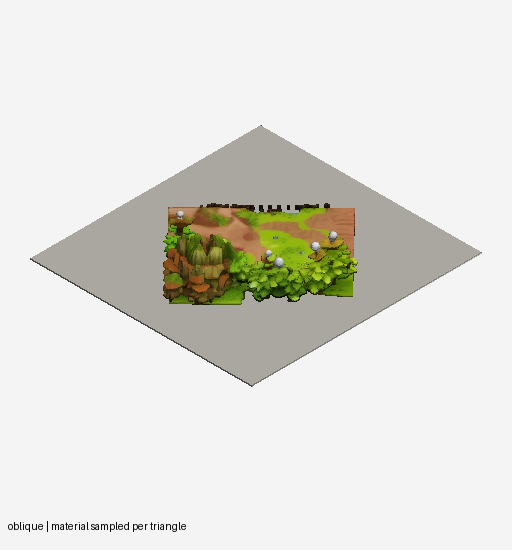 |

<details>
<summary>After WebGL 실제 화면 — 기본 카메라</summary>

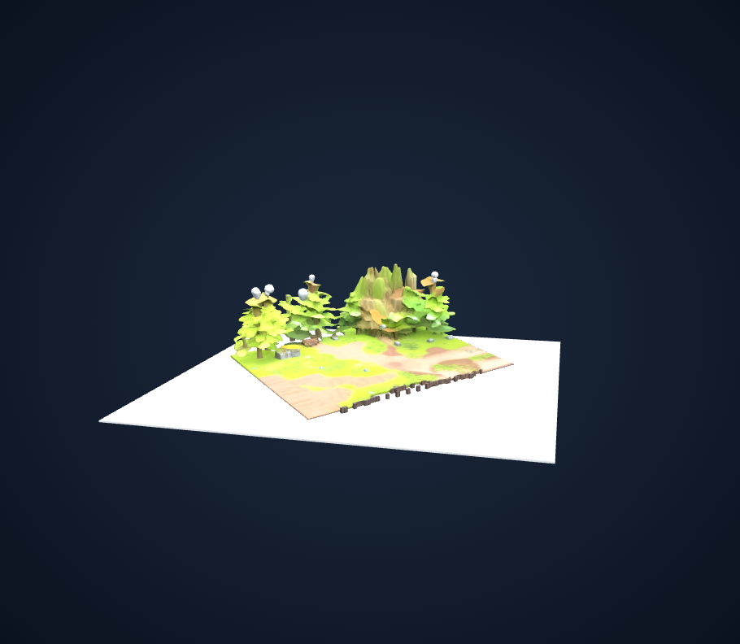

</details>

- [Before Viewer — 로컬 전용](http://127.0.0.1:8082/?run=d66a457c4e6a4aba8d619d646a50fc68)
- Before run: `runs/d66a457c4e6a4aba8d619d646a50fc68/`; GLB: `runs/d66a457c4e6a4aba8d619d646a50fc68/scene.glb`; preview: `runs/d66a457c4e6a4aba8d619d646a50fc68/previews/meshes/oblique.png`.
- [After Viewer — 로컬 전용](http://127.0.0.1:8082/?run=8c3edc6d589d4b988ba21938a36e52d4)
- After run: `runs/8c3edc6d589d4b988ba21938a36e52d4/`; GLB: `runs/8c3edc6d589d4b988ba21938a36e52d4/scene.glb`; preview: `runs/8c3edc6d589d4b988ba21938a36e52d4/previews/meshes/oblique.png`.
- Before 생성 시각: `2026-09-28T12:21:36.005938+00:00`; 생성 객체 1개; 기존 별도 background floor 없음.

### 비교와 검증

- Before 관찰: 게임 지형과 식생이 긴 디오라마 형태로 한 덩어리로 보인다. 개별 furniture correction 평가 대상은 제한적이다.
- Before의 마을 지형은 얇고 세워진 통합 패널처럼 보이며 After에서도 같은 방향과 형상이 유지된다. 회색 바닥은 추가됐지만 넓은 바닥 기준으로 자동 축소되어 원래 mesh가 화면 중앙에 작게 보인다. 지지 객체 0개로 위치 이동은 없고, 원본의 주택과 지형 구성이 정확히 분리되지 않은 문제가 남아 있다.
- 상태: **PASS**.
- 새 객체 1개; 생성 실패 0개; floor True; 위치 이동 0개.
- 새 run 내부 접촉 통계: 부유 0 → 0, 관통 0 → 0 (floor-supported 객체만).
- floor X/Z 크기: `[7.060759430981701, 7.280100543512634]` (모델 좌표 단위; 실측 m 아님).
- 산출물 검사: True; After viewer 검사: True; Before viewer 검사: True.
- RunPod job: `7b0a96cb-a125-4241-95d0-74d9a3eddf8d-e2`; 실행 시각: `2026-09-29T06:49:11.846929+00:00`.

<a id="sample-23"></a>
## 23. pexels-baran-kilic-640071598-18151871.jpg


- 입력: `samples/pexels-baran-kilic-640071598-18151871.jpg` (4159 × 5199)

| Before | After |
|---|---|
| BEFORE MISSING | After preview 없음 |

- Before Viewer 없음: 정확히 매칭되는 기존 완료 run 없음.
- After Viewer 없음: 로컬 입력 제한으로 새 run이 생성되지 않음.

### 비교와 검증

- Before 관찰: 매칭되는 기존 완료 run/preview가 없어 Before를 평가할 수 없다.
- 새 결과 없음; 시각적 개선/회귀를 판정할 수 없다.
- 상태: **FAIL**.
- 실패 원인: {"error": "Please use an image with at most 16 megapixels"}

<a id="sample-24"></a>
## 24. pexels-padrechaks-20422959.jpg


- 입력: `samples/pexels-padrechaks-20422959.jpg` (5184 × 3456)

| Before | After |
|---|---|
| BEFORE MISSING | After preview 없음 |

- Before Viewer 없음: 정확히 매칭되는 기존 완료 run 없음.
- After Viewer 없음: 로컬 입력 제한으로 새 run이 생성되지 않음.

### 비교와 검증

- Before 관찰: 매칭되는 기존 완료 run/preview가 없어 Before를 평가할 수 없다.
- 새 결과 없음; 시각적 개선/회귀를 판정할 수 없다.
- 상태: **FAIL**.
- 실패 원인: {"error": "Please use an image with at most 16 megapixels"}

<a id="sample-25"></a>
## 25. PGnAvG-MUEDZ146fq1MHxdqV-UyNuwFLaiTdCZ_8S2N1eS-bTv24RN6OuyPQvUMbDiZwrSqbpCKcrCEEIx8HAEkcgJpE1eW155RNycHBcqyZXgI7KjZgsHU1CG1F-7sP2GiANdefEyFxmOdMtwp6Q5Ilp-K1JXFsSKlBxEz_EyrvGh1UDPl9AY7X4y5KhN-4.jpg


- 입력: `samples/PGnAvG-MUEDZ146fq1MHxdqV-UyNuwFLaiTdCZ_8S2N1eS-bTv24RN6OuyPQvUMbDiZwrSqbpCKcrCEEIx8HAEkcgJpE1eW155RNycHBcqyZXgI7KjZgsHU1CG1F-7sP2GiANdefEyFxmOdMtwp6Q5Ilp-K1JXFsSKlBxEz_EyrvGh1UDPl9AY7X4y5KhN-4.jpg` (1812 × 1147)

| Before | After |
|---|---|
|  | 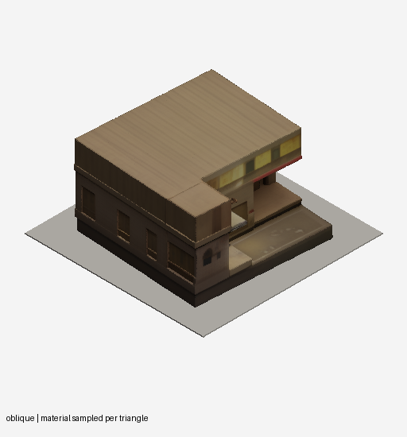 |

<details>
<summary>After WebGL 실제 화면 — 기본 카메라</summary>

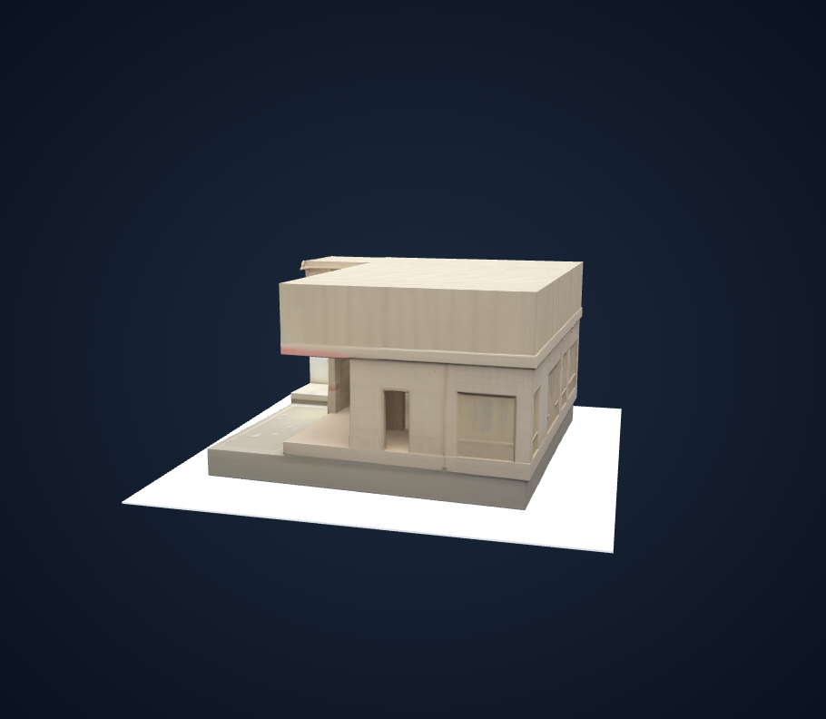

</details>

- [Before Viewer — 로컬 전용](http://127.0.0.1:8082/?run=b3d5939515de4d5ba97e4777c195c634)
- Before run: `runs/b3d5939515de4d5ba97e4777c195c634/`; GLB: `runs/b3d5939515de4d5ba97e4777c195c634/scene.glb`; preview: `runs/b3d5939515de4d5ba97e4777c195c634/previews/meshes/oblique.png`.
- [After Viewer — 로컬 전용](http://127.0.0.1:8082/?run=827ffb7b8d474c84aa972e5032233a8f)
- After run: `runs/827ffb7b8d474c84aa972e5032233a8f/`; GLB: `runs/827ffb7b8d474c84aa972e5032233a8f/scene.glb`; preview: `runs/827ffb7b8d474c84aa972e5032233a8f/previews/meshes/oblique.png`.
- Before 생성 시각: `2026-09-28T12:22:54.099915+00:00`; 생성 객체 1개; 기존 별도 background floor 없음.

### 비교와 검증

- Before 관찰: 갈색 지붕의 상자형 건물 mesh가 두드러진다. 원본의 세부 야경 구조는 제한적으로 복원되었다.
- After에서는 단일 건물 블록 아래 회색 바닥이 추가됐다. Before와 비슷한 상자형 건물 형태로, 원본 좁은 골목의 깊이와 여러 간판·실외기·건물 분리는 재현되지 않았다. 지지 객체가 0개여서 접촉 이동은 없고 바닥 외의 구조적 개선은 확인되지 않는다.
- 상태: **PASS**.
- 새 객체 1개; 생성 실패 0개; floor True; 위치 이동 0개.
- 새 run 내부 접촉 통계: 부유 0 → 0, 관통 0 → 0 (floor-supported 객체만).
- floor X/Z 크기: `[3.461222747096109, 3.4824438684788497]` (모델 좌표 단위; 실측 m 아님).
- 산출물 검사: True; After viewer 검사: True; Before viewer 검사: True.
- RunPod job: `e6776bcf-4123-4594-bebd-3dde286be361-e2`; 실행 시각: `2026-09-29T06:49:55.538021+00:00`.

<a id="sample-26"></a>
## 26. qLNgF9x-U_xG3reZP3Px6-uHxTOgcdVjej0ta7o3o_JALtaLvp6OpWVZW9B9H2JNz9C9d-UingHLFHmtWpzZFx7thrDhHRtpVlPk7GJrju3MurHGxOhEwW-Lwu8O8AEc8es3C5mRb6wJ97zAqOxj0RpXy_5KvOW7sIpU5LFlwZcZmuIIoZamEllBZ8MRaY3p.jpg


- 입력: `samples/qLNgF9x-U_xG3reZP3Px6-uHxTOgcdVjej0ta7o3o_JALtaLvp6OpWVZW9B9H2JNz9C9d-UingHLFHmtWpzZFx7thrDhHRtpVlPk7GJrju3MurHGxOhEwW-Lwu8O8AEc8es3C5mRb6wJ97zAqOxj0RpXy_5KvOW7sIpU5LFlwZcZmuIIoZamEllBZ8MRaY3p.jpg` (1448 × 2048)

| Before | After |
|---|---|
|  | 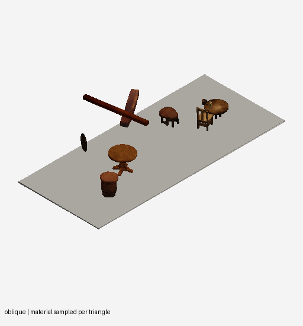 |

<details>
<summary>After WebGL 실제 화면 — 기본 카메라</summary>

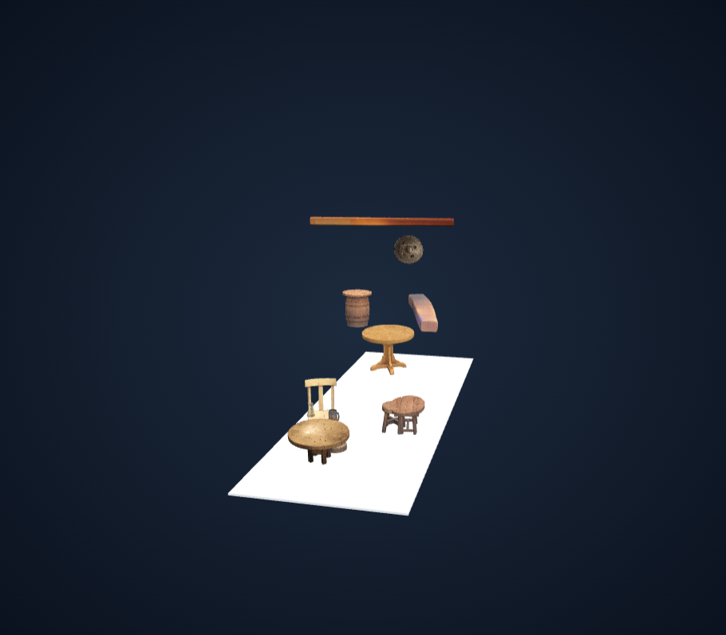

</details>

- [Before Viewer — 로컬 전용](http://127.0.0.1:8082/?run=67281f01271b4c86975c9cdbd5767ff8)
- Before run: `runs/67281f01271b4c86975c9cdbd5767ff8/`; GLB: `runs/67281f01271b4c86975c9cdbd5767ff8/scene.glb`; preview: `runs/67281f01271b4c86975c9cdbd5767ff8/previews/meshes/oblique.png`.
- [After Viewer — 로컬 전용](http://127.0.0.1:8082/?run=345b637123704f62984036f96631fe47)
- After run: `runs/345b637123704f62984036f96631fe47/`; GLB: `runs/345b637123704f62984036f96631fe47/scene.glb`; preview: `runs/345b637123704f62984036f96631fe47/previews/meshes/oblique.png`.
- Before 생성 시각: `2026-09-28T12:24:50.378568+00:00`; 생성 객체 12개; 기존 별도 background floor 없음.

### 비교와 검증

- Before 관찰: 테이블·스툴·통과 긴 막대가 서로 분리되어 있다. 막대들이 X자로 교차하고 높이가 제각각이다.
- 식탁과 의자들의 높이가 긴 회색 바닥에 맞춰져 새 run 지지 객체의 부유가 3→1개, 관통이 3→0개로 줄었다. bar_stool_00은 이동 한도를 넘어 보정을 건너뛰었다. 위쪽 교차 목재와 둥근 조각은 여전히 떨어져 있고, 통 일부는 바닥 범위 밖/아래에 보인다. 바닥이 모든 소품을 수용하거나 원본 술집 공간을 복원하지는 못했다.
- 상태: **PASS**.
- 새 객체 12개; 생성 실패 0개; floor True; 위치 이동 5개.
- 새 run 내부 접촉 통계: 부유 3 → 1, 관통 3 → 0 (floor-supported 객체만).
- floor X/Z 크기: `[1.1572393513079138, 3.6452182054519198]` (모델 좌표 단위; 실측 m 아님).
- 산출물 검사: True; After viewer 검사: True; Before viewer 검사: True.
- RunPod job: `b131d0be-2044-43ed-bba3-d955cb5f4a4a-e1`; 실행 시각: `2026-09-29T06:51:54.275993+00:00`.

<a id="sample-27"></a>
## 27. slR2ZfS3jpf_xRfH8yirgKg2ZFNhT9KPhM97Yn59E5L7aWfgzmblOYRWqQJV6ucxlqTF0YjQk1W0g6vfEjr2Dz7CSoArUiKBKlGmbCKz-aCSL3qITYgZH7m04K30cfSDm1NnpmoyN7-wDu4FptSSs8XjA9TgVSIZMw0jAAesfkGaEwET35zT6NXHrrL4EBAd.jpg


- 입력: `samples/slR2ZfS3jpf_xRfH8yirgKg2ZFNhT9KPhM97Yn59E5L7aWfgzmblOYRWqQJV6ucxlqTF0YjQk1W0g6vfEjr2Dz7CSoArUiKBKlGmbCKz-aCSL3qITYgZH7m04K30cfSDm1NnpmoyN7-wDu4FptSSs8XjA9TgVSIZMw0jAAesfkGaEwET35zT6NXHrrL4EBAd.jpg` (1293 × 1080)

| Before | After |
|---|---|
|  | 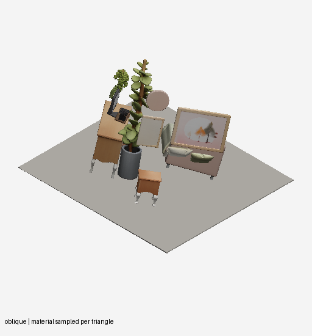 |

<details>
<summary>After WebGL 실제 화면 — 기본 카메라</summary>

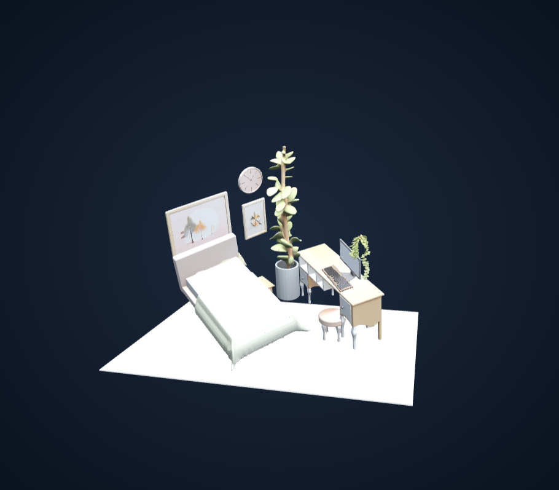

</details>

- [Before Viewer — 로컬 전용](http://127.0.0.1:8082/?run=8c4ac2b9b70d4ca7a0336ff065db5176)
- Before run: `runs/8c4ac2b9b70d4ca7a0336ff065db5176/`; GLB: `runs/8c4ac2b9b70d4ca7a0336ff065db5176/scene.glb`; preview: `runs/8c4ac2b9b70d4ca7a0336ff065db5176/previews/meshes/oblique.png`.
- [After Viewer — 로컬 전용](http://127.0.0.1:8082/?run=4e11dbfa61c549dcb96216005d8fea87)
- After run: `runs/4e11dbfa61c549dcb96216005d8fea87/`; GLB: `runs/4e11dbfa61c549dcb96216005d8fea87/scene.glb`; preview: `runs/4e11dbfa61c549dcb96216005d8fea87/previews/meshes/oblique.png`.
- Before 생성 시각: `2026-09-28T12:33:27.622210+00:00`; 생성 객체 12개; 기존 별도 background floor 없음.

### 비교와 검증

- Before 관찰: 침대·책상·협탁·식물·벽 장식이 분리되어 있고 공통 floor가 없다. 전체가 기울어진 구도다.
- After에는 침실 가구와 화분 아래 회색 바닥이 생겨 공통 높이 기준이 보인다. 새 run 지지 객체 4개의 부유 2→0개, 관통 2→0개로 개선됐다. 하지만 가구·액자·식물의 기울기와 서로 겹치는 배치는 Before와 비슷하게 남아 있고, 큰 덩굴과 분리된 원형 조각이 여전히 위쪽에 떠 있다. 원본 벽과 침대의 정확한 구조는 복원되지 않았다.
- 상태: **PASS**.
- 새 객체 12개; 생성 실패 0개; floor True; 위치 이동 7개.
- 새 run 내부 접촉 통계: 부유 2 → 0, 관통 2 → 0 (floor-supported 객체만).
- floor X/Z 크기: `[1.1408283796826322, 0.9743466493209524]` (모델 좌표 단위; 실측 m 아님).
- 산출물 검사: True; After viewer 검사: True; Before viewer 검사: True.
- RunPod job: `6cb080ee-d2f4-43a7-a0e3-828b07c28f62-e2`; 실행 시각: `2026-09-29T06:52:22.345003+00:00`.

<a id="sample-28"></a>
## 28. spacejoy-9M66C_w_ToM-unsplash.jpg


- 입력: `samples/spacejoy-9M66C_w_ToM-unsplash.jpg` (6144 × 3240)

| Before | After |
|---|---|
| BEFORE MISSING | After preview 없음 |

- Before Viewer 없음: 정확히 매칭되는 기존 완료 run 없음.
- After Viewer 없음: 로컬 입력 제한으로 새 run이 생성되지 않음.

### 비교와 검증

- Before 관찰: 매칭되는 기존 완료 run/preview가 없어 Before를 평가할 수 없다.
- 새 결과 없음; 시각적 개선/회귀를 판정할 수 없다.
- 상태: **FAIL**.
- 실패 원인: {"error": "Please use an image with at most 16 megapixels"}

<a id="sample-29"></a>
## 29. vKDU8NwlREulF-1NM8tvH43BmkrpfmuojXHL74imAbahig4hhJfFFG6DwpMty-HMRb35uM-NNEKZC5nArYwPefMkld_eUOxo0_mFg_Z3fm3XwC3-BD0YwbVdGehOMuUu5QyzHqafsuC7wRAlUHRPOLBkTMRfZhEqpgds5LQzOoDcuVdYJVdnq6RnW2COLaBN.jpg


- 입력: `samples/vKDU8NwlREulF-1NM8tvH43BmkrpfmuojXHL74imAbahig4hhJfFFG6DwpMty-HMRb35uM-NNEKZC5nArYwPefMkld_eUOxo0_mFg_Z3fm3XwC3-BD0YwbVdGehOMuUu5QyzHqafsuC7wRAlUHRPOLBkTMRfZhEqpgds5LQzOoDcuVdYJVdnq6RnW2COLaBN.jpg` (1024 × 684)

| Before | After |
|---|---|
|  | 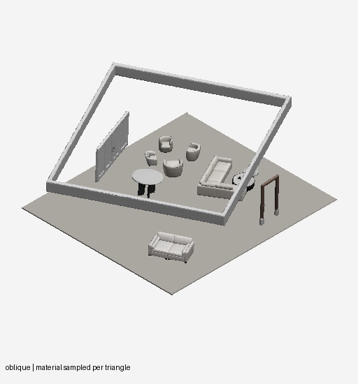 |

<details>
<summary>After WebGL 실제 화면 — 기본 카메라</summary>

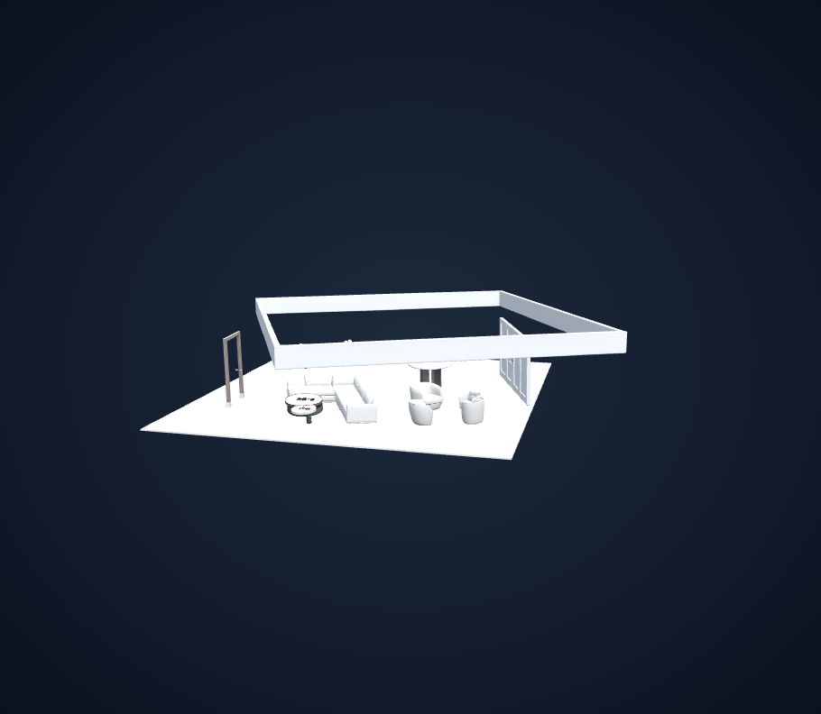

</details>

- [Before Viewer — 로컬 전용](http://127.0.0.1:8082/?run=9d0fe038d6c34b5cb9d5e61af49fc035)
- Before run: `runs/9d0fe038d6c34b5cb9d5e61af49fc035/`; GLB: `runs/9d0fe038d6c34b5cb9d5e61af49fc035/scene.glb`; preview: `runs/9d0fe038d6c34b5cb9d5e61af49fc035/previews/meshes/oblique.png`.
- [After Viewer — 로컬 전용](http://127.0.0.1:8082/?run=a69ab48af7454c58a574baed787f4a6e)
- After run: `runs/a69ab48af7454c58a574baed787f4a6e/`; GLB: `runs/a69ab48af7454c58a574baed787f4a6e/scene.glb`; preview: `runs/a69ab48af7454c58a574baed787f4a6e/previews/meshes/oblique.png`.
- Before 생성 시각: `2026-09-28T12:39:28.087337+00:00`; 생성 객체 11개; 기존 별도 background floor 없음.

### 비교와 검증

- Before 관찰: 큰 사각형 trim/벽 조각과 소파·테이블이 흩어져 있다. 일부 소파가 큰 프레임 밖으로 떨어져 보인다.
- After에는 큰 사각 프레임과 분리된 소파·의자 아래 바닥이 생겼다. 새 run의 지지 객체 8개에서 부유 4→0개, 관통 4→0개로 개선됐다. 그러나 큰 프레임의 기울기, 프레임 밖으로 떨어진 소파, 분리된 벽/문 조각은 그대로 남아 있다. 접촉 높이는 개선됐지만 원본 거실 구성과 객체 간 배치는 복원되지 않았다.
- 상태: **PASS**.
- 새 객체 11개; 생성 실패 0개; floor True; 위치 이동 8개.
- 새 run 내부 접촉 통계: 부유 4 → 0, 관통 4 → 0 (floor-supported 객체만).
- floor X/Z 크기: `[4.333446121010947, 4.770835384087481]` (모델 좌표 단위; 실측 m 아님).
- 산출물 검사: True; After viewer 검사: True; Before viewer 검사: True.
- RunPod job: `3c4e1974-81c9-4fc9-8b8b-0afdffc0edbd-e1`; 실행 시각: `2026-09-29T06:54:00.733260+00:00`.

## 4. 전체 비교 결론

- 전체 29개, PASS 22, PARTIAL 0, FAIL 7; Before 누락 7개.
- 새 GLB 22개, floor 22개, After viewer 검증 통과 22개.
- 새 run 내부 지지 객체 합계: 부유 21 → 3, 관통 21 → 3. 과거 run과의 비교 수치가 아니다.
- 접촉 통계가 개선된 sample: [sample 01](#sample-01), [sample 10](#sample-10), [sample 19](#sample-19), [sample 21](#sample-21), [sample 26](#sample-26), [sample 27](#sample-27), [sample 29](#sample-29). 실제 화면 변화와 남은 형상 문제는 개별 비교에 기록했다.
- 보정 후에도 부유/관통이 남는 sample: [sample 07](#sample-07), [sample 10](#sample-10), [sample 26](#sample-26).
- 지지 객체 분류가 0개인 sample은 13개이며 바닥 생성만 적용됐다. 바닥이 생겼다는 사실을 배치 개선으로 집계하지 않았다.
- 화면상 한계: 기울어진 통합 지형·큰 평판·누락 객체는 유지된다. 일부 scene은 넓은 바닥으로 자동 화면 배율이 작아져 세부가 덜 보인다. 새로운 형상 회귀를 단정할 근거는 없지만 이 표시상의 단점은 비교에서 확인된다.
- 바닥 추가에 따른 표시상 문제: [sample 07](#sample-07)의 탁자와 [sample 10](#sample-10)의 낮은 소파 일부는 실제 WebGL에서 바닥에 가려진다. 미해결 관통을 바닥이 가리는 현상이며, 기능 검사 PASS와 시각적 품질 평가는 구분해야 한다.
- 위치 보정은 보수적인 Y축 접촉 이동이며, orientation·형상 복원·객체 겹침·누락을 해결하는 알고리즘은 아니다. 각 sample의 실제 화면 관찰은 위에 구분했다.
- 16MP 초과 7개는 현재 production 입력 제한으로 실패했다. 새 알고리즘·자동 리사이즈는 추가하지 않았다.
- 기존 테스트 46 passed; placement/floor 포함. JS 구문 검사와 문서 이미지 경로 검사 수행.

## 5. 근거

- [기계 판독 결과](SAMPLES_BEFORE_AFTER_COMPARISON.json)
- 실행 manifest 및 검사 로그: `runs/all_samples_comparison/20260929/` (로컬).
- 각 After run의 `logs/remote_job.json`, `logs/runpod_timing.json`, `logs/remote_integrity.json`, `logs/placement.json`, `logs/artifact_validation.json`에 추론·무결성·접촉 보정 근거를 보존한다.
