# Sample Before / After Comparison

## 1. 개요

**전체 E2E 재실행은 완료되지 않았다.** 새 RunPod GPU batch가 자동 승인 검토에서 두 차례 거부되어 새 After run은 0개다. 기존 CPU 재처리 산출물이나 과거 추론 결과를 새 After로 대체하지 않았다. 이 문서는 전체 입력 inventory, 정확한 Before 매칭, 가능한 로컬 검증 및 실행 차단 사실을 기록한다.

- 대상: 2026-09-29 KST 현재 `samples/`의 PNG/JPEG/WebP 29개. 재귀 스캔했고 임의 제외 없음.
- Before: 이전에 저장된 원본 완료 run 중 EXIF 정규화 RGB 픽셀 SHA가 일치하는 가장 최근 결과. 파일명만으로 매칭하지 않았다. `placement`/`validation_replay`가 있는 이전 CPU 재처리 결과는 제외했다.
- After 계획: 현재 production HTTP upload → 기존 RAM++/SAM3/SAM3D → 현재 로컬 placement/floor finalize → GLB/preview/viewer. 실제 신규 원격 제출은 0건이다.
- 보정 전후 성능 향상이나 회귀의 새 증거는 없으며, Before 화면 관찰과 After 미생성을 분리한다.

## 2. 실행 환경

- Branch: `main` / 시작 HEAD: `476a8a4d64b5c3a9f8e53559e5ff04ac22e2d5dc`.
- After 기준은 해당 HEAD 위의 기존 uncommitted placement/floor 구현이다. `docs/SAMPLES_BEFORE_AFTER_COMPARISON.json`에 mapmaker 소스별 SHA-256을 기록했다. HEAD만으로 실행 코드를 식별할 수 없다.
- Runtime: Windows, Python 3.11.9, 기존 `.venv`, Three.js/Playwright와 설치된 Chromium, 기존 RunPod endpoint `8dzbkfrxys43hb` 및 S3 설정.
- 키 값/인증 파일은 문서나 Git에 포함하지 않았다. 새 모델/endpoint/배치 알고리즘 변경 없음.
- 기존 README/코드/테스트/사용자 samples 및 기존 runs는 덮어쓰거나 삭제하지 않았다. 이번 commit은 새 문서·비교용 작은 이미지·새 검증 스크립트만 포함한다. 기존 구현 변경은 자동으로 stage하지 않는다.

실행 명령:

```powershell
.venv\Scripts\python.exe scripts/compare_all_samples.py --manifest runs/all_samples_comparison/20260929/index.json --prepare-only
# 아래 실제 GPU 실행 명령은 자동 승인 검토에서 차단되어 프로세스가 시작되지 않음
.venv\Scripts\python.exe scripts/compare_all_samples.py --manifest runs/all_samples_comparison/20260929/index.json
# 기존 Before만 localhost에서 읽기 전용으로 검증
.venv\Scripts\python.exe scripts/compare_all_samples.py --manifest runs/all_samples_comparison/20260929/index.json --verify-before
.venv\Scripts\python.exe -m pytest -q -p no:cacheprovider
node --check web/compare-sample.mjs
node --check web/app.js
```

7개 제한 초과 입력은 기존 `/api/runs`에 실제 HTTP 제출해 모두 HTTP 400 / `Please use an image with at most 16 megapixels`를 확인했다. 이 요청은 로컬 입력 검사에서 거절되어 RunPod로 전송되지 않았다. 자동 축소하지 않았다.

### 실행 차단 근거

자동 승인 검토는 이미지의 외부 RunPod 전송과 GPU batch 비용에 대한 구체적 승인이 부족하다고 판단했다. 추가로 현재 29개 파일 SHA가 이전 batch와 모두 같고, 유효한 22개는 동일 endpoint에서 이미 처리된 이미지라는 기존 job ID/픽셀 매칭 근거를 제출했지만 다시 거부됐다. 우회하여 CLI/MCP/브라우저에서 원격 job을 제출하지 않았다. 두 거부 모두 명령 실행 전이어서 새로운 GPU job/run ID가 없다.

### Viewer 주소와 artifact 보존 제약

현재 frontend는 `?run=<32자리 run ID>`를 사용하고 backend는 `GET /api/runs/<id>` 및 `/runs/<id>/scene.glb`를 제공한다. 기존 Windows launcher의 host는 `127.0.0.1:8082`다. 공개 고정 domain은 설정되어 있지 않다.

아래 **Before Viewer 링크는 현재 D:\MapMaker의 runs를 보유한 컴퓨터에서 서버가 실행 중일 때만 유효한 로컬 링크**다. GitHub 페이지 자체에서 모델을 호스팅하는 링크가 아니다. 다른 환경에서는 `{MAPMAKER_BASE_URL}/?run=<id>`에 해당 run 디렉터리를 별도로 복원해야 한다. After ID가 없으므로 After 링크를 만들어내지 않았다.

`runs/`는 기존 `.gitignore`대로 로컬에 보존하며 대형 GLB/masks/objects/cache는 commit하지 않는다. GitHub에서 직접 보이는 자료는 아래 상대 경로의 입력 축소본과 기존 preview 복사본이다. 원본 입력과 원본 preview는 수정하지 않았다.

## 3. 전체 결과 요약

PASS=새 전체 pipeline과 viewer 성공, PARTIAL=새 결과가 있으나 검증/품질 한계, FAIL=실제 입력 제출 실패, BLOCKED=외부 실행 승인 검토로 미실행. Before 없음은 독립적으로 표시한다.

| # / Sample | Before | After | Viewer | 주요 변화 | 상태 |
|---|---|---|---|---|---|
| [01 · 5MrJb0VLPeu5pWNey2XE3AE5mqAXdSIe….jpg](#sample-01) | `09c38164` | 미생성 | [로컬 Before](http://127.0.0.1:8082/?run=09c38164b7784d95a2d8856875c497fd) | 평가 불가 | BLOCKED |
| [02 · 8xa39rx4u5sqcekrqskwxmnafwyz.png](#sample-02) | `665e1cdb` | 미생성 | [로컬 Before](http://127.0.0.1:8082/?run=665e1cdbc01c454e81daa296ca3def4c) | 평가 불가 | BLOCKED |
| [03 · a13d86d90a88538ce3427fe524a79857cbd9b0ae.png](#sample-03) | `21674af9` | 미생성 | [로컬 Before](http://127.0.0.1:8082/?run=21674af9d4fe41d48d57b0697b55c696) | 평가 불가 | BLOCKED |
| [04 · alexandra-gorn-JIUjvqe2ZHg-unsplash.jpg](#sample-04) | BEFORE MISSING | 미생성 | 없음 | 평가 불가 | FAIL |
| [05 · B0yMng87-QPZy6YxEl1ssQEFb_12gluF….jpg](#sample-05) | `13904c85` | 미생성 | [로컬 Before](http://127.0.0.1:8082/?run=13904c85687049dfb0a592cfadf75ccf) | 평가 불가 | BLOCKED |
| [06 · b56sFfaPgkefPFYeBio8ADIH5j84GCng….jpg](#sample-06) | `199672db` | 미생성 | [로컬 Before](http://127.0.0.1:8082/?run=199672dbca6e4d2da59822262fae88a1) | 평가 불가 | BLOCKED |
| [07 · ca4f0d0e-b693-4985-9abf-23a69a8b37a1.jpg](#sample-07) | `7dc137b8` | 미생성 | [로컬 Before](http://127.0.0.1:8082/?run=7dc137b805ce41f985ba9b37587b6670) | 평가 불가 | BLOCKED |
| [08 · CbJCJsFdnzIdxwKJWBi44TSwXU7QZShG….jpg](#sample-08) | `076a099b` | 미생성 | [로컬 Before](http://127.0.0.1:8082/?run=076a099b71814786acd3979a31b57124) | 평가 불가 | BLOCKED |
| [09 · dan-begel-YE7nAeaWS4w-unsplash.jpg](#sample-09) | BEFORE MISSING | 미생성 | 없음 | 평가 불가 | FAIL |
| [10 · fp_eRye2yOmskbXBBLbNnJqI7wZNaZNf….jpg](#sample-10) | `0831486b` | 미생성 | [로컬 Before](http://127.0.0.1:8082/?run=0831486bdcf741e18fca7953be03090f) | 평가 불가 | BLOCKED |
| [11 · frank-huang-8E_RqlT7RUs-unsplash.jpg](#sample-11) | BEFORE MISSING | 미생성 | 없음 | 평가 불가 | FAIL |
| [12 · g31sErZDtH2kz-tEqjrjWker3lTDkJs7….jpg](#sample-12) | `38abfa64` | 미생성 | [로컬 Before](http://127.0.0.1:8082/?run=38abfa6472324289a0983cb386764aef) | 평가 불가 | BLOCKED |
| [13 · hichem-meghachou-7I-Rj_E9ihI-unsplash.jpg](#sample-13) | `2b056880` | 미생성 | [로컬 Before](http://127.0.0.1:8082/?run=2b0568809830463899c2705b4321fb8c) | 평가 불가 | BLOCKED |
| [14 · HJBLjCUWEAAMNIM.jpg](#sample-14) | `7f61267d` | 미생성 | [로컬 Before](http://127.0.0.1:8082/?run=7f61267de9764daabb786f0a3fc94540) | 평가 불가 | BLOCKED |
| [15 · image_0001.jpg](#sample-15) | `574cb4de` | 미생성 | [로컬 Before](http://127.0.0.1:8082/?run=574cb4de90e34bb684518fd4a459164a) | 평가 불가 | BLOCKED |
| [16 · images.jpg](#sample-16) | `ac50e437` | 미생성 | [로컬 Before](http://127.0.0.1:8082/?run=ac50e4379b3a4a278f470514e44d0516) | 평가 불가 | BLOCKED |
| [17 · input.jpg](#sample-17) | `85f58142` | 미생성 | [로컬 Before](http://127.0.0.1:8082/?run=85f5814232a74b77ab05e21e252027ae) | 평가 불가 | BLOCKED |
| [18 · julia-aX1TTOuq83M-unsplash.jpg](#sample-18) | BEFORE MISSING | 미생성 | 없음 | 평가 불가 | FAIL |
| [19 · KakaoTalk_20260829_164738573.jpg](#sample-19) | `d57fea29` | 미생성 | [로컬 Before](http://127.0.0.1:8082/?run=d57fea2928e6401683c9499f3f4a4a4f) | 평가 불가 | BLOCKED |
| [20 · l4Oe0Mu-LKBiOcEUE3ShgfPgdMIGE0ho….jpg](#sample-20) | `f26922c3` | 미생성 | [로컬 Before](http://127.0.0.1:8082/?run=f26922c3015947b0b14ae08dac796932) | 평가 불가 | BLOCKED |
| [21 · living_room.jpg](#sample-21) | `7bcd1654` | 미생성 | [로컬 Before](http://127.0.0.1:8082/?run=7bcd165489c84f6e9436e983f474c017) | 평가 불가 | BLOCKED |
| [22 · p4oC_SMMAWoxQP0Xb92NkrPRCk-o_WPN….jpg](#sample-22) | `d66a457c` | 미생성 | [로컬 Before](http://127.0.0.1:8082/?run=d66a457c4e6a4aba8d619d646a50fc68) | 평가 불가 | BLOCKED |
| [23 · pexels-baran-kilic-640071598-18151871.jpg](#sample-23) | BEFORE MISSING | 미생성 | 없음 | 평가 불가 | FAIL |
| [24 · pexels-padrechaks-20422959.jpg](#sample-24) | BEFORE MISSING | 미생성 | 없음 | 평가 불가 | FAIL |
| [25 · PGnAvG-MUEDZ146fq1MHxdqV-UyNuwFL….jpg](#sample-25) | `b3d59395` | 미생성 | [로컬 Before](http://127.0.0.1:8082/?run=b3d5939515de4d5ba97e4777c195c634) | 평가 불가 | BLOCKED |
| [26 · qLNgF9x-U_xG3reZP3Px6-uHxTOgcdVj….jpg](#sample-26) | `67281f01` | 미생성 | [로컬 Before](http://127.0.0.1:8082/?run=67281f01271b4c86975c9cdbd5767ff8) | 평가 불가 | BLOCKED |
| [27 · slR2ZfS3jpf_xRfH8yirgKg2ZFNhT9KP….jpg](#sample-27) | `8c4ac2b9` | 미생성 | [로컬 Before](http://127.0.0.1:8082/?run=8c4ac2b9b70d4ca7a0336ff065db5176) | 평가 불가 | BLOCKED |
| [28 · spacejoy-9M66C_w_ToM-unsplash.jpg](#sample-28) | BEFORE MISSING | 미생성 | 없음 | 평가 불가 | FAIL |
| [29 · vKDU8NwlREulF-1NM8tvH43Bmkrpfmuo….jpg](#sample-29) | `9d0fe038` | 미생성 | [로컬 Before](http://127.0.0.1:8082/?run=9d0fe038d6c34b5cb9d5e61af49fc035) | 평가 불가 | BLOCKED |

<a id="sample-01"></a>
## 01. 5MrJb0VLPeu5pWNey2XE3AE5mqAXdSIeMg3rOIJIeWpA4TcxyLh5AK3y9gCTXQWQ-2yh5n4XCU6M5aV6gCdLq_Co1O9RGajYjnlSbrrM9lcI409QFCL7dP_5HYuWz04mSDhrlM9zGxCaNrGI4-m7cUKm4ol253hpD9BQ79lcHzgFbr1qnzmPoiVsWJj3JAoo.jpg

### Input

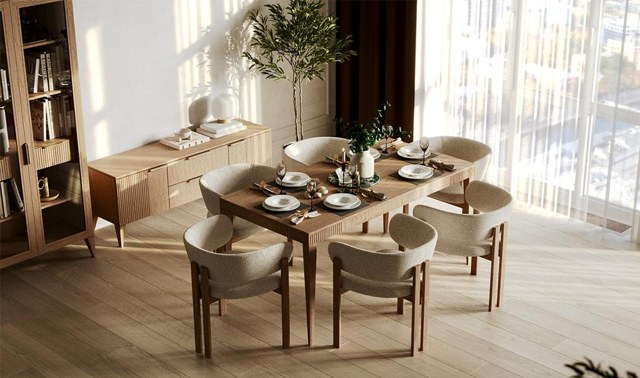

- 원본: `samples/5MrJb0VLPeu5pWNey2XE3AE5mqAXdSIeMg3rOIJIeWpA4TcxyLh5AK3y9gCTXQWQ-2yh5n4XCU6M5aV6gCdLq_Co1O9RGajYjnlSbrrM9lcI409QFCL7dP_5HYuWz04mSDhrlM9zGxCaNrGI4-m7cUKm4ol253hpD9BQ79lcHzgFbr1qnzmPoiVsWJj3JAoo.jpg`
- 정규화 크기: 1024 × 604; 파일 SHA-256: `ba0a206ffa29076dcf29c638a48079034823466522bb3af847e0df294f5cee20`

### Before / After

| Before | After |
|---|---|
| 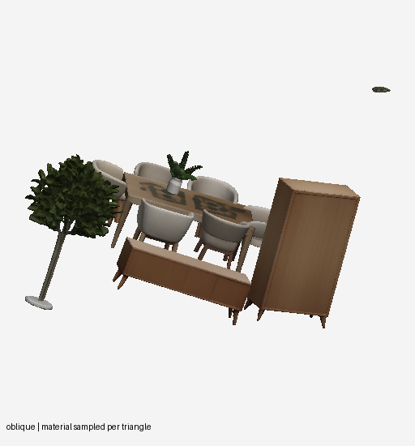 | **미생성** — 자동 승인 검토가 외부 GPU 배치를 차단 |

- [Before Viewer — 로컬 전용](http://127.0.0.1:8082/?run=09c38164b7784d95a2d8856875c497fd)
- Run path/template: `/?run=09c38164b7784d95a2d8856875c497fd`
- Before result: `runs/09c38164b7784d95a2d8856875c497fd/`; GLB: `runs/09c38164b7784d95a2d8856875c497fd/scene.glb`
- 기존 preview: `runs/09c38164b7784d95a2d8856875c497fd/previews/meshes/oblique.png`
- Before metadata 생성 시각: `2026-09-28T10:45:35.084029+00:00`; 생성 객체 12개; 새 background floor 없음.
- Before viewer 재검증: PASS — 로딩/객체 표시 전환/orbit/zoom/pan/GLB 다운로드 hash.
- After Viewer: 생성 불가 — 새 After run ID가 없다.

### 비교

- Before 관찰: 식탁·의자·수납장·식물이 기울어진 구도로 분리되어 있고 공통 바닥은 없다. 우측 상단에 작은 분리 조각도 보인다.
- 새 After가 생성되지 않아 배치·바닥 개선 또는 회귀를 비교 평가할 수 없다.
- 실행 상태: **BLOCKED**. 외부 이미지 전송 및 GPU 비용을 이유로 자동 승인 검토가 차단. 원격 추론 미실행.


<a id="sample-02"></a>
## 02. 8xa39rx4u5sqcekrqskwxmnafwyz.png

### Input

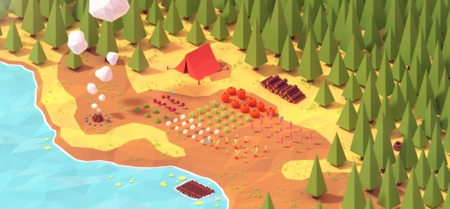

- 원본: `samples/8xa39rx4u5sqcekrqskwxmnafwyz.png`
- 정규화 크기: 2320 × 1080; 파일 SHA-256: `00f05c18c938636e5c1c7631328dafe1f594249e3979c68774838ebb040557b0`

### Before / After

| Before | After |
|---|---|
| 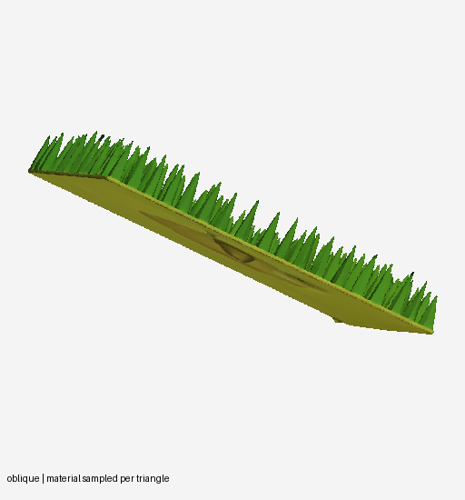 | **미생성** — 자동 승인 검토가 외부 GPU 배치를 차단 |

- [Before Viewer — 로컬 전용](http://127.0.0.1:8082/?run=665e1cdbc01c454e81daa296ca3def4c)
- Run path/template: `/?run=665e1cdbc01c454e81daa296ca3def4c`
- Before result: `runs/665e1cdbc01c454e81daa296ca3def4c/`; GLB: `runs/665e1cdbc01c454e81daa296ca3def4c/scene.glb`
- 기존 preview: `runs/665e1cdbc01c454e81daa296ca3def4c/previews/meshes/oblique.png`
- Before metadata 생성 시각: `2026-09-28T10:55:21.919217+00:00`; 생성 객체 1개; 새 background floor 없음.
- Before viewer 재검증: PASS — 로딩/객체 표시 전환/orbit/zoom/pan/GLB 다운로드 hash.
- After Viewer: 생성 불가 — 새 After run ID가 없다.

### 비교

- Before 관찰: 풀이 붙은 긴 띠 모양의 mesh 하나가 보인다. 객체별 실내 배치 비교에 적합한 결과가 아니다.
- 새 After가 생성되지 않아 배치·바닥 개선 또는 회귀를 비교 평가할 수 없다.
- 실행 상태: **BLOCKED**. 외부 이미지 전송 및 GPU 비용을 이유로 자동 승인 검토가 차단. 원격 추론 미실행.


<a id="sample-03"></a>
## 03. a13d86d90a88538ce3427fe524a79857cbd9b0ae.png

### Input

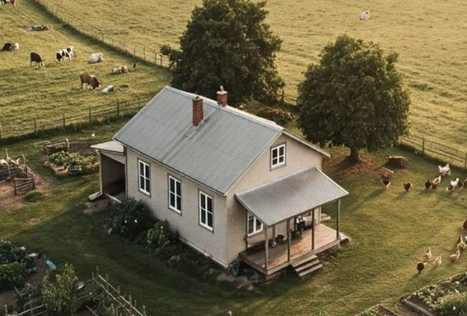

- 원본: `samples/a13d86d90a88538ce3427fe524a79857cbd9b0ae.png`
- 정규화 크기: 586 × 396; 파일 SHA-256: `83aaaf9605921fc3d4dfb866d8fe50bffc3f054023648e8ef2f154086d75c3a5`

### Before / After

| Before | After |
|---|---|
| 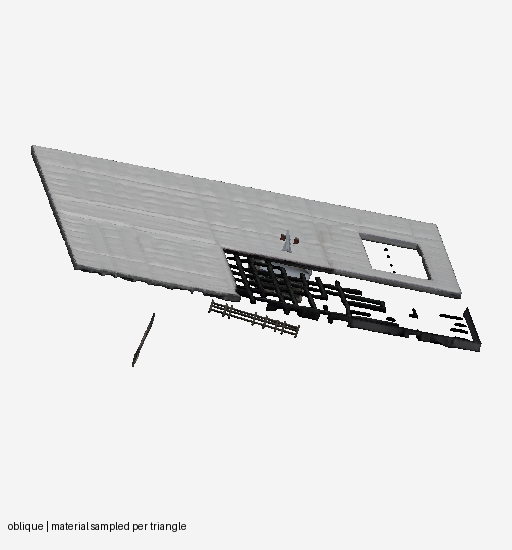 | **미생성** — 자동 승인 검토가 외부 GPU 배치를 차단 |

- [Before Viewer — 로컬 전용](http://127.0.0.1:8082/?run=21674af9d4fe41d48d57b0697b55c696)
- Run path/template: `/?run=21674af9d4fe41d48d57b0697b55c696`
- Before result: `runs/21674af9d4fe41d48d57b0697b55c696/`; GLB: `runs/21674af9d4fe41d48d57b0697b55c696/scene.glb`
- 기존 preview: `runs/21674af9d4fe41d48d57b0697b55c696/previews/meshes/oblique.png`
- Before metadata 생성 시각: `2026-09-28T11:05:41.106891+00:00`; 생성 객체 5개; 새 background floor 없음.
- Before viewer 재검증: PASS — 로딩/객체 표시 전환/orbit/zoom/pan/GLB 다운로드 hash.
- After Viewer: 생성 불가 — 새 After run ID가 없다.

### 비교

- Before 관찰: 넓은 회색 평판과 검은 파편이 보이며 집·울타리의 입체 배치를 명확히 읽기 어렵다.
- 새 After가 생성되지 않아 배치·바닥 개선 또는 회귀를 비교 평가할 수 없다.
- 실행 상태: **BLOCKED**. 외부 이미지 전송 및 GPU 비용을 이유로 자동 승인 검토가 차단. 원격 추론 미실행.


<a id="sample-04"></a>
## 04. alexandra-gorn-JIUjvqe2ZHg-unsplash.jpg

### Input

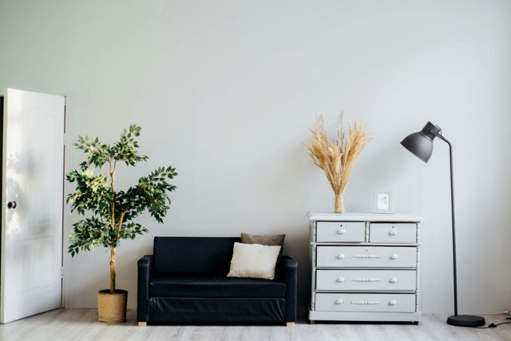

- 원본: `samples/alexandra-gorn-JIUjvqe2ZHg-unsplash.jpg`
- 정규화 크기: 5141 × 3432; 파일 SHA-256: `7e07567119d14e22d73d467e7b6014a7f1692dedbe3fb3e7000525eea2114ed3`

### Before / After

| Before | After |
|---|---|
| BEFORE MISSING — 매칭되는 기존 완료 결과 없음 | **미생성** — 로컬 16MP 입력 제한으로 HTTP 400 |

- Before Viewer: 생성 불가 — 정확히 일치하는 기존 완료 run/scene.glb가 없다.
- After Viewer: 생성 불가 — 새 After run ID가 없다.

### 비교

- Before 관찰: 매칭되는 기존 완료 run/preview가 없어 Before를 평가할 수 없다.
- 새 After가 생성되지 않아 배치·바닥 개선 또는 회귀를 비교 평가할 수 없다.
- 실행 상태: **FAIL**. 실제 로컬 제출 HTTP 400, 16MP 제한 초과. 원격 추론/새 run 없음.


<a id="sample-05"></a>
## 05. B0yMng87-QPZy6YxEl1ssQEFb_12gluF-a3W_mDjVJXYAfZjJCTiz31ryltReAixhwtGZ3W2z-juGvI49scRNCrGm1OwbMpics6giwZNXhOeKeLiSxJStFGoy7_6ONvkieN2ukysror9ZTsCPxU5RdSBku9fHHRqEGuvK9SgR3Y9vZ8vI1-30bmfKLHI1-XC.jpg

### Input

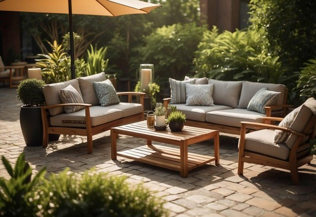

- 원본: `samples/B0yMng87-QPZy6YxEl1ssQEFb_12gluF-a3W_mDjVJXYAfZjJCTiz31ryltReAixhwtGZ3W2z-juGvI49scRNCrGm1OwbMpics6giwZNXhOeKeLiSxJStFGoy7_6ONvkieN2ukysror9ZTsCPxU5RdSBku9fHHRqEGuvK9SgR3Y9vZ8vI1-30bmfKLHI1-XC.jpg`
- 정규화 크기: 1213 × 832; 파일 SHA-256: `eb55fcc24d27bf3d9be6596ef731f9a7cdd9fa3db53d4424fcba8f4edc5b7344`

### Before / After

| Before | After |
|---|---|
| 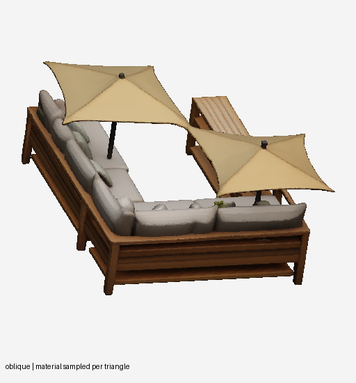 | **미생성** — 자동 승인 검토가 외부 GPU 배치를 차단 |

- [Before Viewer — 로컬 전용](http://127.0.0.1:8082/?run=13904c85687049dfb0a592cfadf75ccf)
- Run path/template: `/?run=13904c85687049dfb0a592cfadf75ccf`
- Before result: `runs/13904c85687049dfb0a592cfadf75ccf/`; GLB: `runs/13904c85687049dfb0a592cfadf75ccf/scene.glb`
- 기존 preview: `runs/13904c85687049dfb0a592cfadf75ccf/previews/meshes/oblique.png`
- Before metadata 생성 시각: `2026-09-28T11:07:28.306334+00:00`; 생성 객체 1개; 새 background floor 없음.
- Before viewer 재검증: PASS — 로딩/객체 표시 전환/orbit/zoom/pan/GLB 다운로드 hash.
- After Viewer: 생성 불가 — 새 After run ID가 없다.

### 비교

- Before 관찰: 파라솔과 야외 좌석이 하나의 큰 구조로 묶여 보인다. 별도 생성 background floor는 없다.
- 새 After가 생성되지 않아 배치·바닥 개선 또는 회귀를 비교 평가할 수 없다.
- 실행 상태: **BLOCKED**. 외부 이미지 전송 및 GPU 비용을 이유로 자동 승인 검토가 차단. 원격 추론 미실행.


<a id="sample-06"></a>
## 06. b56sFfaPgkefPFYeBio8ADIH5j84GCngk7CWJnJ3RzaYXvvDZ7NODDOhzCsj1XdHE4CJMqEm6yuVIDXQ52oH8UcRik85dvvqqg32XO_sDJs0zi9uSCUhmWR88pALGx8Vh3ZyLgJ_6_wL_NevQv--kwsN-sdr38bODDTADOoOg52lgTQgsTtfuyPvaMB26kx-.jpg

### Input

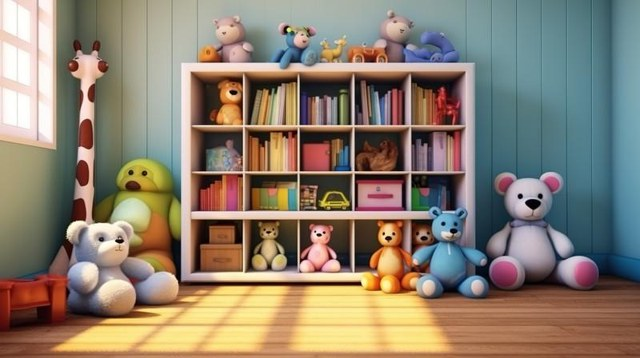

- 원본: `samples/b56sFfaPgkefPFYeBio8ADIH5j84GCngk7CWJnJ3RzaYXvvDZ7NODDOhzCsj1XdHE4CJMqEm6yuVIDXQ52oH8UcRik85dvvqqg32XO_sDJs0zi9uSCUhmWR88pALGx8Vh3ZyLgJ_6_wL_NevQv--kwsN-sdr38bODDTADOoOg52lgTQgsTtfuyPvaMB26kx-.jpg`
- 정규화 크기: 800 × 448; 파일 SHA-256: `cf6c50c171c50eb1c1de33248500a5461f381737f25b6a56c4e7b44c97a53d8f`

### Before / After

| Before | After |
|---|---|
| 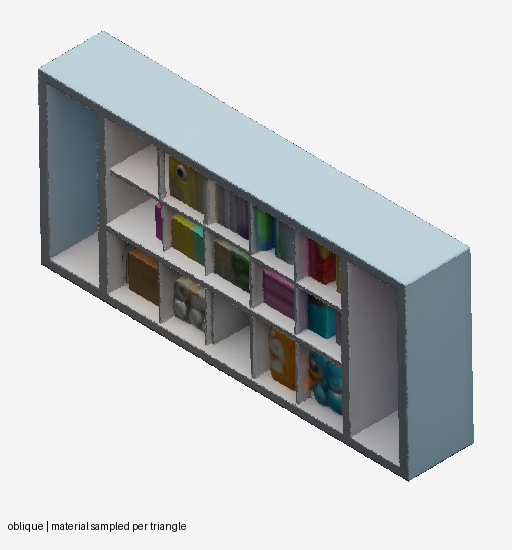 | **미생성** — 자동 승인 검토가 외부 GPU 배치를 차단 |

- [Before Viewer — 로컬 전용](http://127.0.0.1:8082/?run=199672dbca6e4d2da59822262fae88a1)
- Run path/template: `/?run=199672dbca6e4d2da59822262fae88a1`
- Before result: `runs/199672dbca6e4d2da59822262fae88a1/`; GLB: `runs/199672dbca6e4d2da59822262fae88a1/scene.glb`
- 기존 preview: `runs/199672dbca6e4d2da59822262fae88a1/previews/meshes/oblique.png`
- Before metadata 생성 시각: `2026-09-28T11:08:30.723485+00:00`; 생성 객체 1개; 새 background floor 없음.
- Before viewer 재검증: PASS — 로딩/객체 표시 전환/orbit/zoom/pan/GLB 다운로드 hash.
- After Viewer: 생성 불가 — 새 After run ID가 없다.

### 비교

- Before 관찰: 다색 칸이 있는 수납장 모양 구조 하나가 보인다. 원본 전체 공간의 객체별 복원 여부는 제한적이다.
- 새 After가 생성되지 않아 배치·바닥 개선 또는 회귀를 비교 평가할 수 없다.
- 실행 상태: **BLOCKED**. 외부 이미지 전송 및 GPU 비용을 이유로 자동 승인 검토가 차단. 원격 추론 미실행.


<a id="sample-07"></a>
## 07. ca4f0d0e-b693-4985-9abf-23a69a8b37a1.jpg

### Input

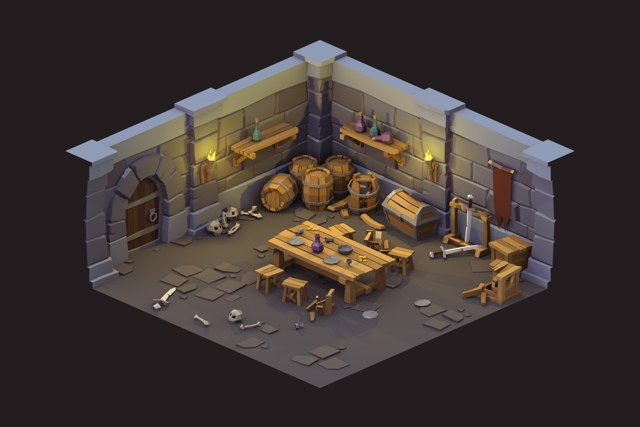

- 원본: `samples/ca4f0d0e-b693-4985-9abf-23a69a8b37a1.jpg`
- 정규화 크기: 1950 × 1300; 파일 SHA-256: `ec9fa808d1dae327083b1aabeed6c0329c0c13078ef973593f2ecf7fee1b42dc`

### Before / After

| Before | After |
|---|---|
| 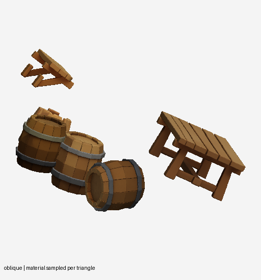 | **미생성** — 자동 승인 검토가 외부 GPU 배치를 차단 |

- [Before Viewer — 로컬 전용](http://127.0.0.1:8082/?run=7dc137b805ce41f985ba9b37587b6670)
- Run path/template: `/?run=7dc137b805ce41f985ba9b37587b6670`
- Before result: `runs/7dc137b805ce41f985ba9b37587b6670/`; GLB: `runs/7dc137b805ce41f985ba9b37587b6670/scene.glb`
- 기존 preview: `runs/7dc137b805ce41f985ba9b37587b6670/previews/meshes/oblique.png`
- Before metadata 생성 시각: `2026-09-28T11:09:20.797977+00:00`; 생성 객체 6개; 새 background floor 없음.
- Before viewer 재검증: PASS — 로딩/객체 표시 전환/orbit/zoom/pan/GLB 다운로드 hash.
- After Viewer: 생성 불가 — 새 After run ID가 없다.

### 비교

- Before 관찰: 통과 벤치들이 서로 떨어져 있으며 일부 벤치는 다른 높이에 보인다. 공통 지지 바닥은 없다.
- 새 After가 생성되지 않아 배치·바닥 개선 또는 회귀를 비교 평가할 수 없다.
- 실행 상태: **BLOCKED**. 외부 이미지 전송 및 GPU 비용을 이유로 자동 승인 검토가 차단. 원격 추론 미실행.


<a id="sample-08"></a>
## 08. CbJCJsFdnzIdxwKJWBi44TSwXU7QZShGXq-wRSfSgF9XUi6g8AntJxejO0qTgSGHyy7XB1lQAhH7j_3jLb7X53yta1NPxNOc83NLO1W77OaD_NnosUASbc467Qch7tnVSw1w6BqynijZW9N3RS7VkA1mln-b5GbPwMhlqVjyMR3AqxqX7Bcpt17_me7qJdvs.jpg

### Input

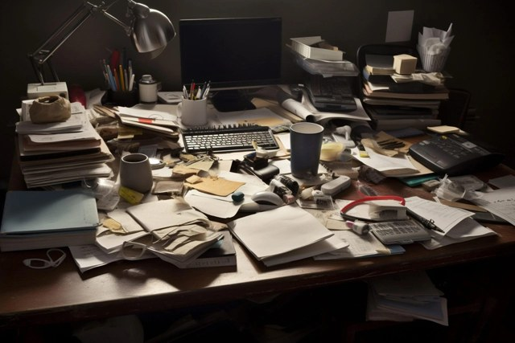

- 원본: `samples/CbJCJsFdnzIdxwKJWBi44TSwXU7QZShGXq-wRSfSgF9XUi6g8AntJxejO0qTgSGHyy7XB1lQAhH7j_3jLb7X53yta1NPxNOc83NLO1W77OaD_NnosUASbc467Qch7tnVSw1w6BqynijZW9N3RS7VkA1mln-b5GbPwMhlqVjyMR3AqxqX7Bcpt17_me7qJdvs.jpg`
- 정규화 크기: 2560 × 1707; 파일 SHA-256: `c46cb4319a66f1112cd3236d599e33ecffd4c920d0e500ae57681bdf989439f6`

### Before / After

| Before | After |
|---|---|
| 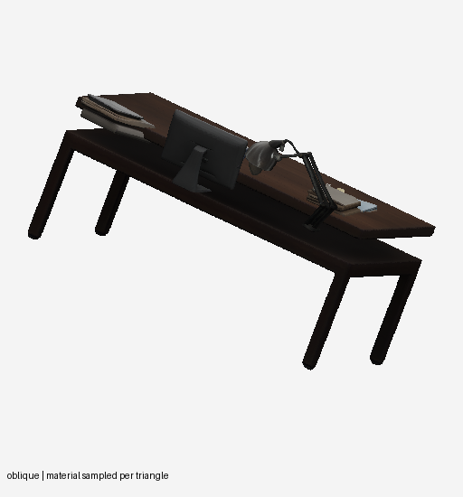 | **미생성** — 자동 승인 검토가 외부 GPU 배치를 차단 |

- [Before Viewer — 로컬 전용](http://127.0.0.1:8082/?run=076a099b71814786acd3979a31b57124)
- Run path/template: `/?run=076a099b71814786acd3979a31b57124`
- Before result: `runs/076a099b71814786acd3979a31b57124/`; GLB: `runs/076a099b71814786acd3979a31b57124/scene.glb`
- 기존 preview: `runs/076a099b71814786acd3979a31b57124/previews/meshes/oblique.png`
- Before metadata 생성 시각: `2026-09-28T11:26:16.737971+00:00`; 생성 객체 12개; 새 background floor 없음.
- Before viewer 재검증: PASS — 로딩/객체 표시 전환/orbit/zoom/pan/GLB 다운로드 hash.
- After Viewer: 생성 불가 — 새 After run ID가 없다.

### 비교

- Before 관찰: 책상과 위의 물체들이 어둡게 보인다. 책상 다리는 있으나 공통 floor geometry는 없다.
- 새 After가 생성되지 않아 배치·바닥 개선 또는 회귀를 비교 평가할 수 없다.
- 실행 상태: **BLOCKED**. 외부 이미지 전송 및 GPU 비용을 이유로 자동 승인 검토가 차단. 원격 추론 미실행.


<a id="sample-09"></a>
## 09. dan-begel-YE7nAeaWS4w-unsplash.jpg

### Input

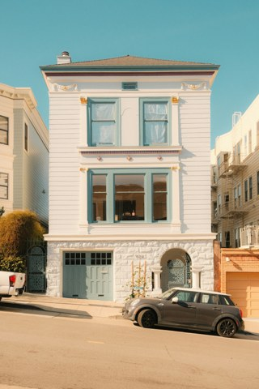

- 원본: `samples/dan-begel-YE7nAeaWS4w-unsplash.jpg`
- 정규화 크기: 3937 × 5905; 파일 SHA-256: `09ba7aae88808b85676e4610c473220a42556d535e3380741d660f9126a99991`

### Before / After

| Before | After |
|---|---|
| BEFORE MISSING — 매칭되는 기존 완료 결과 없음 | **미생성** — 로컬 16MP 입력 제한으로 HTTP 400 |

- Before Viewer: 생성 불가 — 정확히 일치하는 기존 완료 run/scene.glb가 없다.
- After Viewer: 생성 불가 — 새 After run ID가 없다.

### 비교

- Before 관찰: 매칭되는 기존 완료 run/preview가 없어 Before를 평가할 수 없다.
- 새 After가 생성되지 않아 배치·바닥 개선 또는 회귀를 비교 평가할 수 없다.
- 실행 상태: **FAIL**. 실제 로컬 제출 HTTP 400, 16MP 제한 초과. 원격 추론/새 run 없음.


<a id="sample-10"></a>
## 10. fp_eRye2yOmskbXBBLbNnJqI7wZNaZNfkP80C5SW8R81feBrndm8grXAruMEt7n3jCOPKapBKO1-BYfzQrVI70F2jclyDEQg7j_peFK-voT2rH3UYSjTRlLkxtP9JYKAs1P-fOYkti8gQ727Bqi54A0GyR8gyEqBEisFbncIsm4Qar-gL68R6cW8EqsvsuWI.jpg

### Input

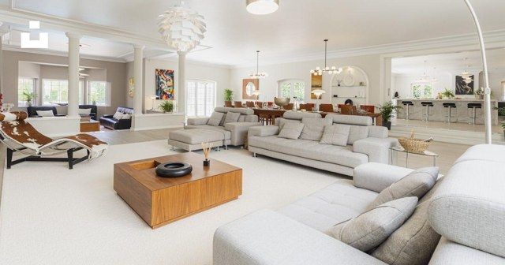

- 원본: `samples/fp_eRye2yOmskbXBBLbNnJqI7wZNaZNfkP80C5SW8R81feBrndm8grXAruMEt7n3jCOPKapBKO1-BYfzQrVI70F2jclyDEQg7j_peFK-voT2rH3UYSjTRlLkxtP9JYKAs1P-fOYkti8gQ727Bqi54A0GyR8gyEqBEisFbncIsm4Qar-gL68R6cW8EqsvsuWI.jpg`
- 정규화 크기: 1200 × 630; 파일 SHA-256: `0747c8c0d050aea1ad3553d9c3f7eef763f609d818c2dc9049e9149160420349`

### Before / After

| Before | After |
|---|---|
| 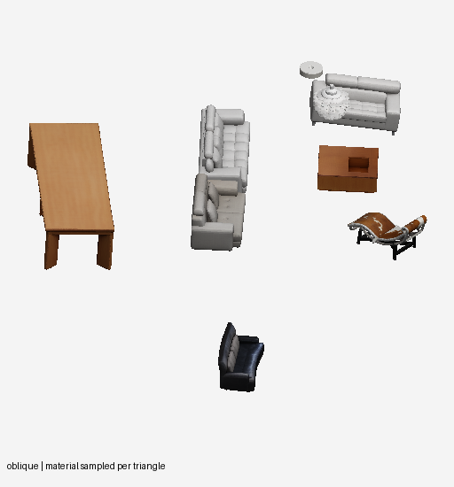 | **미생성** — 자동 승인 검토가 외부 GPU 배치를 차단 |

- [Before Viewer — 로컬 전용](http://127.0.0.1:8082/?run=0831486bdcf741e18fca7953be03090f)
- Run path/template: `/?run=0831486bdcf741e18fca7953be03090f`
- Before result: `runs/0831486bdcf741e18fca7953be03090f/`; GLB: `runs/0831486bdcf741e18fca7953be03090f/scene.glb`
- 기존 preview: `runs/0831486bdcf741e18fca7953be03090f/previews/meshes/oblique.png`
- Before metadata 생성 시각: `2026-09-28T11:46:13.249346+00:00`; 생성 객체 9개; 새 background floor 없음.
- Before viewer 재검증: PASS — 로딩/객체 표시 전환/orbit/zoom/pan/GLB 다운로드 hash.
- After Viewer: 생성 불가 — 새 After run ID가 없다.

### 비교

- Before 관찰: 소파·테이블·의자가 넓게 흩어져 있으며 높이와 방향이 제각각인 구도다.
- 새 After가 생성되지 않아 배치·바닥 개선 또는 회귀를 비교 평가할 수 없다.
- 실행 상태: **BLOCKED**. 외부 이미지 전송 및 GPU 비용을 이유로 자동 승인 검토가 차단. 원격 추론 미실행.


<a id="sample-11"></a>
## 11. frank-huang-8E_RqlT7RUs-unsplash.jpg

### Input

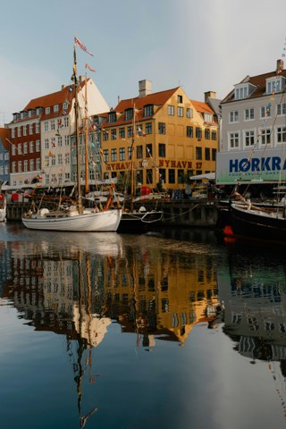

- 원본: `samples/frank-huang-8E_RqlT7RUs-unsplash.jpg`
- 정규화 크기: 3895 × 5843; 파일 SHA-256: `00b740b795a06be262c5293fd69c2b4ccc9000bde43ba6efb3d3f0122c550f6b`

### Before / After

| Before | After |
|---|---|
| BEFORE MISSING — 매칭되는 기존 완료 결과 없음 | **미생성** — 로컬 16MP 입력 제한으로 HTTP 400 |

- Before Viewer: 생성 불가 — 정확히 일치하는 기존 완료 run/scene.glb가 없다.
- After Viewer: 생성 불가 — 새 After run ID가 없다.

### 비교

- Before 관찰: 매칭되는 기존 완료 run/preview가 없어 Before를 평가할 수 없다.
- 새 After가 생성되지 않아 배치·바닥 개선 또는 회귀를 비교 평가할 수 없다.
- 실행 상태: **FAIL**. 실제 로컬 제출 HTTP 400, 16MP 제한 초과. 원격 추론/새 run 없음.


<a id="sample-12"></a>
## 12. g31sErZDtH2kz-tEqjrjWker3lTDkJs7oPZFehc61eEp-0DfHYh8wIcTuk6qlwY9pgckesRSSQLokHEF8hWooWk-aHyZJ9D8_FtRwMIPalu4mI938wXfCKYCFLWtn_baGGbPdKoe3d8t0w_IP6EGmrBZ268ZoGGhYXUonftksdBEuBqChMtPUXu_Y9CI0T6R.jpg

### Input

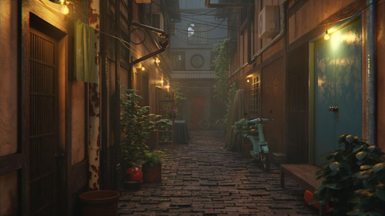

- 원본: `samples/g31sErZDtH2kz-tEqjrjWker3lTDkJs7oPZFehc61eEp-0DfHYh8wIcTuk6qlwY9pgckesRSSQLokHEF8hWooWk-aHyZJ9D8_FtRwMIPalu4mI938wXfCKYCFLWtn_baGGbPdKoe3d8t0w_IP6EGmrBZ268ZoGGhYXUonftksdBEuBqChMtPUXu_Y9CI0T6R.jpg`
- 정규화 크기: 1920 × 1080; 파일 SHA-256: `392dcbc64952d43f65a1d34db8da9e42c54e6a32dec3ed1af4e1d220a8ffde6c`

### Before / After

| Before | After |
|---|---|
| 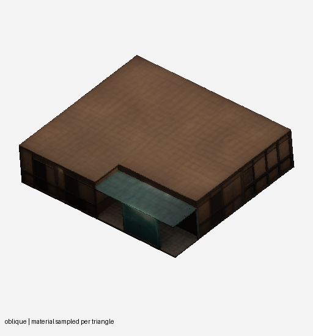 | **미생성** — 자동 승인 검토가 외부 GPU 배치를 차단 |

- [Before Viewer — 로컬 전용](http://127.0.0.1:8082/?run=38abfa6472324289a0983cb386764aef)
- Run path/template: `/?run=38abfa6472324289a0983cb386764aef`
- Before result: `runs/38abfa6472324289a0983cb386764aef/`; GLB: `runs/38abfa6472324289a0983cb386764aef/scene.glb`
- 기존 preview: `runs/38abfa6472324289a0983cb386764aef/previews/meshes/oblique.png`
- Before metadata 생성 시각: `2026-09-28T12:01:20.072643+00:00`; 생성 객체 1개; 새 background floor 없음.
- Before viewer 재검증: PASS — 로딩/객체 표시 전환/orbit/zoom/pan/GLB 다운로드 hash.
- After Viewer: 생성 불가 — 새 After run ID가 없다.

### 비교

- Before 관찰: 큰 갈색 지붕/상자 같은 구조만 두드러진다. 원본 야경의 여러 물체를 구분하기 어렵다.
- 새 After가 생성되지 않아 배치·바닥 개선 또는 회귀를 비교 평가할 수 없다.
- 실행 상태: **BLOCKED**. 외부 이미지 전송 및 GPU 비용을 이유로 자동 승인 검토가 차단. 원격 추론 미실행.


<a id="sample-13"></a>
## 13. hichem-meghachou-7I-Rj_E9ihI-unsplash.jpg

### Input

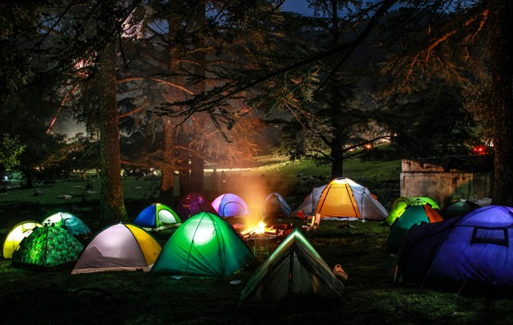

- 원본: `samples/hichem-meghachou-7I-Rj_E9ihI-unsplash.jpg`
- 정규화 크기: 4979 × 3154; 파일 SHA-256: `325fa1c14554b510e1acaa717145992f692c639117bdcdddde4e9aabd33fff04`

### Before / After

| Before | After |
|---|---|
| 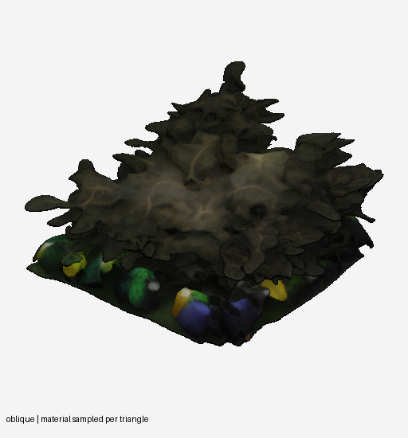 | **미생성** — 자동 승인 검토가 외부 GPU 배치를 차단 |

- [Before Viewer — 로컬 전용](http://127.0.0.1:8082/?run=2b0568809830463899c2705b4321fb8c)
- Run path/template: `/?run=2b0568809830463899c2705b4321fb8c`
- Before result: `runs/2b0568809830463899c2705b4321fb8c/`; GLB: `runs/2b0568809830463899c2705b4321fb8c/scene.glb`
- 기존 preview: `runs/2b0568809830463899c2705b4321fb8c/previews/meshes/oblique.png`
- Before metadata 생성 시각: `2026-09-28T12:02:33.698939+00:00`; 생성 객체 1개; 새 background floor 없음.
- Before viewer 재검증: PASS — 로딩/객체 표시 전환/orbit/zoom/pan/GLB 다운로드 hash.
- After Viewer: 생성 불가 — 새 After run ID가 없다.

### 비교

- Before 관찰: 검고 뒤엉킨 식생/지형 mesh가 보인다. 개별 물체의 바닥 접촉은 판별하기 어렵다.
- 새 After가 생성되지 않아 배치·바닥 개선 또는 회귀를 비교 평가할 수 없다.
- 실행 상태: **BLOCKED**. 외부 이미지 전송 및 GPU 비용을 이유로 자동 승인 검토가 차단. 원격 추론 미실행.


<a id="sample-14"></a>
## 14. HJBLjCUWEAAMNIM.jpg

### Input

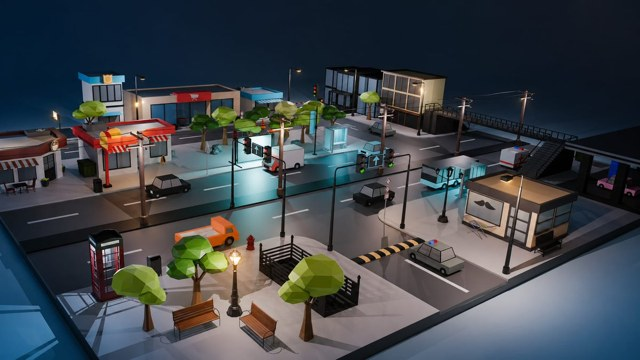

- 원본: `samples/HJBLjCUWEAAMNIM.jpg`
- 정규화 크기: 1199 × 675; 파일 SHA-256: `425e292f40171b952d3eeab709b3959152c623ace04a10c14e782eefa40a44c7`

### Before / After

| Before | After |
|---|---|
| 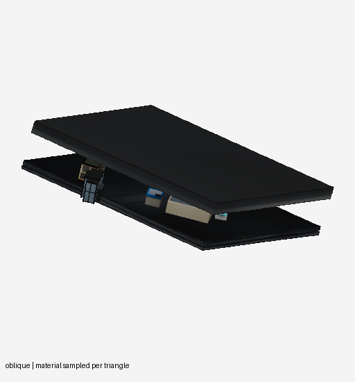 | **미생성** — 자동 승인 검토가 외부 GPU 배치를 차단 |

- [Before Viewer — 로컬 전용](http://127.0.0.1:8082/?run=7f61267de9764daabb786f0a3fc94540)
- Run path/template: `/?run=7f61267de9764daabb786f0a3fc94540`
- Before result: `runs/7f61267de9764daabb786f0a3fc94540/`; GLB: `runs/7f61267de9764daabb786f0a3fc94540/scene.glb`
- 기존 preview: `runs/7f61267de9764daabb786f0a3fc94540/previews/meshes/oblique.png`
- Before metadata 생성 시각: `2026-09-28T12:05:29.703490+00:00`; 생성 객체 8개; 새 background floor 없음.
- Before viewer 재검증: PASS — 로딩/객체 표시 전환/orbit/zoom/pan/GLB 다운로드 hash.
- After Viewer: 생성 불가 — 새 After run ID가 없다.

### 비교

- Before 관찰: 얇고 넓은 검은 판 위주의 결과로, 측면에 일부 도시 텍스처가 보인다.
- 새 After가 생성되지 않아 배치·바닥 개선 또는 회귀를 비교 평가할 수 없다.
- 실행 상태: **BLOCKED**. 외부 이미지 전송 및 GPU 비용을 이유로 자동 승인 검토가 차단. 원격 추론 미실행.


<a id="sample-15"></a>
## 15. image_0001.jpg

### Input

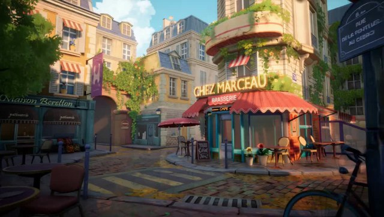

- 원본: `samples/image_0001.jpg`
- 정규화 크기: 1216 × 690; 파일 SHA-256: `8ae922380666d4ab1c5c059a632de49685c5c687f5fbbf56fbab52a637c54168`

### Before / After

| Before | After |
|---|---|
| 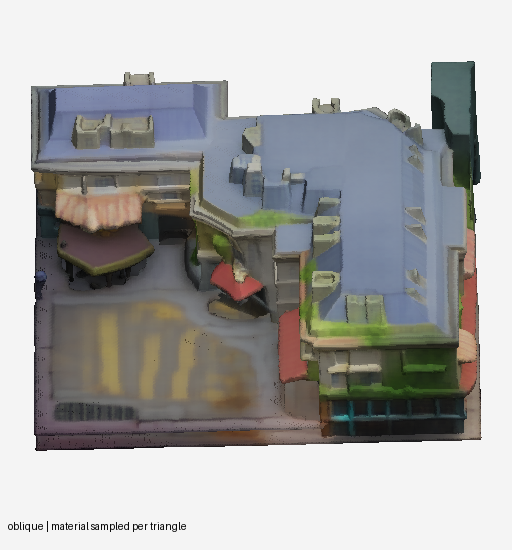 | **미생성** — 자동 승인 검토가 외부 GPU 배치를 차단 |

- [Before Viewer — 로컬 전용](http://127.0.0.1:8082/?run=574cb4de90e34bb684518fd4a459164a)
- Run path/template: `/?run=574cb4de90e34bb684518fd4a459164a`
- Before result: `runs/574cb4de90e34bb684518fd4a459164a/`; GLB: `runs/574cb4de90e34bb684518fd4a459164a/scene.glb`
- 기존 preview: `runs/574cb4de90e34bb684518fd4a459164a/previews/meshes/oblique.png`
- Before metadata 생성 시각: `2026-09-28T12:10:06.823220+00:00`; 생성 객체 1개; 새 background floor 없음.
- Before viewer 재검증: PASS — 로딩/객체 표시 전환/orbit/zoom/pan/GLB 다운로드 hash.
- After Viewer: 생성 불가 — 새 After run ID가 없다.

### 비교

- Before 관찰: 건물 전면과 지면 일부가 사각형 조각으로 묶여 보인다. 별도 배경 바닥은 없다.
- 새 After가 생성되지 않아 배치·바닥 개선 또는 회귀를 비교 평가할 수 없다.
- 실행 상태: **BLOCKED**. 외부 이미지 전송 및 GPU 비용을 이유로 자동 승인 검토가 차단. 원격 추론 미실행.


<a id="sample-16"></a>
## 16. images.jpg

### Input

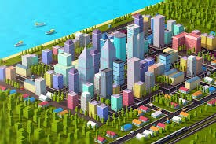

- 원본: `samples/images.jpg`
- 정규화 크기: 275 × 183; 파일 SHA-256: `ed9e390568e274e9b0782eebb41f64d2726d533c53684cb1870a8e7395a6df1c`

### Before / After

| Before | After |
|---|---|
| 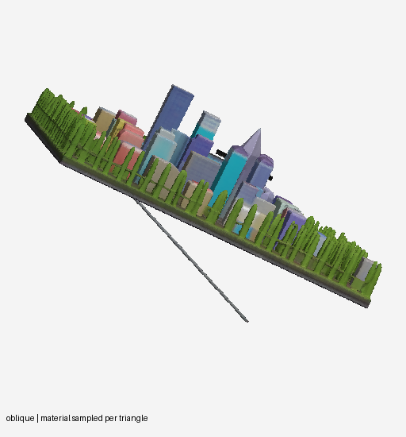 | **미생성** — 자동 승인 검토가 외부 GPU 배치를 차단 |

- [Before Viewer — 로컬 전용](http://127.0.0.1:8082/?run=ac50e4379b3a4a278f470514e44d0516)
- Run path/template: `/?run=ac50e4379b3a4a278f470514e44d0516`
- Before result: `runs/ac50e4379b3a4a278f470514e44d0516/`; GLB: `runs/ac50e4379b3a4a278f470514e44d0516/scene.glb`
- 기존 preview: `runs/ac50e4379b3a4a278f470514e44d0516/previews/meshes/oblique.png`
- Before metadata 생성 시각: `2026-09-28T12:11:28.420015+00:00`; 생성 객체 3개; 새 background floor 없음.
- Before viewer 재검증: PASS — 로딩/객체 표시 전환/orbit/zoom/pan/GLB 다운로드 hash.
- After Viewer: 생성 불가 — 새 After run ID가 없다.

### 비교

- Before 관찰: 도시 skyline과 식생이 긴 띠에 배열되어 있고 아래로 길게 뻗는 가는 조각이 있다.
- 새 After가 생성되지 않아 배치·바닥 개선 또는 회귀를 비교 평가할 수 없다.
- 실행 상태: **BLOCKED**. 외부 이미지 전송 및 GPU 비용을 이유로 자동 승인 검토가 차단. 원격 추론 미실행.


<a id="sample-17"></a>
## 17. input.jpg

### Input

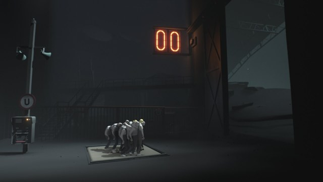

- 원본: `samples/input.jpg`
- 정규화 크기: 1920 × 1080; 파일 SHA-256: `2d1fe4b724766a5b74c74f095a59412e1bba658f7c71a8ae57f7ce4b1e4ccf02`

### Before / After

| Before | After |
|---|---|
| 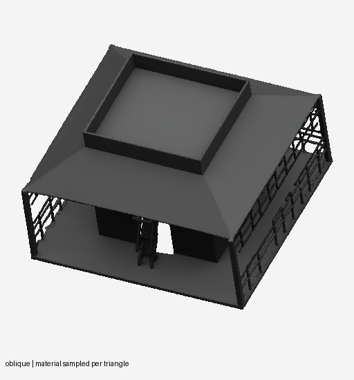 | **미생성** — 자동 승인 검토가 외부 GPU 배치를 차단 |

- [Before Viewer — 로컬 전용](http://127.0.0.1:8082/?run=85f5814232a74b77ab05e21e252027ae)
- Run path/template: `/?run=85f5814232a74b77ab05e21e252027ae`
- Before result: `runs/85f5814232a74b77ab05e21e252027ae/`; GLB: `runs/85f5814232a74b77ab05e21e252027ae/scene.glb`
- 기존 preview: `runs/85f5814232a74b77ab05e21e252027ae/previews/meshes/oblique.png`
- Before metadata 생성 시각: `2026-09-28T12:12:51.942982+00:00`; 생성 객체 5개; 새 background floor 없음.
- Before viewer 재검증: PASS — 로딩/객체 표시 전환/orbit/zoom/pan/GLB 다운로드 hash.
- After Viewer: 생성 불가 — 새 After run ID가 없다.

### 비교

- Before 관찰: 큰 회색 사각 프레임/평판 구조가 보인다. 어두운 원본의 세부 물체 구분은 제한적이다.
- 새 After가 생성되지 않아 배치·바닥 개선 또는 회귀를 비교 평가할 수 없다.
- 실행 상태: **BLOCKED**. 외부 이미지 전송 및 GPU 비용을 이유로 자동 승인 검토가 차단. 원격 추론 미실행.


<a id="sample-18"></a>
## 18. julia-aX1TTOuq83M-unsplash.jpg

### Input

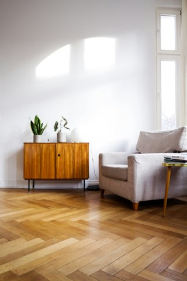

- 원본: `samples/julia-aX1TTOuq83M-unsplash.jpg`
- 정규화 크기: 3443 × 5165; 파일 SHA-256: `d25c7faff7ea26646da36e08cb3d5d8b29832fd3968dec084af335536ba40f54`

### Before / After

| Before | After |
|---|---|
| BEFORE MISSING — 매칭되는 기존 완료 결과 없음 | **미생성** — 로컬 16MP 입력 제한으로 HTTP 400 |

- Before Viewer: 생성 불가 — 정확히 일치하는 기존 완료 run/scene.glb가 없다.
- After Viewer: 생성 불가 — 새 After run ID가 없다.

### 비교

- Before 관찰: 매칭되는 기존 완료 run/preview가 없어 Before를 평가할 수 없다.
- 새 After가 생성되지 않아 배치·바닥 개선 또는 회귀를 비교 평가할 수 없다.
- 실행 상태: **FAIL**. 실제 로컬 제출 HTTP 400, 16MP 제한 초과. 원격 추론/새 run 없음.


<a id="sample-19"></a>
## 19. KakaoTalk_20260829_164738573.jpg

### Input

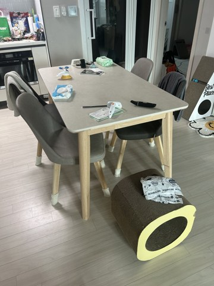

- 원본: `samples/KakaoTalk_20260829_164738573.jpg`
- 정규화 크기: 3024 × 4032; 파일 SHA-256: `9877b7dc938a4fd98fa7ea3979b658bea7589358942ea6db350cdc939c21e285`

### Before / After

| Before | After |
|---|---|
| 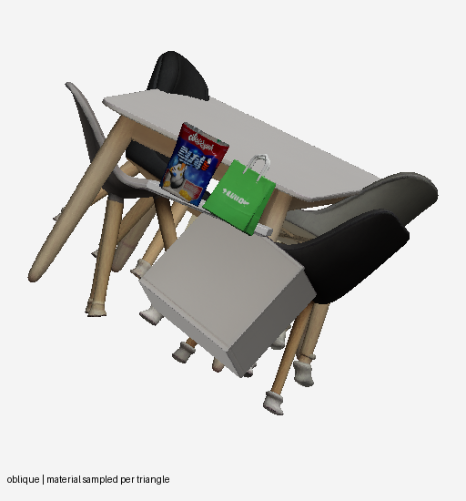 | **미생성** — 자동 승인 검토가 외부 GPU 배치를 차단 |

- [Before Viewer — 로컬 전용](http://127.0.0.1:8082/?run=d57fea2928e6401683c9499f3f4a4a4f)
- Run path/template: `/?run=d57fea2928e6401683c9499f3f4a4a4f`
- Before result: `runs/d57fea2928e6401683c9499f3f4a4a4f/`; GLB: `runs/d57fea2928e6401683c9499f3f4a4a4f/scene.glb`
- 기존 preview: `runs/d57fea2928e6401683c9499f3f4a4a4f/previews/meshes/oblique.png`
- Before metadata 생성 시각: `2026-09-28T12:15:40.460560+00:00`; 생성 객체 10개; 새 background floor 없음.
- Before viewer 재검증: PASS — 로딩/객체 표시 전환/orbit/zoom/pan/GLB 다운로드 hash.
- After Viewer: 생성 불가 — 새 After run ID가 없다.

### 비교

- Before 관찰: 책상·의자와 책상 위 소품들이 기울어져 보인다. 공통 floor 없이 독립 물체들만 보인다.
- 새 After가 생성되지 않아 배치·바닥 개선 또는 회귀를 비교 평가할 수 없다.
- 실행 상태: **BLOCKED**. 외부 이미지 전송 및 GPU 비용을 이유로 자동 승인 검토가 차단. 원격 추론 미실행.


<a id="sample-20"></a>
## 20. l4Oe0Mu-LKBiOcEUE3ShgfPgdMIGE0hoTei-xgsPPlhAaMJ5HoZ7mOjtNhmYq74wdZcE5bCSkJDzc-pQQmt8qZO_8Ww6-_CO8B6HnEjpfwv6M_cOx_nWKQNsaIAtzAKaYGIwbEoAwRKmXdySd6VZIdHev7ufXxGdI3_vUH0UxPRWF_u3ffY5GhFOfC4ibA6l.jpg

### Input

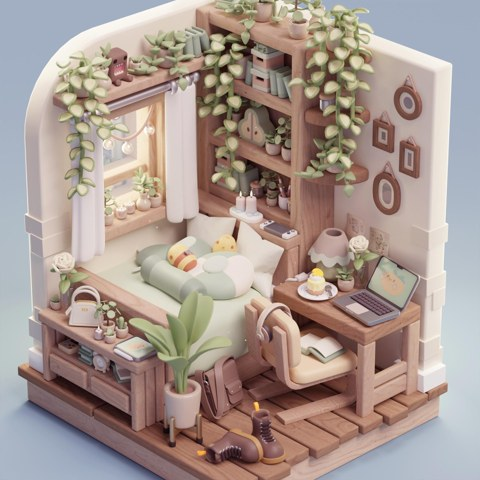

- 원본: `samples/l4Oe0Mu-LKBiOcEUE3ShgfPgdMIGE0hoTei-xgsPPlhAaMJ5HoZ7mOjtNhmYq74wdZcE5bCSkJDzc-pQQmt8qZO_8Ww6-_CO8B6HnEjpfwv6M_cOx_nWKQNsaIAtzAKaYGIwbEoAwRKmXdySd6VZIdHev7ufXxGdI3_vUH0UxPRWF_u3ffY5GhFOfC4ibA6l.jpg`
- 정규화 크기: 1920 × 1920; 파일 SHA-256: `0f36093ff890d34c7f12d2c500a51e18cf6ee6cfb95e6fbb1bce7c34e286bfb3`

### Before / After

| Before | After |
|---|---|
| 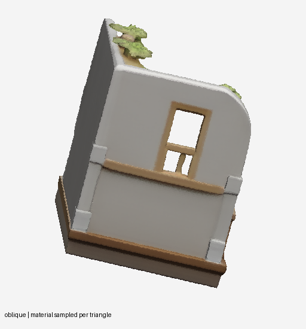 | **미생성** — 자동 승인 검토가 외부 GPU 배치를 차단 |

- [Before Viewer — 로컬 전용](http://127.0.0.1:8082/?run=f26922c3015947b0b14ae08dac796932)
- Run path/template: `/?run=f26922c3015947b0b14ae08dac796932`
- Before result: `runs/f26922c3015947b0b14ae08dac796932/`; GLB: `runs/f26922c3015947b0b14ae08dac796932/scene.glb`
- 기존 preview: `runs/f26922c3015947b0b14ae08dac796932/previews/meshes/oblique.png`
- Before metadata 생성 시각: `2026-09-28T12:20:39.579286+00:00`; 생성 객체 1개; 새 background floor 없음.
- Before viewer 재검증: PASS — 로딩/객체 표시 전환/orbit/zoom/pan/GLB 다운로드 hash.
- After Viewer: 생성 불가 — 새 After run ID가 없다.

### 비교

- Before 관찰: 문과 벽을 포함한 작은 room-shell 같은 mesh 하나가 보인다. 이는 기존 SAM3D 객체이며 새 background floor가 아니다.
- 새 After가 생성되지 않아 배치·바닥 개선 또는 회귀를 비교 평가할 수 없다.
- 실행 상태: **BLOCKED**. 외부 이미지 전송 및 GPU 비용을 이유로 자동 승인 검토가 차단. 원격 추론 미실행.


<a id="sample-21"></a>
## 21. living_room.jpg

### Input

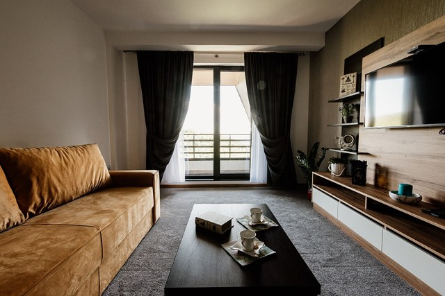

- 원본: `samples/living_room.jpg`
- 정규화 크기: 1280 × 854; 파일 SHA-256: `1a92e6520244da4d9890e1a784cd717ca54906e4c5fa491e192a2f52f4a5a9bc`

### Before / After

| Before | After |
|---|---|
| 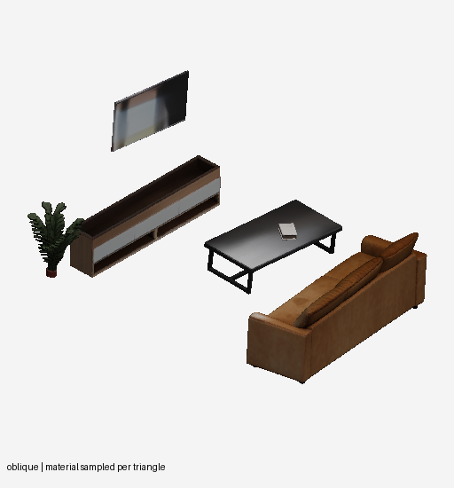 | **미생성** — 자동 승인 검토가 외부 GPU 배치를 차단 |

- [Before Viewer — 로컬 전용](http://127.0.0.1:8082/?run=7bcd165489c84f6e9436e983f474c017)
- Run path/template: `/?run=7bcd165489c84f6e9436e983f474c017`
- Before result: `runs/7bcd165489c84f6e9436e983f474c017/`; GLB: `runs/7bcd165489c84f6e9436e983f474c017/scene.glb`
- 기존 preview: `runs/7bcd165489c84f6e9436e983f474c017/previews/meshes/oblique.png`
- Before metadata 생성 시각: `2026-09-28T10:28:31.883397+00:00`; 생성 객체 6개; 새 background floor 없음.
- Before viewer 재검증: PASS — 로딩/객체 표시 전환/orbit/zoom/pan/GLB 다운로드 hash.
- After Viewer: 생성 불가 — 새 After run ID가 없다.

### 비교

- Before 관찰: 소파·테이블·수납장·TV·식물이 분리되어 있다. 소파와 수납장의 최저 높이가 다르고 별도 바닥은 없다.
- 새 After가 생성되지 않아 배치·바닥 개선 또는 회귀를 비교 평가할 수 없다.
- 실행 상태: **BLOCKED**. 외부 이미지 전송 및 GPU 비용을 이유로 자동 승인 검토가 차단. 원격 추론 미실행.


<a id="sample-22"></a>
## 22. p4oC_SMMAWoxQP0Xb92NkrPRCk-o_WPNRIKgnRpyd58T8Xxihjpkh8_TvVFr8XKHqUAkQIeFmq4idGkwmNBPUn-Uy55tm1l30lca6QdZ0x2S1pwVRthYaLVkOG0bGYj3d_GMohI6hlRjn0Ic3INlwTjtuwnisYxzsJoPUeQ2o2X6JCASeT-hL1Jyn4sxoCgP.jpg

### Input

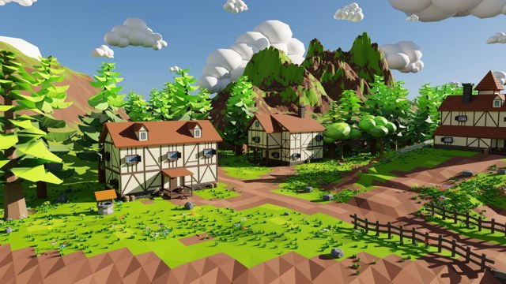

- 원본: `samples/p4oC_SMMAWoxQP0Xb92NkrPRCk-o_WPNRIKgnRpyd58T8Xxihjpkh8_TvVFr8XKHqUAkQIeFmq4idGkwmNBPUn-Uy55tm1l30lca6QdZ0x2S1pwVRthYaLVkOG0bGYj3d_GMohI6hlRjn0Ic3INlwTjtuwnisYxzsJoPUeQ2o2X6JCASeT-hL1Jyn4sxoCgP.jpg`
- 정규화 크기: 3840 × 2160; 파일 SHA-256: `41169fc3b4900300f74b4af02b037b051f0601b4e0e1a3d68cc186f97acae151`

### Before / After

| Before | After |
|---|---|
| 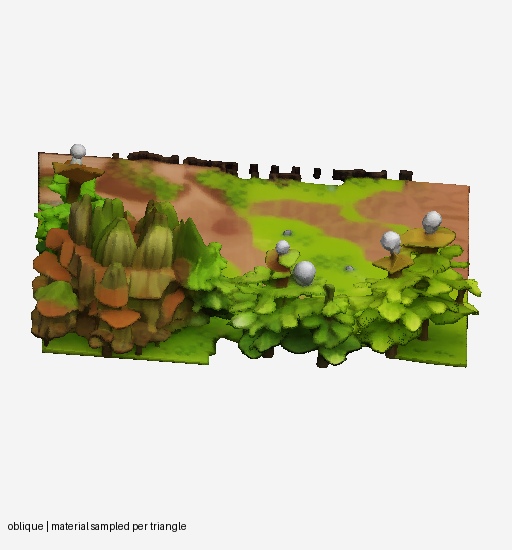 | **미생성** — 자동 승인 검토가 외부 GPU 배치를 차단 |

- [Before Viewer — 로컬 전용](http://127.0.0.1:8082/?run=d66a457c4e6a4aba8d619d646a50fc68)
- Run path/template: `/?run=d66a457c4e6a4aba8d619d646a50fc68`
- Before result: `runs/d66a457c4e6a4aba8d619d646a50fc68/`; GLB: `runs/d66a457c4e6a4aba8d619d646a50fc68/scene.glb`
- 기존 preview: `runs/d66a457c4e6a4aba8d619d646a50fc68/previews/meshes/oblique.png`
- Before metadata 생성 시각: `2026-09-28T12:21:36.005938+00:00`; 생성 객체 1개; 새 background floor 없음.
- Before viewer 재검증: PASS — 로딩/객체 표시 전환/orbit/zoom/pan/GLB 다운로드 hash.
- After Viewer: 생성 불가 — 새 After run ID가 없다.

### 비교

- Before 관찰: 게임 지형과 식생이 긴 디오라마 형태로 한 덩어리로 보인다. 개별 furniture correction 평가 대상은 제한적이다.
- 새 After가 생성되지 않아 배치·바닥 개선 또는 회귀를 비교 평가할 수 없다.
- 실행 상태: **BLOCKED**. 외부 이미지 전송 및 GPU 비용을 이유로 자동 승인 검토가 차단. 원격 추론 미실행.


<a id="sample-23"></a>
## 23. pexels-baran-kilic-640071598-18151871.jpg

### Input

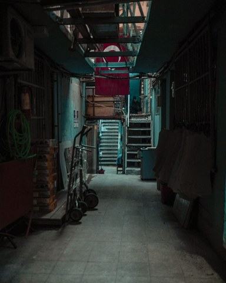

- 원본: `samples/pexels-baran-kilic-640071598-18151871.jpg`
- 정규화 크기: 4159 × 5199; 파일 SHA-256: `c85a699d47f6b674bc08a46df41a3e5d41021b03385bdefa557353884b6022f3`

### Before / After

| Before | After |
|---|---|
| BEFORE MISSING — 매칭되는 기존 완료 결과 없음 | **미생성** — 로컬 16MP 입력 제한으로 HTTP 400 |

- Before Viewer: 생성 불가 — 정확히 일치하는 기존 완료 run/scene.glb가 없다.
- After Viewer: 생성 불가 — 새 After run ID가 없다.

### 비교

- Before 관찰: 매칭되는 기존 완료 run/preview가 없어 Before를 평가할 수 없다.
- 새 After가 생성되지 않아 배치·바닥 개선 또는 회귀를 비교 평가할 수 없다.
- 실행 상태: **FAIL**. 실제 로컬 제출 HTTP 400, 16MP 제한 초과. 원격 추론/새 run 없음.


<a id="sample-24"></a>
## 24. pexels-padrechaks-20422959.jpg

### Input

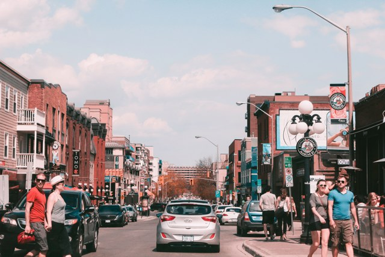

- 원본: `samples/pexels-padrechaks-20422959.jpg`
- 정규화 크기: 5184 × 3456; 파일 SHA-256: `a57910c0e1c9d36ecd310e33da393b26860699ee66df67e4093f8646507538d6`

### Before / After

| Before | After |
|---|---|
| BEFORE MISSING — 매칭되는 기존 완료 결과 없음 | **미생성** — 로컬 16MP 입력 제한으로 HTTP 400 |

- Before Viewer: 생성 불가 — 정확히 일치하는 기존 완료 run/scene.glb가 없다.
- After Viewer: 생성 불가 — 새 After run ID가 없다.

### 비교

- Before 관찰: 매칭되는 기존 완료 run/preview가 없어 Before를 평가할 수 없다.
- 새 After가 생성되지 않아 배치·바닥 개선 또는 회귀를 비교 평가할 수 없다.
- 실행 상태: **FAIL**. 실제 로컬 제출 HTTP 400, 16MP 제한 초과. 원격 추론/새 run 없음.


<a id="sample-25"></a>
## 25. PGnAvG-MUEDZ146fq1MHxdqV-UyNuwFLaiTdCZ_8S2N1eS-bTv24RN6OuyPQvUMbDiZwrSqbpCKcrCEEIx8HAEkcgJpE1eW155RNycHBcqyZXgI7KjZgsHU1CG1F-7sP2GiANdefEyFxmOdMtwp6Q5Ilp-K1JXFsSKlBxEz_EyrvGh1UDPl9AY7X4y5KhN-4.jpg

### Input

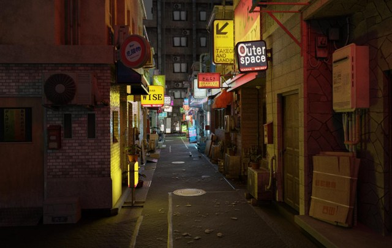

- 원본: `samples/PGnAvG-MUEDZ146fq1MHxdqV-UyNuwFLaiTdCZ_8S2N1eS-bTv24RN6OuyPQvUMbDiZwrSqbpCKcrCEEIx8HAEkcgJpE1eW155RNycHBcqyZXgI7KjZgsHU1CG1F-7sP2GiANdefEyFxmOdMtwp6Q5Ilp-K1JXFsSKlBxEz_EyrvGh1UDPl9AY7X4y5KhN-4.jpg`
- 정규화 크기: 1812 × 1147; 파일 SHA-256: `5088de00aaf91406426d2f5e68fcdd7258a1d7ede20b78b30f50753939b2c5ed`

### Before / After

| Before | After |
|---|---|
| 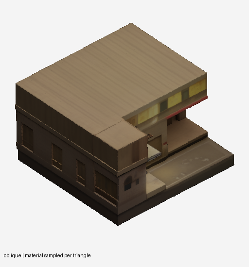 | **미생성** — 자동 승인 검토가 외부 GPU 배치를 차단 |

- [Before Viewer — 로컬 전용](http://127.0.0.1:8082/?run=b3d5939515de4d5ba97e4777c195c634)
- Run path/template: `/?run=b3d5939515de4d5ba97e4777c195c634`
- Before result: `runs/b3d5939515de4d5ba97e4777c195c634/`; GLB: `runs/b3d5939515de4d5ba97e4777c195c634/scene.glb`
- 기존 preview: `runs/b3d5939515de4d5ba97e4777c195c634/previews/meshes/oblique.png`
- Before metadata 생성 시각: `2026-09-28T12:22:54.099915+00:00`; 생성 객체 1개; 새 background floor 없음.
- Before viewer 재검증: PASS — 로딩/객체 표시 전환/orbit/zoom/pan/GLB 다운로드 hash.
- After Viewer: 생성 불가 — 새 After run ID가 없다.

### 비교

- Before 관찰: 갈색 지붕의 상자형 건물 mesh가 두드러진다. 원본의 세부 야경 구조는 제한적으로 복원되었다.
- 새 After가 생성되지 않아 배치·바닥 개선 또는 회귀를 비교 평가할 수 없다.
- 실행 상태: **BLOCKED**. 외부 이미지 전송 및 GPU 비용을 이유로 자동 승인 검토가 차단. 원격 추론 미실행.


<a id="sample-26"></a>
## 26. qLNgF9x-U_xG3reZP3Px6-uHxTOgcdVjej0ta7o3o_JALtaLvp6OpWVZW9B9H2JNz9C9d-UingHLFHmtWpzZFx7thrDhHRtpVlPk7GJrju3MurHGxOhEwW-Lwu8O8AEc8es3C5mRb6wJ97zAqOxj0RpXy_5KvOW7sIpU5LFlwZcZmuIIoZamEllBZ8MRaY3p.jpg

### Input

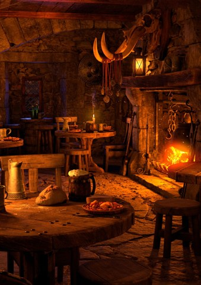

- 원본: `samples/qLNgF9x-U_xG3reZP3Px6-uHxTOgcdVjej0ta7o3o_JALtaLvp6OpWVZW9B9H2JNz9C9d-UingHLFHmtWpzZFx7thrDhHRtpVlPk7GJrju3MurHGxOhEwW-Lwu8O8AEc8es3C5mRb6wJ97zAqOxj0RpXy_5KvOW7sIpU5LFlwZcZmuIIoZamEllBZ8MRaY3p.jpg`
- 정규화 크기: 1448 × 2048; 파일 SHA-256: `7c9a5d9d7de79165f48b8691ad8177b46ca16fba91cb5a64b3e961549e00acd9`

### Before / After

| Before | After |
|---|---|
| 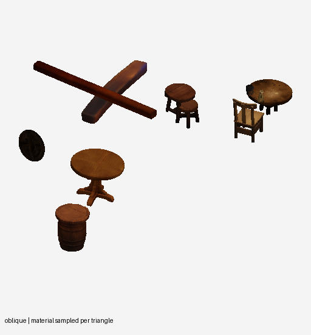 | **미생성** — 자동 승인 검토가 외부 GPU 배치를 차단 |

- [Before Viewer — 로컬 전용](http://127.0.0.1:8082/?run=67281f01271b4c86975c9cdbd5767ff8)
- Run path/template: `/?run=67281f01271b4c86975c9cdbd5767ff8`
- Before result: `runs/67281f01271b4c86975c9cdbd5767ff8/`; GLB: `runs/67281f01271b4c86975c9cdbd5767ff8/scene.glb`
- 기존 preview: `runs/67281f01271b4c86975c9cdbd5767ff8/previews/meshes/oblique.png`
- Before metadata 생성 시각: `2026-09-28T12:24:50.378568+00:00`; 생성 객체 12개; 새 background floor 없음.
- Before viewer 재검증: PASS — 로딩/객체 표시 전환/orbit/zoom/pan/GLB 다운로드 hash.
- After Viewer: 생성 불가 — 새 After run ID가 없다.

### 비교

- Before 관찰: 테이블·스툴·통과 긴 막대가 서로 분리되어 있다. 막대들이 X자로 교차하고 높이가 제각각이다.
- 새 After가 생성되지 않아 배치·바닥 개선 또는 회귀를 비교 평가할 수 없다.
- 실행 상태: **BLOCKED**. 외부 이미지 전송 및 GPU 비용을 이유로 자동 승인 검토가 차단. 원격 추론 미실행.


<a id="sample-27"></a>
## 27. slR2ZfS3jpf_xRfH8yirgKg2ZFNhT9KPhM97Yn59E5L7aWfgzmblOYRWqQJV6ucxlqTF0YjQk1W0g6vfEjr2Dz7CSoArUiKBKlGmbCKz-aCSL3qITYgZH7m04K30cfSDm1NnpmoyN7-wDu4FptSSs8XjA9TgVSIZMw0jAAesfkGaEwET35zT6NXHrrL4EBAd.jpg

### Input

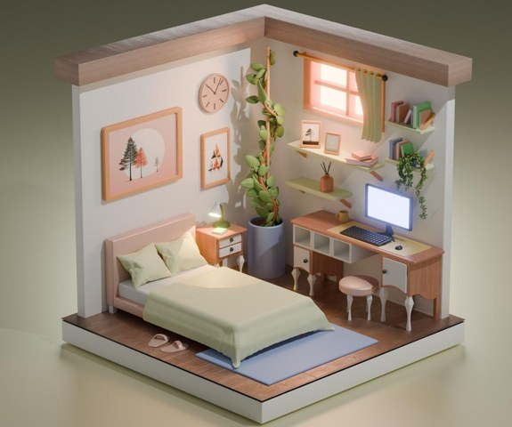

- 원본: `samples/slR2ZfS3jpf_xRfH8yirgKg2ZFNhT9KPhM97Yn59E5L7aWfgzmblOYRWqQJV6ucxlqTF0YjQk1W0g6vfEjr2Dz7CSoArUiKBKlGmbCKz-aCSL3qITYgZH7m04K30cfSDm1NnpmoyN7-wDu4FptSSs8XjA9TgVSIZMw0jAAesfkGaEwET35zT6NXHrrL4EBAd.jpg`
- 정규화 크기: 1293 × 1080; 파일 SHA-256: `ae06b9d95e62dae6892387ca276c069e6167296c4e6094f19b31f25fe68f442a`

### Before / After

| Before | After |
|---|---|
| 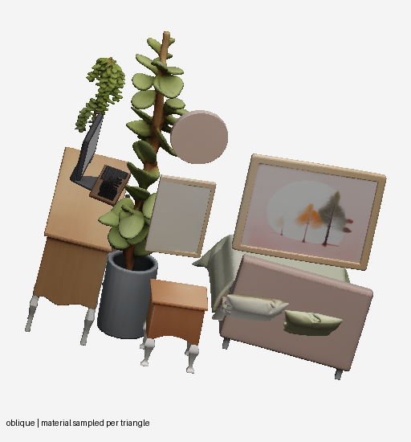 | **미생성** — 자동 승인 검토가 외부 GPU 배치를 차단 |

- [Before Viewer — 로컬 전용](http://127.0.0.1:8082/?run=8c4ac2b9b70d4ca7a0336ff065db5176)
- Run path/template: `/?run=8c4ac2b9b70d4ca7a0336ff065db5176`
- Before result: `runs/8c4ac2b9b70d4ca7a0336ff065db5176/`; GLB: `runs/8c4ac2b9b70d4ca7a0336ff065db5176/scene.glb`
- 기존 preview: `runs/8c4ac2b9b70d4ca7a0336ff065db5176/previews/meshes/oblique.png`
- Before metadata 생성 시각: `2026-09-28T12:33:27.622210+00:00`; 생성 객체 12개; 새 background floor 없음.
- Before viewer 재검증: PASS — 로딩/객체 표시 전환/orbit/zoom/pan/GLB 다운로드 hash.
- After Viewer: 생성 불가 — 새 After run ID가 없다.

### 비교

- Before 관찰: 침대·책상·협탁·식물·벽 장식이 분리되어 있고 공통 floor가 없다. 전체가 기울어진 구도다.
- 새 After가 생성되지 않아 배치·바닥 개선 또는 회귀를 비교 평가할 수 없다.
- 실행 상태: **BLOCKED**. 외부 이미지 전송 및 GPU 비용을 이유로 자동 승인 검토가 차단. 원격 추론 미실행.


<a id="sample-28"></a>
## 28. spacejoy-9M66C_w_ToM-unsplash.jpg

### Input

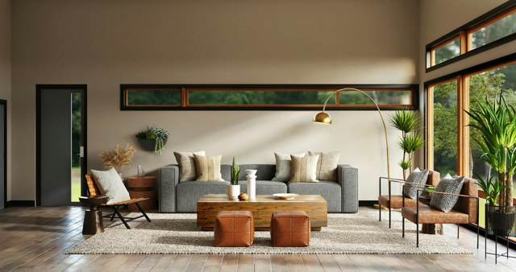

- 원본: `samples/spacejoy-9M66C_w_ToM-unsplash.jpg`
- 정규화 크기: 6144 × 3240; 파일 SHA-256: `92f13358e80b5a4facb2b31b5bd95f176b5df2bab4c3a159eafca8c92837787f`

### Before / After

| Before | After |
|---|---|
| BEFORE MISSING — 매칭되는 기존 완료 결과 없음 | **미생성** — 로컬 16MP 입력 제한으로 HTTP 400 |

- Before Viewer: 생성 불가 — 정확히 일치하는 기존 완료 run/scene.glb가 없다.
- After Viewer: 생성 불가 — 새 After run ID가 없다.

### 비교

- Before 관찰: 매칭되는 기존 완료 run/preview가 없어 Before를 평가할 수 없다.
- 새 After가 생성되지 않아 배치·바닥 개선 또는 회귀를 비교 평가할 수 없다.
- 실행 상태: **FAIL**. 실제 로컬 제출 HTTP 400, 16MP 제한 초과. 원격 추론/새 run 없음.


<a id="sample-29"></a>
## 29. vKDU8NwlREulF-1NM8tvH43BmkrpfmuojXHL74imAbahig4hhJfFFG6DwpMty-HMRb35uM-NNEKZC5nArYwPefMkld_eUOxo0_mFg_Z3fm3XwC3-BD0YwbVdGehOMuUu5QyzHqafsuC7wRAlUHRPOLBkTMRfZhEqpgds5LQzOoDcuVdYJVdnq6RnW2COLaBN.jpg

### Input

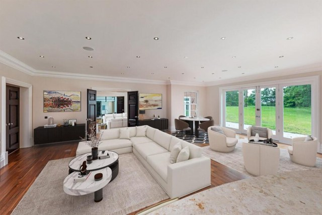

- 원본: `samples/vKDU8NwlREulF-1NM8tvH43BmkrpfmuojXHL74imAbahig4hhJfFFG6DwpMty-HMRb35uM-NNEKZC5nArYwPefMkld_eUOxo0_mFg_Z3fm3XwC3-BD0YwbVdGehOMuUu5QyzHqafsuC7wRAlUHRPOLBkTMRfZhEqpgds5LQzOoDcuVdYJVdnq6RnW2COLaBN.jpg`
- 정규화 크기: 1024 × 684; 파일 SHA-256: `ba8da31b721fe7856b4700588ef90086de203f1b1dcd2e4cc21b532eba24c51b`

### Before / After

| Before | After |
|---|---|
| 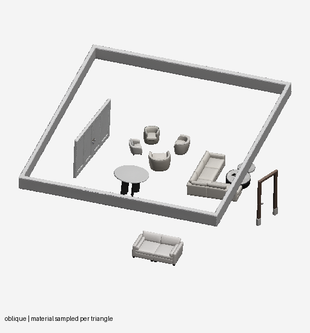 | **미생성** — 자동 승인 검토가 외부 GPU 배치를 차단 |

- [Before Viewer — 로컬 전용](http://127.0.0.1:8082/?run=9d0fe038d6c34b5cb9d5e61af49fc035)
- Run path/template: `/?run=9d0fe038d6c34b5cb9d5e61af49fc035`
- Before result: `runs/9d0fe038d6c34b5cb9d5e61af49fc035/`; GLB: `runs/9d0fe038d6c34b5cb9d5e61af49fc035/scene.glb`
- 기존 preview: `runs/9d0fe038d6c34b5cb9d5e61af49fc035/previews/meshes/oblique.png`
- Before metadata 생성 시각: `2026-09-28T12:39:28.087337+00:00`; 생성 객체 11개; 새 background floor 없음.
- Before viewer 재검증: PASS — 로딩/객체 표시 전환/orbit/zoom/pan/GLB 다운로드 hash.
- After Viewer: 생성 불가 — 새 After run ID가 없다.

### 비교

- Before 관찰: 큰 사각형 trim/벽 조각과 소파·테이블이 흩어져 있다. 일부 소파가 큰 프레임 밖으로 떨어져 보인다.
- 새 After가 생성되지 않아 배치·바닥 개선 또는 회귀를 비교 평가할 수 없다.
- 실행 상태: **BLOCKED**. 외부 이미지 전송 및 GPU 비용을 이유로 자동 승인 검토가 차단. 원격 추론 미실행.

## 4. 전체 비교 결론

- 총 sample **29개**, 신규 E2E 성공 **0개**, 실제 로컬 입력 실패 **7개**, 외부 실행 차단 **22개**.
- Before 정확 매칭 **22개**, Before 누락 **7개**. After run/scene/preview/viewer 생성 **0개**, 새 floor 생성 **0개**.
- 저장된 Before viewer는 **22/22개**가 실제 Chromium 검증을 통과했다. 이는 새 pipeline 성공 수가 아니다.
- 새 After가 없어 placement 개선이 눈에 보인 sample이나 새 regression을 판정할 수 없다. 기존 문제가 해결됐다고 추론하지 않는다.
- Before에서 반복되는 문제: 공통 바닥 부재, 가구 높이/기울기 차이, 큰 평판 또는 단일 통합 mesh, 어두운/불완전한 형상, 분리된 조각. 각 입력별 관찰은 위에 기록했다.
- 기존 tests **46 passed**; placement/floor tests 포함. 기존 JS와 새 browser 검증 스크립트 syntax 통과. 실제 새 GPU 결과 및 배포 검증은 미완료.

## 5. 근거 파일

- [기계 판독 결과 및 파일별 source hash](SAMPLES_BEFORE_AFTER_COMPARISON.json)
- 로컬 원본 manifest/logs: `runs/all_samples_comparison/20260929/`
- 기존 결과와 현재 입력 동일성 근거: `.runtime/all-samples-comparison/authorization-evidence.json` (로컬만 보존)
- 비교 이미지: `docs/assets/sample_comparison/<sample_id>/input.jpg`, `before.png` (Before가 있을 때만).
- Git commit/push 결과는 최종 응답에 기록한다.
