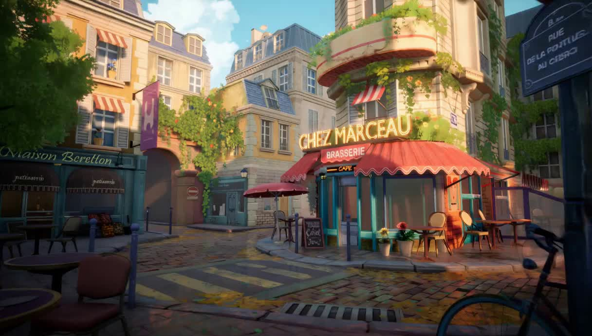
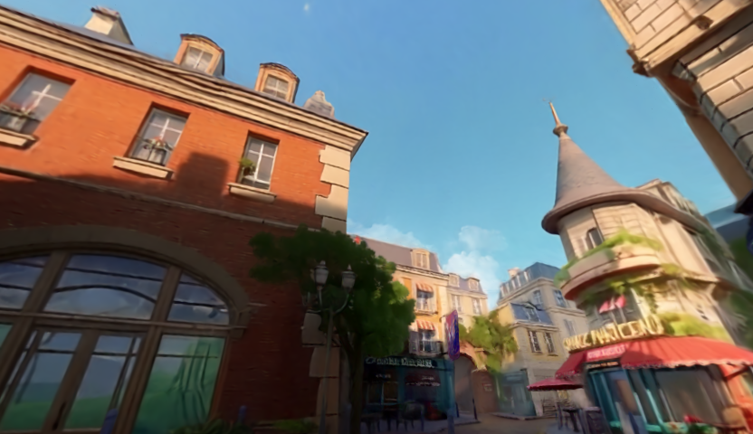
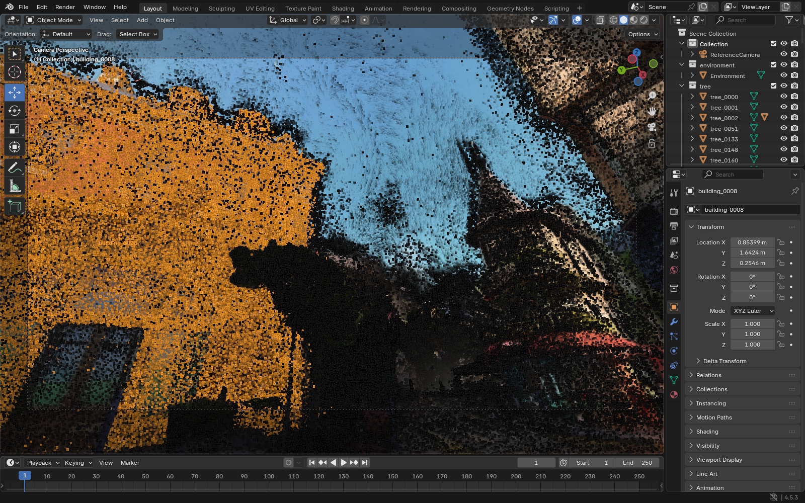

# 2026.09.10

### 목표

이미지로 생성한 3D 장면을 **객체별로 분리해 Blender 등에서 편집**할 수 있게 만드는 프로젝트입니다. 학습 원본 Gaussian 수준의 외관을 유지하는 것이 기준입니다.

### 입력 이미지와 객체 분리 전 장면

*실제 장면 생성에 사용한 원본 입력 이미지(`image_0001.jpg`)입니다.*

*HY-World 기반 파이프라인으로 생성한 학습 원본 Gaussian의 렌더 이미지입니다.*

### 추가 작업 결과: 장면의 Gaussian을 객체 단위로 분리

**하나의 장면을 이루던 Gaussian들을 건물·나무 등 객체별 그룹으로 나눴습니다.** 분리 과정은 다음과 같습니다.

1. **객체 탐지:** `objects.json`에 있는 건물·나무 등의 종류를 SAM3의 텍스트 프롬프트로 사용했습니다. 원본 Gaussian 장면을 808개 카메라 시점에서 렌더한 이미지에서 각 물체의 영역(마스크)을 얻었습니다.
2. **2D 영역을 3D에 대응:** 각 마스크 안의 픽셀을 그리는 데 기여한 Gaussian을 찾았습니다. 이때 앞뒤 물체의 가림과 투명도를 반영해 배경이 함께 선택되는 오류를 줄였습니다.
3. **시점 간 통합·소속 보정:** 여러 시점에서 같은 Gaussian들을 지지하는 탐지를 묶고, 같은 시점에서 따로 보이는 물체가 합쳐지지 않도록 제약을 적용했습니다. 이후 렌더된 객체 영역이 탐지 마스크와 맞도록 Gaussian의 객체 소속을 보정했습니다.
4. **객체별 저장:** 각 그룹을 Blender의 독립 객체로 구성했습니다. 원본 위치·색·크기 등의 속성은 유지하고, 소속이 불확실한 Gaussian은 배경 그룹에 남겼습니다.

아래 화면은 분리한 건물 하나를 선택한 결과입니다. **주황색으로 표시된 Gaussian들이 해당 건물에 배정된 그룹**이며, 이 그룹을 단위로 이동·회전·크기 변경과 삭제가 가능합니다. 원본 Gaussian의 외관 속성은 유지하고 객체 소속을 추가했습니다.

*객체 분리 결과 확인: 왼쪽 붉은 건물에 배정된 Gaussian 그룹(`building_0008`)을 선택한 화면.*

### 남은 문제와 다음 할 일

- **작은 물체와 가려진 부분의 분리가 부정확**하고, 배경에 객체 일부가 남습니다. 대표 객체를 이동·삭제하며 잔여 조각을 확인하고, 분리 오류를 보정하겠습니다.
- 현재는 **Blender의 Gaussian 편집**까지 검증했습니다. 일반 폴리곤 메시와 편집 방식이 다르며, Unity·Unreal 연동은 아직 검증하지 않았습니다.
